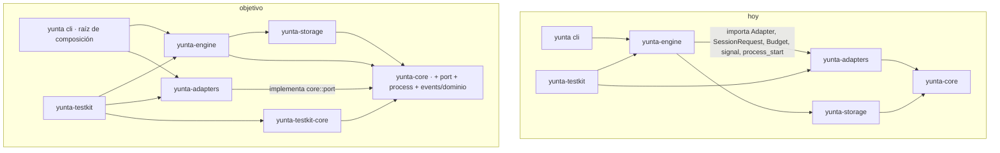
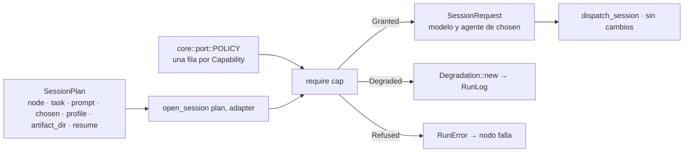
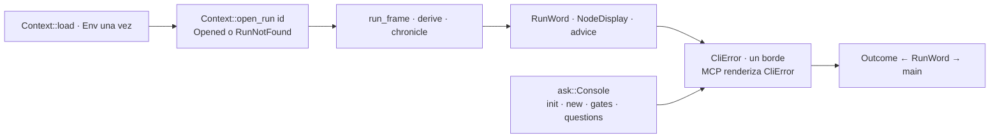
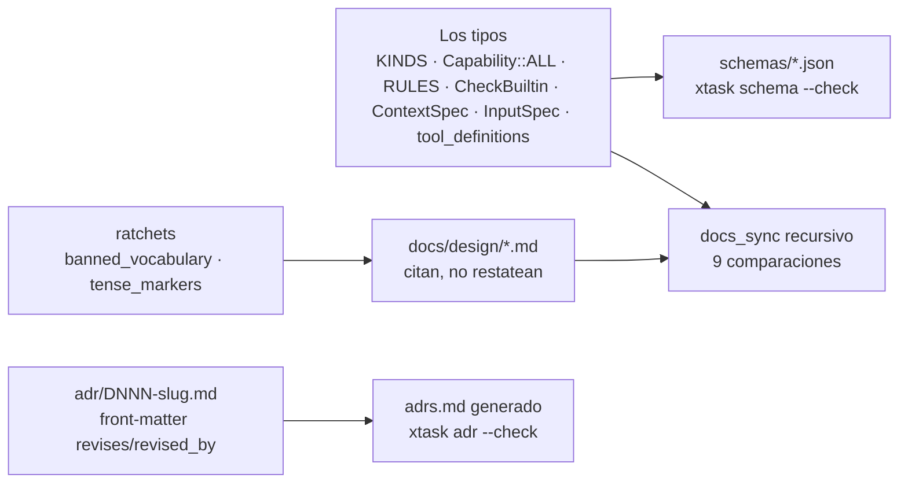

# Plan de raíz

El plan vigente de corrección arquitectónica de Yunta. Es la especificación de
todo el trabajo que sigue en la rama `feature/improve-ux`: cada ítem se
implementa tal como está escrito acá, con los nombres, los archivos y los tests
que acá se nombran. Lo que este documento no dice, no se inventa: se levanta
(§0) y decide un humano.

Fuente: ocho auditorías independientes sobre `80abe93` —eventos, engine,
artifacts, CLI, adapters, core, tests, documentación— con 198 defectos citados
por archivo y línea, reducidos a doce vicios y veinticuatro mecanismos.

## Qué hay en este directorio

| archivo | qué es | quién lo lee |
|---|---|---|
| [`README.md`](README.md) (este) | el plan: régimen, diagnóstico, vicios, arquitectura, flujos, decisiones, fases, tablero, levantamientos, índice | todos, entero, antes de tocar nada |
| [`mecanismos.md`](mecanismos.md) | los 24 mecanismos con firmas exactas, archivos que tocan (nuevo · modifica · borra), tests y defectos que cierran | quien implementa un ítem, la sección del mecanismo que el ítem nombra |
| [`cronica.md`](cronica.md) | M19 completo: tipos, tabla kind→momento→kept, palabras, disposiciones, pase del pintor, archivos, tests, ADR D164 | quien implementa 5-05 |
| [`cerco.md`](cerco.md) | M25 completo: vocabulario, tipos, juez, codec, `yunta fence`, engine, adapters builtin, la muestra del mercado, archivos, tests, ADR D172 | quien implementa 3-08 |
| [`artefactos/yunta-de-raiz.html`](artefactos/yunta-de-raiz.html), [`artefactos/cronica-del-run.html`](artefactos/cronica-del-run.html) | las dos propuestas tal como fueron aprobadas, con sus diagramas; el README y `mecanismos.md` son su forma normativa | quien quiera la versión legible |
| [`auditoria/01-eventos.md`](auditoria/01-eventos.md) … [`08-docs.md`](auditoria/08-docs.md) | las ocho auditorías, textuales, con toda la evidencia archivo:línea; están en inglés porque son evidencia y se conservan como se produjeron | quien implementa un ítem, la auditoría de su frente, para no re-auditar ni adivinar |
| [`auditoria/09-mercado-de-clis.md`](auditoria/09-mercado-de-clis.md) | los ocho CLIs relevados para el cerco (Gemini, Copilot, Cursor, OpenCode, Aider, Goose, Amp, Kimi), textuales, con URLs y lo no verificado marcado | quien implementa 3-08 o un adapter nuevo |

Ningún ítem se empieza sin haber leído este README entero, el mecanismo que el
ítem nombra en `mecanismos.md`, y la auditoría del frente. Lo que esos tres no
dicen, no existe: se levanta.

---

## 0. Régimen de ejecución

Estas reglas rigen para todo agente o persona que implemente un ítem de este
plan. No admiten interpretación.

1. **El plan es la spec.** Un ítem se implementa con los nombres de tipos,
   funciones, módulos, archivos y tests que el plan nombra. No se renombra, no
   se reubica, no se "mejora" el nombre. Si el plan dice `Escalation::new`, el
   constructor se llama `Escalation::new`.
2. **Lo que el plan no dice, se levanta.** Un agente que encuentra una
   contradicción, una imposibilidad, un diseño mejor, una dependencia oculta o
   un alcance mayor **se detiene**, escribe el levantamiento en §11 con
   evidencia (archivo:línea), alternativas y recomendación, y espera. No
   improvisa una solución "mientras tanto". No implementa una parte y deja una
   nota. No decide solo.
3. **Nada fuera del ítem.** Un PR cierra ítems del tablero (§10) y nada más.
   No se agregan mecanismos, tipos, archivos, dependencias ni flags que el plan
   no nombre. No se aprovecha "ya que estoy". Un refactor adyacente que el
   ítem no exige es drift.
4. **Las decisiones P1–P8 son bloqueantes.** Un ítem marcado como dependiente
   de una decisión no registrada en `adrs.md` no se empieza. Un agente no toma
   una decisión P por defecto, ni "provisoriamente".
5. **Lo marcado "se conserva" no se toca.** `RunLog`, el observer, `RunFrame`,
   `Failure`, `reserved::offer`, `FindingLedger`, `ArtifactLedger`,
   `GateResolvedPayload`, `string_id!`, `shape::read`, `spawn_governed`,
   `Delivery::choose`, `Curtain`, `Folded`, `render::state`, `advice`,
   `Layout`, `wait.rs`, `Terminal`, la nomenclatura de tests. Un mecanismo
   nuevo los generaliza; nunca los reimplementa ni los reemplaza.
6. **Cada ítem cierra con el gate completo ejecutado**, en este orden, por
   quien implementa: `cargo fmt --all --check`, `cargo clippy --workspace
   --all-targets -- -D warnings`, `RUSTDOCFLAGS="-D warnings" cargo doc
   --workspace --no-deps`, `cargo run -p xtask -- schema --check`, `cargo run
   -p xtask -- smells --check`, `cargo deny check`, `cargo test --workspace`,
   `yunta check` sobre todo workflow del repo y los packs, `yunta test` en el
   repo y en cada pack, `cargo check -p <crate>` por crate. Un resultado no
   ejecutado no existe.
7. **Primero en rojo.** Cada ítem nombra su test. El test se escribe primero,
   corre, falla por la razón exacta del ítem, y recién entonces se escribe el
   código. Un ítem sin su test en rojo no se considera empezado.
8. **El texto queda en presente.** Ningún rustdoc, ayuda, mensaje ni comentario
   del diff nombra este plan, una fase, un ítem, lo que había antes ni lo que
   vendrá. Este archivo es el único lugar del repo que planifica.
9. **El tablero se actualiza en el mismo PR.** Un ítem cerrado cambia su estado
   en §10 en el mismo commit que lo cierra, con el hash del commit. Un ítem
   levantado cambia a `levantado` y apunta a §11.
10. **Prohibiciones que el ratchet mide** (§7, M22) y que un PR no puede subir:
    `_ =>` en un `apply` de ledger; un `format!` que construya `reason`,
    `summary`, `cause` o `policy_applied`; un `SessionRequest { … }` literal
    fuera de `open_session`; `Command::new("git")` fuera de `git.rs` y
    `repo.rs`; `std::fs` dentro de `async fn`; `SystemClock` o `Utc::now`
    fuera de `clock.rs` y `main.rs`; `std::env` fuera del boundary de `Env`;
    `execute_run(RunEnv` fuera del testkit; `fn event(` fuera del testkit;
    `sleep` en tests; vocabulario prohibido (tabla de CLAUDE.md); marcadores
    de tiempo o plan en texto (`for now`, `yet`, `today`, `the old`, `will`,
    `future`, `not yet`).
11. **Vocabulario.** La tabla de CLAUDE.md rige. `ledger` solo nombra un
    pliegue del log. El documento de tareas es `tasks`.
12. **Orden.** Los ítems de un PR respetan las dependencias de §10. Una fase
    no empieza hasta que la anterior de la que depende está cerrada.
13. **Leer antes de tocar.** README entero, el mecanismo del ítem en
    `mecanismos.md`, la auditoría del frente en `auditoria/`. Un agente que no
    puede citar la línea de la auditoría que motiva el ítem no lo empezó.
14. **Un ítem, un PR** (o una serie corta que el tablero enumera). El título
    del PR nombra el ítem (`W-03`, `2-01`); la descripción lista los defectos
    del índice que cierra por id y pega la salida del gate.
15. **Lo que deja de usarse se borra; lo que falta terminar se termina.**
    Sin uso no prueba que sobre. Antes de borrar algo hay que decir en cuál
    de estos tres cae, y sólo el primero se borra:
    - **Reemplazado**: otro mecanismo ocupó su lugar y nadie puede volver a
      consumirlo. Se borra en el mismo commit que lo dejó sin uso — el tipo,
      la función, la constante, el campo, el archivo, el test y el párrafo
      que lo describía. Un envoltorio que sólo delega y un alias "por
      compatibilidad" caen acá.
    - **Inconcluso**: está construido y todavía no conectado, y el sistema
      lo necesita conectado. No se borra: se termina en el ítem que lo
      nombra, o se levanta en §11 si ningún ítem lo nombra. Borrarlo
      esconde trabajo que falta.
    - **Planificado**: su consumidor llega en una fase que el plan nombra
      (§7, §10, `mecanismos.md`). No se toca hasta esa fase, y el plan es
      la prueba de que tiene destino.

    Lo que además se conserva a propósito lo dice §8 o una decisión
    registrada. Un barrido que no clasifica antes de borrar no es limpieza:
    es pérdida.

### Cómo se cierra un ítem

- [ ] Leídos README, mecanismo y auditoría del frente; citada la evidencia.
- [ ] Toda decisión P de la que depende está registrada como ADR.
- [ ] El test nombrado por el ítem existe, corrió y falló por la razón del ítem.
- [ ] El código usa los nombres del plan; no hay tipo, archivo, mecanismo ni
      dependencia que el plan no nombre.
- [ ] Nada marcado "se conserva" fue reimplementado ni reemplazado.
- [ ] Ningún texto del diff nombra el plan, una fase, un ítem, lo que había o
      lo que vendrá.
- [ ] Gate completo (§0.6) ejecutado, con salida en el PR.
- [ ] `xtask/smells.baseline` regenerado por medición; ningún contador subió.
- [ ] Tablero (§10) actualizado en el mismo commit, con el hash.
- [ ] Índice (§12): los defectos que este ítem cierra siguen apuntando a él.

---

## 1. Diagnóstico

| medida | valor |
|---|---|
| lugares donde se declara un kind de evento | 9 en el workspace + 2 docs; el compilador defiende 3 |
| literales de `GateWaitingPayload` sin constructor | 7, en 4 módulos |
| módulos que pliegan el ciclo de vida de un nodo | 19 |
| replays completos del log por iteración del scheduler | ≥ 3 (y ≥ 2 lecturas de storage) |
| subprocesos git con process group, registro o cancelación | 0 |
| capacidades declaradas que el engine nunca consulta | 3 (`edit_hooks`, `usage_reporting`, `permission_profiles`) |
| copias de "buscar el run dir" en el CLI / redacciones de "no run" | 6 / 10 |
| `execute_run(RunEnv{…})` a mano en tests / en el testkit | 46 / 1 |
| divergencias documentación↔código | 44; `docs/design/` no está atado por ningún test |
| tags publicados | 0 — por D141, reestructurar payloads hoy no cuesta ningún `_v2` |

Lo que está bien y se conserva (regla 5 de §0): el engine tiene cero
conocimiento de CLIs concretos; `RunLog` es una costura única con el observer
colgado; `Failure` y `reserved::offer` son hechos tipados con constructor
único; `FindingLedger` y `ArtifactLedger` son pliegues únicos; `GateResolvedPayload`
separa forma Rust de forma wire; `string_id!` valida todo id; `shape::read`
fusiona parsear y chequear; `spawn_governed` es el modelo de propiedad;
`Delivery::choose`, `Curtain`, `Folded`, `render::state`, `advice`, `Layout`
en el CLI; `wait.rs` y `Terminal` en el testkit; la calidad de los ADRs.

---

## 2. Los doce vicios y los veinticinco mecanismos

| vicio | síntoma principal | mecanismos |
|---|---|---|
| V1 un hecho se construye en muchos lugares | `GateWaiting` ×7, `capability_degraded` ×8, `SessionRequest` ×2 divergentes, lo escribible ×4 | M03 M08 M25 |
| V2 una pregunta se responde en muchos lugares | `last_external_ref` ×2, attempt ×6, dedup ×2, run dir ×6, `RunPhase`→palabras ×5 | M04 M15 M16 |
| V3 el catch-all silencioso | `replay::apply` `_ => Ok(())`, `phase.rs` `_ => Created` | M05 |
| V4 la declaración dispersa | un kind = 9+2 lugares | M02 |
| V5 prosa congelada en el log, texto en la capa equivocada | `run_paused.reason`, `{:?}` al usuario ×9, MCP re-bordea ×17 | M06 M17 |
| V6 la disciplina que el tipo no impone | globs `String`, `Legacy` fresco, nombre de artifact que escapa, versión no leída | M12 M13 M14 |
| V7 la capacidad declarada y no consultada | 3 capacidades sin consulta, 5 comportamientos prometidos-no-construidos | M09 M24 M25 |
| V8 la cáscara que no gobierna | git sin grupo, 15 `std::fs` en async, 3 `SystemClock`, `target_digest` crudo | M10 M11 |
| V9 el puerto del lado equivocado | el engine importa su interfaz desde `yunta-adapters` | M01 |
| V10 los caminos duplicados | `yunta test` sin `check`, `mcp::tool_resolve_gate`, 8 `Bench` sombra | M18 M19 M20 |
| V11 la documentación sin atar | `docs/design/` invisible a `docs_sync`; la config de referencia no parsea | M23 |
| V12 el ratchet que mide el síntoma | `copied_test_helpers 0` falso; propiedad de resume tautológica | M21 M22 |

### Los mecanismos

- **M01 · Puerto en core.** `yunta_core::port` define `Adapter`, `AgentSession`,
  `SessionRequest`, `RunToolsEndpoint`, `Budget`, `PermissionProfile`,
  `ProbeReport`, `AgentEvent`, `AdapterError`. `yunta_core::process` recibe
  `subprocess.rs`, `signal.rs`, `process_start.rs`. `yunta-adapters` implementa
  el puerto y no lo exporta. El engine depende de core y storage únicamente.
  `MockFixture::parse(yaml, &RunPaths)` en `adapters/src/mock/fixture.rs`.
  `yunta-testkit-core` (solo depende de core) + `yunta-testkit`. Test de
  frontera `crates/engine/tests/no_adapter_crate_in_engine.rs`. El registro de
  adapters concretos en el CLI se deriva de `adapters.keys()`, no de prosa.
- **M02 · Kind declarado en su dominio.** `core/src/events/{run,node,session,
  tasks,scope,findings,artifacts,gates,children}/` con `kinds.rs`,
  `payloads.rs`, `ledger.rs`, `happening.rs`. `EventPayload` de 9 brazos
  (`Run(RunEvent)`, `Node(NodeEvent)`, …). `wire.rs`: `EventPayloadWire` plano
  por `#[serde(from/into)]`; `KINDS` concatenado de los dominios; `JsonSchema`
  a mano que emite el mismo `oneOf` de 36 ramas en el mismo orden.
  `events.json` no cambia un byte (`xtask schema --check` lo guarda).
  `kind_name`, `all_kinds()` y los "36" se derivan de `KINDS`. Versión por
  dominio.
- **M03 · Constructor por hecho.** Un constructor público por kind, en su
  dominio, que fija el invariante: `RunPaused::new(PauseReason)`,
  `RunResumed::new(OnInterrupt)`, `RunFinished::closed(terminal, &RunState)`,
  `NodeStarted::attempt(n)`, `NodeFinished::new(outcome, tokens)`,
  `NodeRerouted::new(to, RerouteCause(Failure), origin)`,
  `Degradation::new(Capability, AdapterId, Policy)`,
  `TaskStatusChanged::to(task, status, caused_by)` / `::done(task, caused_by,
  commit)`, `Escalation::new(summary, Evidence, NonEmpty<GateOption>)`,
  `QuestionsAnswered::via(Channel, Responder)`, `ChildClosed::new(run,
  terminal, tokens)`, `ArtifactAccepted::new(id, hash, RecordedOrigin)`.
  `artifact_written` sin constructor y `#[doc(hidden)]`. `RunCtx::engine_finding`
  es el único autor de findings del engine.
- **M04 · Un ledger por dominio.** `TaskLedger`, `GateLedger`, `NodeLedger`,
  `SessionLedger`, `ChildLedger`, `DegradationLedger`, `RunLedger` junto a
  `FindingLedger`, `ArtifactLedger`, `GrantLedger`. `RunState` los sostiene a
  todos en un pase O(e). `NodeHistory`, `last_external_ref` ×2, los 6 conteos
  de attempt, las 5 lecturas de tasks, `RunArtifacts::of` ×4, los scans de
  hijos ×5 desaparecen. `blackboard.rs` consume
  `FindingLedger::effective_of`. Una sola regla de dedup (`dedup_findings`),
  consumida por `inherited_findings`. `FindingLedger::effective` se llama una
  vez al final de `derive`, no por evento.
- **M05 · Replay sin comodín.** `derive` despacha por dominio; cada
  `<dominio>::apply` es exhaustivo. Lo que no mueve estado se declara
  `Audit` por nombre en su `kinds.rs`. `phase.rs` lee `RunLedger`.
- **M06 · Hechos tipados, prosa en el borde.** `PauseReason { Escalation,
  Cancelled, BudgetExhausted{spent,cap}, ExternalGate(Url),
  UncertainOrphans(Vec<NodeId>), NodeFailed{node,failure} }`, `Policy` enum,
  `RerouteCause(Failure)`, `Capability::as_str` en vez de `{:?}`;
  `RunError::Git(#[source] GitError)`; parsers de adapters como
  `#[serde(tag = "type")]` con `#[serde(other)] Unknown` y `Option<u64>` para
  conteos ausentes; `AgentError` con causa; `Diagnostic` en vez de
  `Vec<String>` en `questions::validate_answers` y
  `permission_layer_conflicts`.
- **M07 · decide/execute separados.** `schedule::next_step` en `gate_step`,
  `waiting_step`, `orphan_step`, `failure_step`, `ready_batch` compuestas por
  `decide(&Workflow, &RunState, &Policy)`. `parallel_exec` llama
  `schedule::resume_policies`. `GateStep::Waiting(PauseReason)`: `steps`
  registra `run_paused`, el gate nunca. `RunFinished::closed` único en
  `finish(terminal)`. `current_escalation` sin segundo `next_step`;
  `current_mode_name` es `run_mode()`.
- **M08 · SessionPlan único.** `SessionPlan { node, task: Option<TaskId>,
  prompt, chosen: RunnerCandidate, profile, artifact_dir, resume:
  Option<SessionId> }`; `open_session(plan, adapter) -> (SessionRequest,
  Vec<Degradation>)` en `engine/src/run/session_plan.rs`, único lugar que
  construye un `SessionRequest`, y con él la cerca de la sesión (M25).
  `prompt_exec` y `attempt.rs` lo llaman. `TypedArtifactNeedsRunTools` rige
  en ambos.
- **M09 · Capacidad→política como tabla.** `core::port::POLICY:
  [(Capability, Absence)]` con `Absence { Resting, FailAtCheck, FailNode,
  DegradeWith(Policy) }`, una fila por variante (test que recorre
  `Capability::ALL`). `require(adapter, capability, ctx) -> Decision` en el
  engine, único consumidor. `check(workflow, config, &Adapters)`. Test
  `every_capability_round_trips_through_a_fixture` para el twin
  `FixtureCapabilities`.
- **M10 · Una cáscara.** `git.rs` por `spawn_governed`; `tokio::fs` en
  `node_close`, `distill`, `context_resolve/{sources,knowledge}`,
  `workflow_exec`, `lock.rs`, `worktree`, `criteria.rs`, `process_registry`,
  `claude_code/mod.rs`, `mock/mod.rs`; `Clock` inyectado en `worktree/mod.rs`
  (3 sitios); `SecretSource` en `RunEnv` consumido por `secrets_env` y
  `context_resolve/mcp.rs`; `Env` leído una vez en `main`; `JoinHandle`
  conservado en `MockSession`; `#[instrument(fields(run_id, node_id))]` en
  `publish_gate`, `poll_gate`, `resolve_internal_gate`, `execute_ask`;
  `tokio::spawn(fut.instrument(Span::current()))` en readers y players;
  `ctx.adapters.get(&id).ok_or(RunError::AdapterMissing)`;
  `ContentHash::short()`; toda falla de `process_registry`, `interrupt`/`kill`,
  `encode_ref`, `git::success` es un `engine_finding`; `read_registry`
  distingue corrupto de ausente.
- **M11 · Secreto.** `ToolTarget { display: Option<String>, digest:
  ContentHash }` con `display` solo para paths relativos al worktree, nunca
  `command`/`url`; pase de redacción en `RunLog::record` contra el
  `SecretSource`; `scratch/mcp.json` se borra con el registro; comparación de
  bearer en tiempo constante sobre `Secret`.
- **M12 · Parsear es validar, extendido.** `ScopeGlob`, `SchemaRange`,
  `ArtifactName` + `ReservedIdentity`, `TemplateVar` (enum; `{{runner.role}}`
  → `{{runner.name}}`), `CommitSha` en `PackProvenance`/`PackLockEntry`,
  `DateTime<Utc>` en `EngineProcessFile.started_at`, `WorkflowName`,
  `SkillName`, `InputName`, `McpServerName`, `RecordedOrigin` →
  `ArtifactOrigin`, `ArtifactKind::Answers`, `Location { path, range }`,
  `Vec<QuestionId>`, `DiagnosticCode` (una enum), `StagedHash` distinto del
  hash del store, `ArtifactRefId` con `deny_unknown_fields` por variante,
  `Answer`/`AnswersFile` estrictos, `ScopeExpansionPermissions` exportado.
- **M13 · Puertas únicas en core.** `workflow::read(bytes, path) ->
  Result<Workflow, Report>` con las reglas de `engine/src/check/` en el mismo
  `Report`; `Document` para `FindingEntry` y `Withdrawal`; `text::counted(n,
  noun)`; `Answerer { Log, Staging }`; `RunTool` enum con `name()`,
  `describe()`, `schema()` y dispatch exhaustivo; `run_dir::{manifest_path,
  progress_path, sessions_root, task_worktrees}`; `steps.rs:256` por
  `canonical::derive_findings`.
- **M14 · PersistedDoc<T>.** `schema_version` escrito **y leído**, balde
  `unknown` que aflora, en `manifest.yaml`, `yunta.lock`,
  `scratch/engine.json`, el lock de aislamiento, `receipt.json`. `Manifest`
  embebe formas persistidas tolerantes, no `Workflow`/`ConfigLayer`
  estrictos. `manifest.rs:151` reporta un `pack.yaml` ilegible.
- **M15 · Context::open_run.** `Opened { run_id, run_dir, manifest:
  PersistedDoc<Manifest>, events, project }`; `CliError::RunNotFound { id,
  roots }` con una sola oración. La usan `status`, `stats`, `receipt`,
  `verify`, `cancel`, `gc`, `graph`, `resume`, `resolve-gate`, `list --runs`,
  `drive::settle`, los 4 tools MCP y `collect_history` (que deja de tener dos
  copias).
- **M16 · Un vocabulario.** `render::state::RunWord` para el estado de un run;
  `progress::summary`, `Closing::verdict`, `Standing::heading`,
  `RunJson.outcome`, `demand_line` lo consumen; `--json` emite el mismo token
  que el texto. `Outcome` deriva de `RunWord` en un solo lugar. `RunDocument`
  versionado para run/resume/status; `receipt.json` con `schema_version`.
  `width::` en `ask/menu.rs` y `schema.rs`. `stats.rs` renderiza a `String`.
- **M17 · Un borde de texto.** `CliError` con brazos tipados; `Message(String)`
  solo para lo único; `mcp.rs` devuelve `Result<T, CliError>` y un adaptador lo
  vuelve tool result; `promote.rs` y `test.rs` tipados; `init`/`new` preguntan
  por `ask::Console`; warnings de `Console::open` por `Diagnostics`.
- **M18 · Un camino de ejecución.** `test::run_case` y `promote` entran por
  `runnable` + `drive` con `ctx.clock` y `ctx.ids`; `mcp::tool_resolve_gate`
  es `resolve_gate` con otro medio; `graph` abre storage por `ctx.storage()`;
  `check_or_refuse(&Path)`.
- **M19 · Crónica derivada.** `engine/src/view/chronicle.rs`: `Moment { seq,
  at, elapsed, node, happening }`, `Happening` de 9 brazos por dominio (cada
  dominio implementa `From<&XEvent> for x::Happening`), `chronicle(events) ->
  Vec<Moment>` pura, uno por evento, monótona. `cli/src/surface/chronicle.rs`:
  `Said`, `say`, `kept`, `graduation`. `Lines::moment`, `Region::record`.
  Desaparecen `Scrollback::{gone,leaving,restart}`, `Region::restart`,
  `view::{graduation,settled_nodes,working_nodes}`, `lines::{detail,
  resolution,counted_problems}`. `Painter` recibe `glyphs`. `Layout::aside` →
  `Layout::advice`. Tests: `every_event_is_one_moment`,
  `the_chronicle_of_a_prefix_is_a_prefix_of_the_chronicle`,
  `the_frame_agrees_with_the_chronicle`,
  `a_settled_node_carries_how_long_it_worked_and_the_children_it_bore`,
  `a_node_that_settles_twice_is_two_moments`,
  `what_a_watched_terminal_keeps_above_its_region_is_what_the_append_only_surface_writes`,
  `a_run_read_back_from_a_pipe_says_what_a_watched_terminal_kept`.
- **M20 · Un arnés por capa.** `testkit_core::Log::for_run(id).at(t).node(n,
  p).after(s).event(p).build()`; un `Bench` con `run_sabotaged`, `wake`,
  `wake_with(forge)`, `with_clock`, `with_ids`, `findings_by`, `group_output`,
  `commit_subjects`; `hermetic(cmd, dir, home)` compartido por `run_yunta` y
  `Terminal::open` (fija `YUNTA_HOME`, `YUNTA_ORG_CONFIG` a un archivo vacío,
  `HOME`, `USER`, `TERM`, quita `NO_COLOR`); `Checkout::without_yunta_home()`;
  `common/mod.rs` reducido a literales; `testkit::adapter` con `request`,
  `drain`, `write_lines`, `child_pid_fifo`, `grandchild_pid` y el test de
  secretos parametrizado; `SourceLog::record` con clock inyectado;
  `SeqIdSource` por bench; `wait.rs` cede con `sleep(1ms)`.
- **M21 · Cuatro propiedades.** Generador sobre los 36 kinds + `Unknown`
  (comparte la lista con `all_kinds()`): replay (se conserva), resume real
  (prefijo → camino de resume → estado final igual), idempotencia
  (re-entrega de subsecuencia; re-corrida tras crash = un `node_finished` por
  attempt), cadena (todo append verifica; toda mutación de un byte falla).
- **M22 · Ratchet que mide la regla.** Contadores nuevos en `xtask smells`,
  sobre `src` y `tests`: `execute_run_outside_testkit`,
  `git_command_outside_git_rs`, `system_clock_in_tests`, `sleep_in_tests`,
  `env_set_in_tests`, `event_builder_outside_testkit`,
  `bench_struct_outside_testkit`, `banned_vocabulary`, `tense_markers`,
  `test_files_over_500_lines`, `test_fns_over_50_lines`; `[workspace.lints]`
  en `Cargo.toml` con el bloque de deny (5 copias → 1); `release.yml` reusa
  `ci` por `workflow_call`; job macOS `cargo test --workspace`; `for p in
  packs/*/`; `concurrency` + `timeout-minutes`; `cargo test --release` una
  vez; CONTRIBUTING lista `smells --check`.
- **M23 · Docs atados.** `docs_sync.rs` recursivo sobre `docs/design/`: todo
  YAML parsea y chequea; Contrato §3 ≡ `KINDS`; spec-events §5.x ≡ structs;
  spec-adapter caps ≡ `Capability::ALL`, tabla de degradación completa, §6 ≡
  `capabilities()` por adapter; spec-ledger §3 ≡ `RULES`; Contrato §6.4 ≡
  `tool_definitions()` + catálogo; §7.1/§9/§2.3 ≡ variantes.
  `docs/design/adr/DNNN-slug.md` con front-matter `number, title, status,
  revises, revised_by`; `adrs.md` generado por `cargo xtask adr --check`
  (huecos, citas, recíprocos). Pase que deshace la corrupción del corpus
  (`\{\{`, `\[`, `\|`, fences `javascript`, autolinks `http://x.md`, fence sin
  cerrar en `contrato:19`). Correcciones que los tests exigen (§9). Glosario:
  `frame`, `standing`, `escalation`, `tradeoff`, `demand line`,
  `crónica`/`momento`, `puerto`. `spec-ledger.md` → `spec-tasks.md`.
- **M24 · Build-or-register.** Cada comportamiento prometido por la
  documentación y no construido se construye, o se retira con entrada `A-NN`
  en `deuda-consciente.md` y nota `Revisada` en el ADR que lo describía.
  Nunca un comentario que explique el atajo.
- **M25 · El cerco.** `yunta_core::fence::Fence { allowed: Vec<ScopeGlob>,
  roots: Vec<PathBuf> }` con `judge(worktree, target) -> Verdict`, el único
  juez de lo que una sesión escribe; `Capabilities::fence: FenceLevel { None,
  ToolCalls, Filesystem }` reemplaza `edit_hooks`; `Coverage { Exact,
  WidenedToRoots, ToolsOnly }` en `agent_session_opened`, el canal más
  débil; kind `write_refused { session_id, target }`; `FenceHook` lo arma el
  CLI y `yunta fence <adapter>` es el hook, cada adapter escribe solo el
  `FenceCodec`; las raíces salen de `fence.roots`; el cerco vive en
  `scratch_dir`, nunca bajo `cwd`; `read_only` = `allowed` vacío con raíces;
  una escritura que llega al diff bajo `Exact` es `engine_finding`.
  `edit_constraints`, `Glob`, `blocked:<path>` se borran. Especificación
  completa y la muestra de ocho CLIs del mercado: `cerco.md`.

---

## 3. Arquitectura objetivo

```
RunState  ← derive(events)                        // un pase, un dueño por lectura
Decision  ← decide(&Workflow, &RunState, &Policy)  // pura, total, no toca el log
Effects   ← execute(Decision, &mut Shell)          // solo I/O; produce hechos
Fact      ← <dominio>::Constructor(...)            // uno por kind
seq       ← RunLog::record(fact)                   // una costura, observer colgado
                    ↓
        run_frame(&RunState)  chronicle(events)     // dos derivaciones, un vocabulario
                    ↓
        Region · Scrollback · Lines · Closing · status · --json · MCP   // disposiciones
```

### Diagrama

```mermaid
flowchart LR
  subgraph storage
    L[(Event log<br/>wire plano · hash chain)]
  end
  subgraph core/events · por dominio
    LD[Ledgers<br/>Run Node Session Tasks Grant<br/>Finding Artifact Gate Child Degradation]
    RS[RunState<br/>= todos los ledgers, un pase O e]
  end
  subgraph engine · puro
    D[decide<br/>gate · waiting · orphan · failure · ready_batch]
    RF[run_frame<br/>estado en un instante]
    CH[chronicle<br/>qué pasó, en orden]
  end
  subgraph engine · cáscara
    EX[execute<br/>Shell: spawn_governed · tokio::fs · Clock/Env/Secrets inyectados]
    SP[SessionPlan → open_session → dispatch]
    RQ[require cap ← POLICY]
  end
  subgraph de vuelta al log
    CT[Constructores<br/>Escalation::new · Degradation::new · PauseReason …]
    RL[RunLog::record<br/>una costura, observer colgado]
  end
  L --> LD --> RS --> D --> EX --> CT --> RL --> L
  RS --> RF
  L --> CH
  EX --> SP --> RQ
  RL -.observer.-> RF
  RL -.observer.-> CH
  RF --> UI[Region · Closing · status · --json · MCP]
  CH --> UI2[Scrollback · Lines]
```

### Crates

```
yunta (cli)  → engine, adapters, core, storage        raíz de composición
yunta-engine → core, storage                          conoce el puerto, no el crate
yunta-adapters → core                                 implementa core::port
yunta-storage → core
yunta-core                                            + port + process + events/<dominio>
yunta-testkit-core → core                             FixedClock, Log, ids, Captured
yunta-testkit → core, storage, adapters, engine, cli  Bench, Checkout, Terminal
```



Test de frontera: `crates/engine/tests/no_adapter_crate_in_engine.rs`.

### Eventos: nueve dominios

| dominio | kinds | ledger |
|---|---|---|
| `run` | run_created run_paused run_resumed run_finished promotion_signaled | `RunLedger` |
| `node` | node_started node_finished node_failed node_rerouted hook_executed context_assembled criteria_checked scope_checked baseline_captured | `NodeLedger` |
| `session` | agent_session_opened agent_message capability_degraded write_refused (este último nace en 3-08, no en 2-01) | `SessionLedger`, `DegradationLedger` |
| `tasks` | task_registered task_status_changed | `TaskLedger` |
| `scope` | scope_expansion_requested/granted/denied | `GrantLedger` (existe) |
| `findings` | finding_posted/updated/withdrawn/refused | `FindingLedger` (existe) |
| `artifacts` | artifact_accepted artifact_submitted artifact_written | `ArtifactLedger` (existe) |
| `gates` | gate_waiting gate_resolved questions_answered | `GateLedger` |
| `children` | child_run_created child_run_finished loop_iteration | `ChildLedger` |

Lo que un módulo de dominio es dueño de, y lo que se deriva:

```mermaid
flowchart LR
  subgraph core/events/findings/ · dueño de
    K[kinds.rs<br/>enum FindingEvent · KINDS · kind_name · schema_version · is_audit]
    P[payloads.rs<br/>structs + constructores]
    LG[ledger.rs<br/>FindingLedger::apply exhaustivo]
    H[happening.rs<br/>From&lt;&amp;FindingEvent&gt; for Happening]
  end
  subgraph core/events/ · derivado
    EP[EventPayload<br/>9 brazos]
    W[wire.rs<br/>EventPayloadWire plano · KINDS · JsonSchema]
  end
  subgraph ya no se escribe a mano
    D1[kind_name]
    D2[all_kinds]
    D3["36" = KINDS.len]
    D4[events.json]
    D5[lines::detail → chronicle::say]
  end
  K --> EP --> W --> D1 & D2 & D3 & D4
  H --> D5
```

Constructores por dominio, con el invariante que fijan: `mecanismos.md#m03`.

### Tipos: lo inválido, irrepresentable

| tipo nuevo | reemplaza | qué vuelve irrepresentable |
|---|---|---|
| `ScopeGlob` | `Node.scope`, `Task.scope`, `ScopeExpansion.within` (`Vec<String>`) | un glob inválido que pasa `check` y falla a mitad del run |
| `SchemaRange` | `Workflow.yunta_schema`, `PackManifest.yunta_schema` (`String`) | un rango que se parsea en el engine y no en el pack |
| `ArtifactName` + `ReservedIdentity` | `ArtifactSpec::Opaque(String)`, `ArtifactRefId::Name`, `MountArtifact.rename` | `..`, absoluto, o colisión con un nombre del engine; se re-valida después de renderizar |
| `TemplateVar` (enum) | `BTreeMap<String,String>` de `template_vars` | un input del usuario expandido donde un path no lo admite; `{{runner.role}}` → `{{runner.name}}` |
| `CommitSha` (existe) | `PackProvenance.commit`, `PackLockEntry.commit` | un commit que no es hex |
| `DateTime<Utc>` | `EngineProcessFile.started_at: String` | dos representaciones del instante en archivos hermanos |
| `WorkflowName` `SkillName` `InputName` `McpServerName` | `NodeKind::Workflow.use`, `Node.skills`, claves de `inputs`, `McpQueryParams.server` | una referencia que no puede resolver |
| `RecordedOrigin` → `ArtifactOrigin` | `ArtifactAcceptedPayload.origin` | `Legacy` en una aceptación fresca |
| `ArtifactKind::Answers` | `ANSWERS_SUFFIX` + `Opaque` | un documento que el engine escribe y se niega a leer |
| `Location { path, range }` | `FindingEntry.location: String` | "path y rango opcional" solo por convención |
| `Vec<QuestionId>` | `pending_questions: Vec<String>` | un id y una violación en la misma lista |
| `DiagnosticCode` | `RuleCode` + literales de parse/file/artifact + `DiagnosticCount.code: String` | un código escrito a mano sin test que lo ate |
| `Answerer { Log, Staging }` | `answered_by_the_log` + su re-derivación | una tercera lectura de quién responde por un artifact |
| `RunTool` (enum) | literales en `catalog.rs` y `session.rs` | catálogo y dispatch que se olvidan uno del otro |
| `StagedHash` | `VerifiedArtifact.content_hash` con dos significados | un campo que es dos hashes |
| `PauseReason` `Policy` `RerouteCause` | `reason: String`, `policy_applied: String`, `cause: String` | prosa del engine congelada en el log |
| `PersistedDoc<T>` | archivos persistidos sin versión leída | un lector viejo que no marca lo que no entendió |
| `FenceLevel` | `Capabilities.edit_hooks: bool` | un sandbox y un hook dichos con la misma palabra |
| `Fence { allowed: Vec<ScopeGlob>, roots }` | `edit_constraints: Option<Vec<String>>` + `artifact_dir` como permiso | un glob inválido en una sesión; dos fuentes para lo escribible |
| `Coverage` en `agent_session_opened` | nada (la sesión no decía qué cercó) | una cobertura declarada y no construida |

### Sesiones y capacidades




`SessionPlan` → `open_session` → `require(cap)` por cada campo gobernado
(`fence`, `skills`, `agent`, `run_tools_endpoint`, `budget.max_turns`,
`network`) → `SessionRequest` + `Vec<Degradation>` → `dispatch_session`
(sin cambios). El cerco lo arma `Fence::for_session(profile, scope,
artifact_dir)` (M25, `cerco.md` §5).

`POLICY` (valores iniciales; una fila por variante):

| capacidad | ausencia |
|---|---|
| `resume_session` | `Resting` (sesión fresca; ya emite `capability_degraded`) |
| `fence` (`FenceLevel::None`) | `DegradeWith(PostCheckOnly)` una vez por run |
| `permission_profiles` | `FailAtCheck` cuando un nodo pide `read_only`/`edit` |
| `custom_agents` | `FailAtCheck` cuando un nodo declara `agent:` |
| `usage_reporting` | `DegradeWith(NoTokenBudget)` una vez por run |
| `skills` | `DegradeWith(NoSkills)` |
| `run_tools` | `FailNode` si el nodo declara artifact interpretado o blackboard; `DegradeWith(NoRunTools)` si no |
| `network_isolation` | `DegradeWith(NetworkOpen)` |

---

## 4. Los bugs de comportamiento

Trece defectos que cambian lo que un run hace hoy. Ocho tienen un fix propio
que es un subconjunto estricto de su mecanismo —código que la fase igual
escribiría, en el mismo lugar— y se hacen **antes de la fase 0**, cada uno un
ítem del tablero (W-01…W-08) con su test en rojo primero. Cinco van por fase o
por decisión.

| # | bug | hoy | mecanismo | fix | test |
|---|---|---|---|---|---|
| W-01 | sesiones de `loop` en el modelo default | `task_cycle/attempt.rs:266-267` pasa `model: None, agent: None, artifact_dir: None`; `runner_resolved` registra otro modelo | M08 | `SessionSetup` gana `chosen: RunnerCandidate` y `artifact_dir: Option<PathBuf>`; `attempt.rs` copia `chosen.model`, `chosen.agent` y `artifact_dir` de ahí; `prepare_loop` llama `open_run_tools` (y con eso rige `TypedArtifactNeedsRunTools`) | `crates/engine/tests/run_concurrency.rs::a_task_session_runs_on_the_model_and_agent_the_runner_resolved`; `::a_loop_node_declaring_an_interpreted_artifact_is_refused_without_run_tools` |
| W-02 | nombre de artifact que escapa del run dir | `check/declarations.rs:133` valida el template sin renderizar; `node_exec.rs:348` renderiza `{{inputs.*}}`; `store.rs:147` une el nombre a un `PathBuf` | M12 | `core::workflow::ArtifactName::parse(&str) -> Result<Self, Problem>` (segmentos relativos, sin `..`, sin absoluto, no reservado por `ReservedIdentity`); `render_artifact_names` lo aplica **después** de renderizar y falla el nodo con `Failure::message` | `crates/engine/tests/artifacts.rs::a_rendered_artifact_name_that_leaves_the_run_dir_fails_the_node`; `crates/core/tests/artifacts.rs::an_artifact_name_with_a_parent_segment_is_refused` |
| W-03 | `target_digest` persiste comandos crudos | `claude_code/parse.rs:131-138`, `codex/parse.rs:109-138` guardan `command`/`url`/`file_path` literal | M11 | ambos parsers producen siempre `sha256_hex(input)[..12]`; nada literal | `crates/adapters/tests/claude_code.rs::a_tool_use_never_persists_the_command_it_ran`; ídem en `codex.rs` |
| W-04 | blackboard muestra findings retirados | `run_tools/blackboard.rs:26-52,64-86` pliegan `finding_posted` a mano | M04 | `consolidate_blackboard` y `get_blackboard` leen `FindingLedger::of(events).effective()` filtrado por grupo; `findings::inherited_findings` llama `replay::dedup_findings` (una regla) | `crates/engine/tests/blackboard.rs::a_withdrawn_finding_leaves_the_blackboard`; `::an_updated_finding_shows_its_last_content`; `crates/engine/tests/promotion.rs::inherited_findings_dedup_the_way_the_frame_counts_them` |
| W-05 | git sin process group ni cancelación | `git.rs:116,132,145,157,167` usan `Command::new("git")` directo | M10 | `git.rs` construye `GovernedCommand` y llama `spawn_governed` con el registro y el `CancellationToken` del run; los dos `std::process::Command` pasan a async | `crates/engine/tests/process.rs::a_cancelled_run_kills_the_git_it_spawned` (git envuelto por un stub en `PATH` inyectado que espera un marcador) |
| W-06 | `parallel_exec` ignora `on_interrupt` | `parallel_exec.rs:39-47` reinicia siempre | M07 | `execute_parallel` llama `schedule::resume_policies` y honra `fail_if_uncertain`/`resume_session` | `crates/engine/tests/run_concurrency.rs::a_parallel_child_with_fail_if_uncertain_fails_instead_of_restarting` |
| W-07 | mock pierde el handle del player | `mock/mod.rs:234` `tokio::spawn` descartado; `MockSession` sin `Drop` | M10 | `MockSession { player: JoinHandle<()> }` + `impl Drop` que aborta | `crates/adapters/tests/mock.rs::a_dropped_session_stops_its_player` |
| W-08 | tests heredan `/etc/yunta/config.yaml` | `testkit/src/bin.rs:11-19` y `terminal.rs:81-88` no fijan `YUNTA_ORG_CONFIG` | M20 | `run_yunta` y `Terminal::open` fijan `YUNTA_ORG_CONFIG` a un archivo vacío bajo `home`, `USER=yunta-test`, `TERM` y quitan `NO_COLOR` — el núcleo de `hermetic()` | `crates/cli/tests/run_flow.rs::a_run_under_test_reads_no_org_config_from_the_host` |
| — | tres capacidades nunca consultadas | AD-D2 D3 D4 | M09 · fase 3 | un quinto gate inline sería V7; depende de P3 | — |
| — | findings bloqueantes salen con 0 | CLI-D16 | M16 · fase 5 | depende de P5 | — |
| — | propiedad de resume tautológica | TE-D12 | M21 · fase 6 | ahora: renombrar a `derive_is_deterministic_from_any_prefix` y borrar el `_crashed_at_k`; la real es M21 | W-09 |
| — | `loop` sin gate de artifact tipado | EN-D3 | M08 | cae con W-01 | — |
| — | config de referencia no parsea | CO-14 | M23 · fase 0 | W-10 | — |

---

### El CLI: puertas, vocabulario, borde



### Documentación atada



## 5. Los siete flujos

**F1 · agregar un kind.** Variante en `<dominio>/kinds.rs`; struct y
constructor en `<dominio>/payloads.rs`; `ledger.rs::apply` no compila sin
brazo (o `Audit` por nombre); `happening.rs` no compila sin lectura; `KINDS`,
`kind_name`, `all_kinds()`, `events.json`, los "36" se derivan; el test de docs
exige fila del Contrato y sección del spec.

**F2 · un nodo corre.** `exec` lee el log una vez → `derive` → `decide` →
`Execute(node, attempt)` (attempt de `NodeLedger`) → `NodeStarted::attempt(n)`
por `RunLog::record` → por kind: `spawn_governed`, o `SessionPlan` (F3), o
`Escalation::new` + `GateStep::Waiting(PauseReason)` → `close_node` con
`Answerer` → `NodeFinished::new`/`NodeFailed::new` → `progress.md` por
`tokio::fs` desde `RunState` → observer → `Folded` → `run_frame` +
`chronicle`.

**F3 · una sesión se abre.** `resolve_node_runner` → `SessionPlan` →
`open_session` con `require(cap)` por campo → `SessionRequest` con modelo y
agente de `chosen` → `dispatch_session` → audit events con `Result`,
`ToolTarget` digest → cancel/budget: interrupt → gracia → kill; un kill fallido
es `engine_finding`.

**F4 · un artifact vive.** `ArtifactSpec::{Interpreted(kind),
Opaque(ArtifactName)}` validado como escrito y después de renderizar →
entrega por `RunTool` (`yunta_submit_<kind> {document}`) con `shape::accept`
+ `canonical` + `accept(…, RecordedOrigin::Submitted)`, o archivo en staging →
cierre por `Answerer` → `held_document`/`verify_one`, mismo camino para
`yunta_check_artifact` → `ArtifactLedger` única respuesta → `Answers` es un
kind.

**F5 · un comando abre un run.** `Context::load()` con `Env` una vez →
`ctx.open_run(&id)?` → `Opened` o `RunNotFound` → `PersistedDoc<Manifest>` →
deriva → `RunWord`/`NodeDisplay`/`advice` → `Outcome ← RunWord` → `main` mapea
una vez.

**F6 · una capacidad degrada.** `POLICY` → `require()` →
`capability_degraded(Policy)` por `RunLog` → `DegradationLedger` →
`RunFrame.degraded`, receipt, `stats`, `verify`, crónica → `check` refuta antes
lo `FailAtCheck`.

**F7 · una afirmación queda atada.** Tipo declara → doc lista en tabla fija →
`docs_sync` compara → ratchets corren → ADR con `revises` → `xtask adr
--check` exige recíproco.

---

## 6. Decisiones que van antes (paso 2)

Registradas el 2026-09-13, con la recomendación como decisión, por
aprobación explícita del dueño del repo: D165 (P1), D166 (P2), D167 (P3),
D168 (P4), D169 (P5), D164 (P6, dentro de la crónica), D170 (P7), D171 (P8),
D172 (P9, el cerco, con la muestra de ocho CLIs del mercado).
Viven en `docs/design/adr/` y las indexa `adrs.md`. Un ítem que quiera
apartarse de una de ellas la revisa con un ADR nuevo; no la reinterpreta.

| id | pregunta | decisión | ADR · desbloquea |
|---|---|---|---|
| P1 | ¿El puerto vive en `yunta_core::port` o en un crate `yunta-port`? | `core::port` | D165 · fase 1 |
| P2 | ¿La reestructura de eventos se hace antes del primer tag? | sí, y es lo primero después de P1 (D141) | D166 · fase 2 |
| P3 | Build-or-register para: baseline al crear el run (D18, §7.2); hooks de edición (spec-adapter §6); preguntas por PR (§3, §4.1); orden de criterios aprendido del log (D62); fuentes de contexto por executor (D19) | construir baseline eager y orden desde el log; registrar como deuda A-13/A-14/A-15 los otros tres | D167 · M09, M24, fase 3 |
| P4 | `#[serde(alias = "task-ledger")]` en YAML de autor y CLI | alias solo al leer lo persistido; rechazo con diagnóstico en YAML de autor; ADR | M12, fase 4 |
| P5 | exit code de un run "finished, holding N blocking findings" | `Reported` (1) | D169 · M16, fase 5 |
| P6 | qué conserva una terminal observada (`kept`) | lo que cierra algo o pide algo a una persona | D164 · M19, fase 5 |
| P7 | umbrales sin ADR: `WAIT_DEADLINE`, stagger 60 ms, `QUEUE_DEPTH`, `REDRAW_CEILING_HZ`, `MIN_SAMPLES_FOR_ESTIMATION` | un ADR "umbrales de superficie y arnés"; el ratchet rechaza `const` numérico nuevo sin referencia a ADR | M22, fase 6 |
| P8 | los ocho fixes de §4 antes de la fase 0 | sí, cada uno como subconjunto estricto de su mecanismo | D171 · W-01…W-08 |
| P9 | ¿Cómo se cerca lo que una sesión escribe, y escala a cualquier adapter futuro? | un juez en core, un nivel por adapter, una cobertura por sesión, un rechazo como kind; el post-check sigue siendo la garantía | D172 · M25, 3-08 |

---

## 7. Fases

| fase | ítems | desbloquea | depende de |
|---|---|---|---|
| W | W-01…W-10: los ocho fixes, el rename de la propiedad, la config de referencia | un usuario de hoy | P8 |
| 0 | P1–P8 registrados como ADR por archivo; corpus des-corrompido; `docs_sync` recursivo; ratchets nuevos sembrados | que la documentación pueda perder | — |
| 1 | M01 | tabla de política en core; arnés único | P1 |
| 2 | M02 M03 M04 M05 | todo lo que deriva | P2, fase 1 |
| 3 | M06 M07 M08 M09 M10 M11 M25 | un engine que el compilador defiende | P3, P9, fase 2; 3-08 además 4-01 |
| 4 | M12 M13 M14 | `check` atrapa antes del primer token | P4, fase 2 |
| 5 | M15 M16 M17 M18 M19 | la misma palabra en cada superficie | P5, P6, fase 2 |
| 6 | M20 M21 M22 | que el ratchet signifique lo que dice | P7, fase 2 |
| 7 | M23 M24 | el primer tag | acompaña 2–6 |

Orden estricto W → 0 → 1 → 2 → 3; 4, 5 y 6 dependen de 2 y pueden ir en
paralelo entre sí; 7 acompaña. El primer tag se publica después de la 7.

---

## 8. Lo que no cambia

`RunLog`, `observer.rs`, `run_frame`/`view/`, `lock` + `hand_over` (salvo su
`std::fs`), `worktree` (integridad, `branch -d`, guard en `Drop`),
`reserved::offers`, los dos builders de `escalation`, `pre_seeded_resolution`,
`process.rs::spawn_governed`, `node_close::fail_with`, `create_run`'s
`tokio::fs`; `Failure`, `Evidence`/`Fact`, `Report`/`Diagnostic`,
`GateResolvedPayload`, `EventDraft`/`StoredEvent`, `EventBody::Unknown`,
`FindingLedger`, `ArtifactLedger`, `run_mode()`, `string_id!`, `shape::read`
+ `RULES`, `FrozenPaths::new`, `Secret<T>`, `text.rs`, `yaml.rs`,
`ArtifactKind`, `InputSpec`; hash store + view, `ArtifactId`, la entrega por
tools, el split estricto/tolerante; `Capabilities::declares`,
`RunToolsEndpoint`, `staged_paths`, `SessionObserver -> Result`,
`typed_settings`, `ConfigOverride`, `LineReader`, `note_summary`, el mock como
cliente MCP real; `Delivery::choose`, `Curtain`, la política de drop del
`Feed`, `Folded`, `Region` sin raw mode, `render::state`, `advice`, `Layout`,
`render::escalation`, `json::SCHEMA_VERSION` como regla, `error::{warn,note}`
+ `Diagnostics`; `wait.rs`, `Terminal`, `repo.rs`, `Bench`/`Checkout` como
par, `RecordingObserver`, `frames.rs`, `Env::subprocess_vars`, `yunta test`
como segunda superficie, la nomenclatura de tests, la forma del ratchet.

---

## 9. Correcciones documentales que los tests de M23 van a exigir

Contrato: 6 tools MCP en §6.4; `{document}` en §6.4; `finished` en §3.2;
§5.3 sin `free_text`/`default_on_timeout` como campos y con `external_ref`;
§5.4 con la clave real del memo y la cache por invocación; §9 sin fuentes por
executor (o P3); §2 sin `baseline/` (o P3); §12 sin `ledger` del hijo.
spec-events: `commit` en §5.11, `paths` en §5.14, `external_ref` y el modelo
de `gate_resolved` con `sha` en §5.18, `model` opcional en §5.5, sin
`[inferido]`, artifacts fuera de §5.21.x, sin "precede a los tipos".
spec-adapter: 8 capacidades, tabla de degradación completa, `SessionRequest`
real, `pgid()`, `AdapterId`, §6 verdadero por adapter, O1–O6 sin duplicar.
spec-ledger → spec-tasks: 9 reglas, regla 1 en su capa, ejemplo con path
real, sin "se escribe antes del código". referencia-schema: `2000000`,
`50000000`, `32000`, `baseline.suite` igual al fixture. compatibility: 8
schemas, todos los códigos de artifact. adrs: D132 "tasks document", D139
"ocho", D152 `Revisada por D157`, D03 con reviser, D140/D144 `Revisada por
D156`, D06 sin `plugin`, D37 sin `subagente`. rfc-0002 `M14` → A-06;
rfc-0003 `deuda ⑪` → A-05. README: `graph <workflow> [--run <id>]`, `list`
sin "modes". concepts: `waiting` incluye preguntas. Rustdoc:
`session.rs:3-10`, `sections.rs:133-168`, `declarations.rs:9`,
`process_registry.rs:3`, `mcp.rs:1-2`, `cli.rs:141-145`, `replay.rs:1-8`,
`lib.rs:4,6`, `project.rs:46`, `create.rs:113`, `criteria.rs:25`,
`worktree/mod.rs:75`, `Task.id`. Comentarios de dev-dep: `storage/Cargo.toml`
(fixed clock), `cli/Cargo.toml` (`nix`). 19 tests sin `//!`.

---

## 10. Tablero

Estados: `pendiente` · `bloqueado(Pn)` · `en curso` · `levantado(§11)` ·
`cerrado(hash)`. Se actualiza en el mismo commit que cambia el estado.

Cada ítem `N-xx` implementa los mecanismos que su fase nombra en §7; la
especificación de cada mecanismo —firmas, archivos, tests— es
`mecanismos.md#mNN`, para 5-05 es `cronica.md` y para 3-08 es `cerco.md`. Los
ítems W-xx tienen su especificación completa en §4.

| ítem | qué | depende de | estado |
|---|---|---|---|
| W-01 | `SessionSetup` con `chosen` y `artifact_dir`; `prepare_loop` por `open_run_tools` | P8 | cerrado(a45e19a) |
| W-02 | `ArtifactName::parse` después de renderizar | P8 | cerrado(aa437f7) |
| W-03 | `target_digest` siempre hash | P8 | cerrado(56ad092) |
| W-04 | blackboard por `FindingLedger`; una regla de dedup | P8 | cerrado(6bf7baa) |
| W-05 | `git.rs` por `spawn_governed` | P8 | levantado(§11 L-03) |
| W-06 | `parallel_exec` por `resume_policies` | P8 | cerrado(1dd753b) |
| W-07 | `MockSession` con handle y `Drop` | P8 | cerrado(48b93e3) |
| W-08 | `run_yunta`/`Terminal::open` herméticos | P8 | cerrado(99f148a) |
| W-09 | renombrar la propiedad tautológica a lo que prueba | — | cerrado(afaf173) |
| W-10 | `referencia-schema.md` parsea; `docs_sync` recorre `docs/design/` | — | levantado(§11 L-04) |
| 0-01 | `cargo xtask adr --check` (índice generado, huecos, citas, recíprocos); D164–D171 ya escritos | — | cerrado(ebd4d16) |
| 0-02 | corpus des-corrompido (Contrato, rfc-0001, rfc-0002) | — | pendiente |
| 0-03 | ratchets `banned_vocabulary` y `tense_markers` sembrados | — | pendiente |
| 1-01 | `core::port` + `core::process`; engine sin `yunta-adapters`; test de frontera | P1 | pendiente |
| 1-02 | `MockFixture::parse(yaml, &RunPaths)`; `commands/test.rs` y `Bench` lo usan | 1-01 | pendiente |
| 1-03 | `testkit-core`; `core` y `adapters` lo enlazan; `testkit::adapter` | 1-01 | pendiente |
| 1-04 | registro de adapters derivado en `refuse_unrunnable`, `doctor`, `init` | 1-01 | pendiente |
| 2-01 | dominios `run` `node` `session` `tasks` `scope` `findings` `artifacts` `gates` `children` con `kinds`/`payloads`/`ledger`/`happening`; `wire.rs`; `events.json` idéntico | P2, 1-01 | pendiente |
| 2-02 | constructores M03 en cada dominio; todos los emisores los usan | 2-01 | pendiente |
| 2-03 | ledgers nuevos; `RunState` los sostiene; `NodeHistory` y los pliegues ad hoc borrados | 2-01 | pendiente |
| 2-04 | `derive` por dominio, `apply` exhaustivo, `Audit` por nombre; `phase.rs` por `RunLedger` | 2-03 | pendiente |
| 3-01 | `PauseReason`, `Policy`, `RerouteCause`; `Capability::as_str`; `RunError::Git(#[source])` | 2-02 | pendiente |
| 3-02 | `decide` en cinco; `GateStep::Waiting`; `RunFinished::closed` único; `current_escalation` sin doble derive | 2-03 | pendiente |
| 3-03 | `SessionPlan` + `open_session`; `attempt.rs` y `prompt_exec` lo llaman | 2-02 | pendiente |
| 3-04 | `POLICY` + `require()`; `check(…, &Adapters)`; twin test | 1-01, 3-03 | pendiente |
| 3-05 | Shell: `tokio::fs` ×15+, `Clock` en worktree, `SecretSource`, spans, `get()`, degradaciones como `engine_finding` | 2-02 | pendiente |
| 3-06 | `ToolTarget`; pase de redacción; `mcp.json` limpiado; bearer constante | 3-05 | pendiente |
| 3-07 | parsers tagged con `Unknown`; `AgentError` con causa; codex falla en settings; claude `read_only` con `Write`/`Edit` solo si hay archivos declarados (`cerco.md` §6) | 1-01 | pendiente |
| 3-08 | el cerco (`cerco.md`): `core::fence`, `FenceLevel`, `Coverage`, `FenceHook`, `write_refused`, `yunta fence`, codec claude-code, sandbox codex, mock por el juez, `fence_breach`, docs y glosario | 3-03, 3-04, 3-06, 3-07, 4-01 | pendiente |
| 4-01 | `ScopeGlob`, `SchemaRange`, `WorkflowName`, `SkillName`, `InputName`, `McpServerName`, `CommitSha`, `DateTime` | 2-01 | pendiente |
| 4-02 | `ReservedIdentity`, `TemplateVar`, `ArtifactKind::Answers`, `RecordedOrigin`, `Location`, `QuestionId`, `DiagnosticCode`, `StagedHash` | 4-01 | pendiente |
| 4-03 | `workflow::read`; `Document` para `FindingEntry`/`Withdrawal`; `text::counted`; `Answerer`; `RunTool`; `run_dir::*`; `steps.rs:256` por canonical | 4-01 | pendiente |
| 4-04 | `PersistedDoc<T>` en manifest, lock, engine.json, lock de aislamiento, receipt | 4-01 | pendiente |
| 5-01 | `Context::open_run`; `collect_history` único | 4-04 | pendiente |
| 5-02 | `RunWord`; `Outcome` de `RunWord`; `RunDocument`; receipt versionado; `width::` | 5-01 | pendiente |
| 5-03 | `CliError` en MCP/promote/test; `ask::Console` en init/new; `Diagnostics` en `Console::open` | 5-01 | pendiente |
| 5-04 | `test`/`promote` por `runnable`+`drive`; `mcp::resolve_gate` único; `graph` por `ctx.storage()`; `Env` una vez | 5-01 | pendiente |
| 5-05 | crónica: `view/chronicle.rs`, `surface/chronicle.rs`, `Lines::moment`, `Region::record`, borrados, `Layout::advice`, tests | 2-01, P6 | pendiente |
| 6-01 | `Log` builder; 10 `fn event()` borrados; `SourceLog` con clock | 1-03 | pendiente |
| 6-02 | un `Bench` con las cinco capacidades; 46 `execute_run` y 8 sombra migrados; `common/mod.rs` a literales | 6-01 | pendiente |
| 6-03 | `hermetic()`; `Checkout::without_yunta_home`; `SeqIdSource` por bench; `sleep`→`wait_until_async` | 6-01 | pendiente |
| 6-04 | cuatro propiedades sobre generador completo | 2-01 | pendiente |
| 6-05 | ratchet: 11 contadores nuevos sobre `src`+`tests`; `[workspace.lints]`; CI `workflow_call`, macOS, glob de packs, timeouts, `--release`; CONTRIBUTING | — | pendiente |
| 7-01 | `docs_sync` ata los conjuntos cerrados (§2 M23) | 2-01, 3-04 | pendiente |
| 7-02 | ADR por archivo, índice generado, recíprocos | 0-01 | pendiente |
| 7-03 | correcciones de §9 | 7-01 | pendiente |
| 7-04 | glosario; deuda: `yunta replay/diff` (rfc-0003 §2) y la verificación en vivo (status.md) entran como A-16/A-17 con ids estables; `spec-tasks.md` | 7-03 | pendiente |

Ya cerrado en esta rama, antes del plan: merge de `main` con la costura del
observer en `RunLog` (`6fe9ccc`), `Evidence` como hechos etiquetados
(`365aa41`), ofertas con tradeoff por constructor (`reserved::offers`),
`hand_over` del lock en `--detach`, la vista viva como default (D162),
correcciones de docs (`8582c01`, `80abe93`).

---

## 11. Levantamientos

Un agente que se detiene por la regla 2 de §0 escribe acá, con fecha, ítem,
evidencia (archivo:línea), alternativas y recomendación. El humano responde en
el mismo lugar y, si corresponde, registra un ADR.

### L-01 · 2026-09-14 · W-01 · `prepare_loop` no puede llamar `open_run_tools` tal cual

**Evidencia.** `open_run_tools` (`engine/src/run/runner_resolve.rs`) hace dos
cosas en una: decide si el nodo puede correr sin run tools —y refusa cuando
declara un artifact interpretado o está en un grupo `blackboard`— y **abre el
listener de esa sesión**. Para un nodo `prompt` eso es correcto: la sesión es
una. Para un `loop` no: cada intento abre el suyo
(`engine/src/task_cycle/attempt.rs:205-240`, "A fresh listener + credential per
attempt"), y `run_tools/mod.rs:1-6` fija el invariante: "one loopback HTTP
listener **per node session**, never per run".

Implementado al pie de la letra, el ítem quedó con dos defectos: un listener
por nodo `loop` que ninguna sesión usaba (abierto y cerrado en el acto), y un
fallo transitorio de bind en `prepare_loop` dejaba `setup.run_tools = None`
para **todos** los intentos del nodo, contra la política por intento que
`attempt.rs` documenta.

**Alternativas.**

1. Llamar `open_run_tools` solo por su refusal y seguir derivando el acceso de
   la capacidad. Cumple la letra; conserva el listener-sonda inútil.
2. Partir la decisión del bind: una función que responde si el nodo puede
   mountar las tools, consumida por `open_run_tools` y por `prepare_loop`.
   Cumple la intención del ítem (que rija `TypedArtifactNeedsRunTools`) sin
   efecto de lado; introduce un nombre que el plan no fija.
3. Detenerse sin implementar W-01.

**Lo que hice, y por qué.** La 2, con la función `run_tools_allowed` en
`runner_resolve.rs`: la 1 deja en el código un recurso que se abre para nada, y
la 3 dejaba en `main` la regresión que el propio ítem introdujo. El nombre
`run_tools_allowed` es lo único que el plan no fija; el resto del ítem quedó
como está escrito.

**Pendiente de decisión.** Si el nombre o el corte no son los que el plan
quiere, se revisan en un ADR y el ítem se ajusta.

### L-03 · 2026-09-14 · W-05 · gobernar los dos `git` sincrónicos vuelve `build_manifest` async

**Evidencia.** La fila de W-05 pide que "`git.rs` construye `GovernedCommand` y
llama `spawn_governed`" y que "los dos `std::process::Command` pasan a async".
Esos dos son `git::output_blocking` y `git::success_blocking`
(`engine/src/git.rs:157,167`). `output_blocking` lo llama `manifest.rs:305`
(`git_line`), que llama `pack_provenance` (`manifest.rs:139`), que llama
`build_manifest` (`manifest.rs:73`), **sincrónica y pública**: 102 llamadas en
33 archivos (94 en `engine`, 4 en `cli`, 3 en `testkit`, 1 en `core`).
Volverla async arrastra a todos, casi todos tests, y a `yunta_testkit::Bench`.
`spawn_governed` es async (`engine/src/process.rs:198`), así que no hay forma
de gobernar desde una función sincrónica.

Los otros dos llamadores de la pareja sincrónica son `cli/commands/init.rs:89,97`
y `cli/commands/test.rs:418`, fuera de todo run: no hay registro ni token de
cancelación que pasarles.

Esto es "un alcance mayor del previsto" (§0.2): el ítem se describe como "un
subconjunto estricto de su mecanismo —código que la fase igual escribiría, en
el mismo lugar—" (§4), y esto es una migración async de la API pública del
engine.

**Alternativas.**

1. Volver `build_manifest` async y migrar las 102 llamadas. Cumple la letra;
   es un ítem propio, no un subconjunto de M10.
2. Gobernar sólo las tres funciones async (`output_bytes`, `output`,
   `success`) — las que un run llama mientras puede ser cancelado — y dejar la
   pareja sincrónica como está, porque corre al construir el manifest y en
   comandos del CLI, donde no hay run que cancelar. Cierra el bug que la fila
   describe y hace pasar el test que nombra; contradice la cláusula "los dos
   `std::process::Command` pasan a async".
3. Dar grupo de proceso a la pareja sincrónica sin gobernarla
   (`process_group(0)` sin registro ni cancelación). Mitad de camino, y el
   plan no lo dice.

**Recomendación.** La 2, y que la cláusula del plan diga "las tres funciones
que un run llama"; la migración async de `build_manifest` entra como ítem
propio de la fase que implementa M10 entero, con su propio tablero.

**Por qué no avancé.** §0.2: "No implementa una parte y deja una nota". El ítem
queda `levantado(§11)` hasta que el humano decida.

### L-04 · 2026-09-14 · W-10 · el recorrido recursivo choca con el ejemplo de composición

**Evidencia.** Con `every_yaml_example_in_the_docs_is_one_the_binary_accepts`
recorriendo `docs/design/` aparecen dos fallas. La primera es CO-14 y §9 la
nombra: `referencia-schema.md:85,89,90` escribe `2_000_000`, `50_000_000` y
`32_000`, y el parser pide `u64` (`limits.max_tokens_per_run: invalid type:
string "2_000_000"`). Se corrige escribiendo los números planos.

La segunda no está prevista: el bloque `name: release-cycle`
(`referencia-schema.md:229`) es una composición cuyos nodos declaran
`use: design-review`, `use: build-feature` y `use: qa-review`, y `yunta check`
la rechaza con "cannot be resolved — no workflow `design-review`". De los tres
nombres, sólo `build-feature` está declarado en el corpus
(`referencia-schema.md:103`); los otros dos son ilustrativos y no existen en
ningún documento.

El plan da a ese archivo un test propio en M23,
`the_reference_config_parses_and_its_workflows_check` ("`referencia-schema.md`
bloques", `mecanismos.md#m23`), que es donde vive el proyecto alrededor del
cual esos bloques se verifican. W-10 pide el recorrido recursivo antes, y el
recorrido genérico arrastra esos bloques a un proyecto que no los sostiene.

**Alternativas.**

1. Sembrar en el proyecto del test los workflows que los propios documentos
   declaran, y stubs para los que no. Los stubs hacen pasar el ejemplo contra
   hijos falsos: el test diría que la composición verifica cuando lo que
   verificó es otra cosa.
2. Declarar `design-review` y `qa-review` en `referencia-schema.md`. Es un
   cambio de documento que §9 no enumera, y agranda un documento de
   referencia con dos workflows que sólo existen para el test.
3. Que el recorrido recursivo trate un workflow cuyos `use:` no resuelven
   como "parsea" en vez de "verifica". Es una regla nueva de clasificación
   que el plan no da.
4. Mover el recorrido recursivo al ítem de M23 que ya tiene el test propio de
   `referencia-schema.md`, y dejar en W-10 sólo la corrección de los números.

**Recomendación.** La 4: la corrección de CO-14 es independiente y se cierra
sola; el recorrido recursivo entra con `the_reference_config_parses_and_its_workflows_check`,
que es el test que el plan ya le asigna a ese archivo.

**Por qué no avancé.** §0.2: "No implementa una parte y deja una nota". El
ítem queda `levantado(§11)`; la corrección de los números no se commiteó.

### L-05 · 2026-09-14 · W-03 · truncar en el productor deja a M11 sin su `ContentHash`

**Evidencia.** La fila de W-03 pide que ambos parsers produzcan
`sha256_hex(input)[..12]`. M11 fija el tipo del campo:
`pub struct ToolTarget { pub display: Option<String>, pub digest: ContentHash }`
(`mecanismos.md#m11`). Un `ContentHash` es el hash entero
(`core/src/hash.rs`), y truncar en el productor es irreversible: cuando M11
llegue, esos eventos no pueden dar el hash que el tipo declara.

Además W-03 deja sin identificación a un ítem que sólo se distinguía por el
campo hasheado: una llamada MCP de codex viajaba como `server:tool`, que no es
contenido de nadie, y ahora viaja como digest bajo el nombre genérico
`mcp_tool_call`. M11 lo resuelve con `display`, que W-03 no tiene.

**Lo que hice.** El valor sale de `ContentHash::abbreviated()`, que es el
único lugar del workspace donde vive "doce dígitos" y ya existía para esto
(`core/src/hash.rs`); el digest queda `sha256:` más doce dígitos en vez de
doce dígitos pelados. Es la misma abreviatura que la fila pide, con el
algoritmo adelante y sin una tercera copia del umbral.

**Alternativas para la contradicción de fondo.** (a) que W-03 guarde el
`ContentHash` entero y la abreviatura sea cosa del borde que lo muestra —
entonces la fila dice `[..12]` de más; (b) que M11 acepte un digest abreviado
y `ToolTarget.digest` no sea `ContentHash`; (c) dejar los dos y que M11
reinterprete lo viejo, que el log no permite.

**Recomendación.** La (a): el log guarda el hash entero, y doce dígitos son
cómo se lee, no cómo se guarda. Es lo que `ContentHash::abbreviated()` ya
dice de sí mismo ("Prose, not an identifier — what compares, and what a log
records, is the whole value").

### L-06 · 2026-09-14 · W-04 · cuál de las dos reglas de dedup sobrevive

**Evidencia.** La fila de W-04 dice que `findings::inherited_findings` llame a
`replay::dedup_findings`, "una regla", y no dice cuál de las dos redacciones
queda. No eran la misma: `dedup_findings` normalizaba con
`title.trim().to_lowercase()` y `inherited_findings` con
`split_whitespace().join(" ").to_lowercase()`, que además colapsa los espacios
internos. Con la primera, "Scope  expansion DENIED" y "scope expansion denied"
son dos findings; con la segunda, uno.

Hacer que `inherited_findings` llamara a `dedup_findings` tal cual habría
debilitado la herencia, y un test del propio módulo depende del caso de los
dos espacios (`engine/src/findings.rs`, `a_withdrawal_frees_the_dedup_key_…`).

**Lo que hice.** `dedup_findings` adoptó la normalización más fuerte y
`inherited_findings` la consume: una regla, y ninguna lectura se debilita.
Pero `dedup_findings` es con lo que el frame del run cuenta findings
(`engine/src/view/mod.rs`), así que un run cuyos reviewers escriben el mismo
título con espacios distintos ahora cuenta uno donde antes contaba dos.

**Alternativas.** (a) la más fuerte para las dos lecturas, que es lo que está;
(b) la más débil para las dos, que debilita la herencia y rompe un test;
(c) dos reglas declaradas como dos, que es lo que la fila vino a cerrar.

**Recomendación.** La (a), y que la fila lo diga: "una regla, la que colapsa
espacios y mayúsculas". Queda pendiente además una tercera lectura del mismo
conteo que el ítem no unificó: `provenance.yaml` cuenta los findings vigentes
sin deduplicar (`engine/src/run/distill.rs`), mientras el frame los cuenta
deduplicados — dos números para la misma pregunta en dos superficies.

### L-02 · 2026-09-14 · §0.9 · un commit no puede llevar su propio hash

**Evidencia.** §0.9 pide que el ítem cambie su estado a `cerrado(hash)` "en el
mismo commit que lo cierra, con el hash del commit". Un commit no puede
contener su propio hash: cualquier edición del tablero lo cambia.

**Alternativas.** (a) dos commits en el mismo PR —el del ítem y el del tablero
con su hash—; (b) `cerrado` sin hash en el mismo commit, y el hash se lee del
historial; (c) el hash del commit anterior, que no es el que cierra.

**Lo que hice.** La (a): cada ítem cerrado va en su commit y el tablero lo
sigue en otro, citando el hash verdadero. Es la única forma en que el hash
escrito es el del commit que cierra.

**Pendiente de decisión.** Reescribir §0.9 con la forma elegida.

### L-07 · 2026-09-14 · §4 · un nodo con preguntas contestadas cierra debiendo sus artifacts

**Evidencia.** El pack de referencia no corre de punta a punta. En `fragua`,
`grill` declara `artifacts: produces: [questions, brief.md]` y su prompt dice
"Once answered, write the brief"
(`packs/fragua/.yunta/workflows/build-feature.yaml`). El run muere un nodo
después, citando un artifact que otro nodo debía:

```
run 01M2EPK3DAQE9X4QJ1GV5F76Y8: paused — node `plan` failed: context
`artifact:grill/brief.md` on node `plan`: the artifact `brief.md` (declared by
node `grill`) was never produced — this run's log holds no such artifact
```

El engine sí lo había visto. El log de `grill`, en orden:

| seq | evento |
|---|---|
| 7 | `artifact_accepted { Interpreted { kind: Questions } }` |
| 9 | `node_failed { Artifacts [ File { path: ".../grill/brief.md", Missing } ] }` |
| 10 | `node_started { attempt: 2 }` |
| 12 | `questions_answered` |
| 13 | `node_finished { outcome: "questions answered" }` |

Dos mecanismos convierten ese `node_failed` verdadero en un `finished` falso:

1. `engine/src/replay.rs:242` deriva `Waiting` de **cualquier** `node_failed`
   mientras el nodo tenga preguntas sin contestar. Su propio comentario declara
   la intención —"a node that failed *because its questions are unanswered*"—
   pero la condición escrita es sólo que el log tenga un artifact `questions`
   aceptado (`replay.rs:185-196`). El fallo por `brief.md` faltante desaparece
   del estado derivado.
2. `engine/src/run/questions_exec.rs:106-167` cierra el nodo por su cuenta:
   emite `node_started`, acepta las respuestas y emite `node_finished` sin pasar
   por `node_close::close_node`. No corren los hooks `after`, no se audita el
   `scope`, no se llama `close_artifacts` y no se registra artifact alguno. El
   nodo termina debiendo todo lo que declaró menos `questions`.

Reproducción, que da ese terminal palabra por palabra: un workflow con `grill`
(`produces: [questions, brief.md]`) y `plan`
(`context: [{ artifact: { node: grill, name: brief.md } }]`), y un fixture cuya
sesión de `grill` sólo hace `yunta_submit_questions`. Respondiendo con
`ScriptedAnswers`, `state.nodes["grill"]` queda
`Finished { outcome: "questions answered" }`.

**Qué no lo arregla.** Ningún ítem de §4 ni mecanismo M01–M25 toca esto. El
plan nombra `questions_exec.rs` sólo por líneas —el constructor de
`NodeStarted` (M03), el `attempt` desde `NodeLedger` (M04), el span (M13), los
ids tipados (M15)— y ninguna de esas filas cambia qué verifica la ronda de
preguntas ni qué deriva el replay de un `node_failed`. Es un defecto de
comportamiento del mismo género que W-01…W-10, sin fila propia.

**El tercer problema, que es de diseño.** Corregidos (1) y (2), el run pararía
en `grill` diciendo que falta `brief.md`: correcto, y todavía inútil. Al agente
se le pidió escribir el brief *una vez contestadas* las preguntas, y nadie le da
nunca las respuestas ni un turno para escribirlo. O un nodo con preguntas debe
una segunda sesión, o un nodo no puede declarar preguntas y además un artifact
que sólo puede escribir después de que las contesten.

**Alternativas.**

1. **Cerrar la ronda por `close_node`.** `execute_ask` deja de emitir
   `node_finished` y cierra como todos los demás kinds; la derivación de
   `Waiting` exige que el `node_failed` sea el de preguntas pendientes —un
   `Failure` tipado, no la presencia del artifact. Arregla (1) y (2) y deja el
   (3) a la vista: `fragua` falla en `grill` con su propio diagnóstico en vez de
   en `plan` con uno prestado. Exige además corregir el workflow del pack.
2. **Lo anterior más una segunda sesión.** Contestadas las preguntas, el nodo
   vuelve a despachar con las respuestas en su contexto y cierra por
   `close_node` con lo que esa sesión produjo. Es lo que el prompt de `fragua`
   supone, y hace que un nodo interactivo signifique "preguntá, después
   trabajá". Cuesta un mecanismo que el plan no nombra: qué contexto lleva esa
   segunda sesión, qué `attempt` es, qué pasa si vuelve a preguntar.
3. **Prohibirlo al parsear.** Un nodo que declara `questions` no declara ningún
   otro artifact, y `yunta check` lo rechaza nombrando los dos. Es la lectura
   "parsear es validar", no toca el engine, y obliga a partir `grill` en dos
   nodos. Invalida workflows que hoy parsean.
4. **Dejarlo.** No: es el único camino por el que el pack de referencia llega a
   `implement`, y hoy no llega.

**Recomendación.** La 1 como ítem W del tablero: es un bug de comportamiento
con fix acotado, test en rojo primero y el mismo género que los otros ocho. El
(3) del diagnóstico va aparte, como decisión P10 con su ADR: si un nodo con
preguntas debe una segunda sesión (alternativa 2) o si declarar preguntas
excluye declarar otra cosa (alternativa 3). Lo primero devuelve el diagnóstico
verdadero; lo segundo decide qué significa `interactive: true`, y eso no lo fija
ningún documento del repo.

### L-08 · 2026-09-14 · §0.15 · D26 llama "append-only" al blackboard que W-04 dejó plegado

**Evidencia.** El Contrato afirmaba dos cosas que el código no hace desde W-04
(`cerrado(6bf7baa)`): §6.4 decía que el blackboard "es append-only" y §5.9 que
el join "consolida todos los posteos del grupo". Hoy
`engine/src/run_tools/blackboard.rs` publica el pliegue vigente:
`consolidate_blackboard` (:29) y `get_blackboard` (:70) leen
`FindingLedger::of(events).effective()`, o sea el contenido de la última
versión de cada hallazgo que su autor sostiene, sin los retirados. El propio
§6.4 se contradecía tres líneas antes, describiendo `yunta_withdraw_finding`
como "queda fuera de todo conteo, archivo y vista". Las dos cláusulas del
Contrato quedaron corregidas en este commit.

`docs/design/adrs.md:32` (D26) repite la palabra: "blackboard append-only
mediado por el engine vía MCP por-run". Un ADR no se reescribe: registra la
decisión como se tomó, y el repo la revisa con el marcador
`*(Revisada por DN: …)*`. Ninguna decisión registrada revisa ésta. `grep` sobre
`adrs.md` y `adr/` no devuelve ADR alguno que fije el pliegue vigente del
blackboard; la fila de W-04 en §4 tampoco cita uno, y §9 no enumera D26 entre
las correcciones a `adrs.md`.

**La ambigüedad.** "Append-only" tiene dos lecturas y D26 no dice cuál. Como
propiedad del **canal** sigue siendo verdad: cada posteo, actualización y retiro
es un append al log, nada se muta. Como propiedad de la **vista** es falsa desde
W-04. El Contrato usaba la segunda; D26 no se pronuncia.

**Alternativas.** (a) D26 gana `*(Revisada por Dn: la lectura del blackboard es
el pliegue vigente, no el historial)*` con un ADR nuevo que registre lo que W-04
implementó; (b) D26 se lee como propiedad del canal y no se toca, porque el log
sigue siendo append-only y la decisión nunca habló de la vista; (c) se corrige
la palabra dentro de D26, que es reescribir una decisión registrada.

**Recomendación.** La (b), y que la distinción quede dicha donde se lee: el
Contrato ya la dice en presente después de este commit. La (a) sólo si el pliegue
vigente merece decisión propia, que es defendible porque cambia qué recibe un
nodo consolidador. La (c) no: §0.8 permite el pasado en un ADR justamente para
que el registro no se reescriba.

---

## 12. Índice: cada defecto, su mecanismo

Ids de las auditorías: EV eventos, EN engine, AR artifacts, CLI, AD adapters,
CO core, TE tests, DO docs.

| id | defecto | mecanismo | fase |
|---|---|---|---|
| EV-D1 | kind declarado en 9 sitios, 3 defendidos | M02 | 2 |
| EV-D2 | `KINDS` sin vínculo de compilación con la enum | M02 | 2 |
| EV-D3 | `replay::apply` `_ => Ok(())` silencioso | M05 | 2 |
| EV-D4 | 30+ brazos comodín en 13 módulos | M04 M05 | 2 |
| EV-D5 | `phase.rs` responde `Created` a lo desconocido | M04 | 2 |
| EV-D6 | `GateWaitingPayload` sin constructor, 7 literales | M03 | 2 |
| EV-D7 | escalación con menú vacío representable | M03 | 2 |
| EV-D8 | `run_paused.reason` con 10 strings | M03 M06 | 2 |
| EV-D9 | 4 bypass de `engine_finding` | M03 | 2 |
| EV-D10 | `capability_degraded` sin constructor, prosa ×8 | M03 M09 | 2–3 |
| EV-D11 | blackboard repliega findings | M04 · W-04 | W |
| EV-D12 | `last_external_ref` ×2 idéntica | M04 | 2 |
| EV-D13 | tasks plegadas en 5 lugares | M04 | 2 |
| EV-D14 | ciclo de nodo en 19 módulos; dos "sesión" | M04 | 2 |
| EV-D15 | `artifact_written` escribible sin emisor | M03 | 2 |
| EV-D16 | spec-events numera artifacts bajo findings | M23 | 7 |
| EV-D17 | `schema_version` constante | M02 | 2 |
| EV-D18 | tres "36" a mano | M02 M23 | 2 |
| EV-D19 | `payloads.rs` 989 líneas | M02 | 2 |
| EN-D1 | git sin process group/registro/cancel | M10 · W-05 | W |
| EN-D2 | `parallel_exec` ignora `on_interrupt` | M07 · W-06 | W |
| EN-D3 | loop sin gate `TypedArtifactNeedsRunTools` | M08 · W-01 | W |
| EN-D4 | dos dedup de findings divergentes | M04 · W-04 | W |
| EN-D5 | `derive` O(e+F²) | M04 | 2 |
| EN-D6 | ≥2 lecturas, ≥3 replays por iteración | M04 M07 | 2–3 |
| EN-D7 | `progress.md` con replay + fs síncrono | M04 M10 | 3 |
| EN-D8 | índice de HashMap ×2 | M10 | 3 |
| EN-D9 | `encode_ref` traga error | M10 | 3 |
| EN-D10 | registro de procesos a tracing | M10 | 3 |
| EN-D11 | registro corrupto = ausente | M14 | 4 |
| EN-D12 | kill fallido descartado | M10 | 3 |
| EN-D13 | `git::success.unwrap_or(false)` | M10 | 3 |
| EN-D14 | `StillWaiting` ambiguo sobre `run_paused` | M07 | 3 |
| EN-D15 | `node_finished` ×4, `node_started` ×3 | M03 | 2 |
| EN-D16 | gate/questions sin span | M10 | 3 |
| EN-D17 | 15 `std::fs` en async | M10 | 3 |
| EN-D18 | 3 `SystemClock` en el engine | M10 | 3 |
| EN-D19 | `std::env` en el engine ×2 | M10 | 3 |
| EN-D20 | 5 archivos >500, 56 fns >50 | M07 M02 | 2–3 |
| EN-D21 | `verification_effectiveness` 5 pases | M04 | 3 |
| EN-D22 | `current_escalation` deriva ×2 | M07 | 3 |
| EN-D23 | `RunArtifacts::of` ×4 | M04 | 2 |
| EN-D24 | `clippy.toml` apunta a lints inexistentes; deny ×5 | M22 | 6 |
| EN-D25 | literales `distilled`/`manifest.yaml` | M13 | 4 |
| EN-D26 | `GitError` stringificado | M06 | 3 |
| AR-D1 | blackboard repliega (confirmación) | M04 · W-04 | W |
| AR-D2 | loop en modelo default, sin agente | M08 · W-01 | W |
| AR-D3 | `SessionRequest` ×2 campo a campo | M08 | 3 |
| AR-D4 | gate de artifact tipado solo en prompt | M08 · W-01 | W |
| AR-D5 | `answered_by_the_log` re-derivado | M13 | 4 |
| AR-D6 | nombres de tools como literales | M13 | 4 |
| AR-D7 | `manifest.yaml` ×15, paths fuera de `run_dir` | M13 | 4 |
| AR-D8 | nombre de artifact escapa el run dir | M12 · W-02 | W |
| AR-D9 | `ANSWERS_SUFFIX` no reservado | M12 | 4 |
| AR-D10 | findings heredados fuera de `canonical` | M13 | 4 |
| AR-D11 | `Legacy` representable en fresco | M12 | 4 |
| AR-D12 | Contrato §6.4 `{name, document}` | M23 | 7 |
| AR-D13 | Contrato §5.2 brief con ruta | M23 | 7 |
| AR-D14 | spec-ledger regla 1 en dos capas | M23 | 7 |
| AR-D15 | `Vec<String>` por `QuestionId` | M12 | 4 |
| AR-D16 | `location: String` | M12 | 4 |
| AR-D17 | `content_hash` con dos significados | M12 | 4 |
| AR-D18 | `{{runner.role}}` | M12 | 4 |
| CLI-D1 | sin puerta `open_run` | M15 | 5 |
| CLI-D2 | `collect_history` saltea `Project::run_dir` | M15 | 5 |
| CLI-D3 | `collect_history` ×2 | M15 | 5 |
| CLI-D4 | run parado con 4 palabras | M16 | 5 |
| CLI-D5 | `RunPhase`→palabras ×5 | M16 | 5 |
| CLI-D6 | `{:?}` al usuario ×9 | M06 | 5 |
| CLI-D7 | 25 `(s)`, 3 pluralizadores | M13 | 4 |
| CLI-D8 | dos derivaciones para las superficies | M19 | 5 |
| CLI-D9 | `Scrollback::gone` | M19 | 5 |
| CLI-D10 | `mcp::tool_resolve_gate` duplicado | M18 | 5 |
| CLI-D11 | MCP re-bordea 17 errores | M17 | 5 |
| CLI-D12 | `promote` aplana errores, `SystemClock` | M17 M18 | 5 |
| CLI-D13 | `test` cuarto camino, sin `check` | M18 M13 | 4–5 |
| CLI-D14 | `init`/`new` fuera de `ask` | M17 | 5 |
| CLI-D15 | cwd/HOME leídos ×2 | M10 | 5 |
| CLI-D16 | dos exit codes; findings bloqueantes = 0 | M16 · P5 | 5 |
| CLI-D17 | receipt JSON sin versión | M14 M16 | 4–5 |
| CLI-D18 | `--quiet` imprime más que el id | M23 | 5 |
| CLI-D19 | README `list` modes, `graph` firma | M23 | 7 |
| CLI-D20 | scans de terminal a mano ×3 | M04 M15 | 5 |
| CLI-D21 | "only claude-code and codex" ×2 | M01 | 1 |
| CLI-D22 | `stats.rs` 25 `println!` | M16 | 5 |
| CLI-D23 | tamaños | M15 M17 M18 | 5 |
| CLI-D24 | `graph` abre storage solo | M15 | 5 |
| CLI-D25 | `MARKER`/`GAP`, `{:<12}` | M16 | 5 |
| CLI-D26 | warnings de `Console::open` sin `Diagnostics` | M17 | 5 |
| AD-D1 | mock pierde handle del player | M10 · W-07 | W |
| AD-D2 | `edit_hooks` nunca consultada | M09 M25 | 3 |
| AD-D3 | `usage_reporting` nunca consultada | M09 | 3 |
| AD-D4 | `permission_profiles` nunca; `check` ciego | M09 | 3 |
| AD-D5 | `target_digest` crudo | M11 · W-03 | W |
| AD-D6 | sin pase de redacción | M11 | 3 |
| AD-D7 | claude `ReadOnly` con `Write` | M09 M25 | 3 |
| AD-D8 | fixture renderer en el CLI | M01 | 1 |
| AD-D9 | gates de skills/run_tools duplicados | M08 M09 | 3 |
| AD-D10 | `policy_applied` prosa ×7 | M03 M09 | 2–3 |
| AD-D11 | codex traga error de settings | M10 | 3 |
| AD-D12 | `std::fs` en spawn async | M10 | 3 |
| AD-D13 | parsers stringly; conteos ausentes = 0 | M06 | 3 |
| AD-D14 | `AgentError` sin causa | M06 | 3 |
| AD-D15 | `FixtureCapabilities` sin guard | M09 | 3 |
| AD-D16 | `init.rs` re-deletrea ids | M01 | 1 |
| AD-D17 | `refuse_unrunnable` prosa | M01 | 1 |
| AD-D18 | `RunTools` vs `run_tools` | M06 | 5 |
| AD-D19 | codex sin `RunToolsMounted` | M09 | 3 |
| AD-D20 | codex `ReadOnly`+`artifact_dir` sin evento | M25 | 3 |
| AD-D21 | readers sin span | M10 | 3 |
| AD-D22 | spec-events 6 caps, `model` obligatorio | M23 | 7 |
| AD-D23 | adapters.md "primer sano" | M23 | 7 |
| AD-D24 | spec-adapter §6 falso | M23 M25 · P9 | 3–7 |
| CO-1 | globs sin compilar | M12 | 4 |
| CO-2 | `yunta_schema` String | M12 | 4 |
| CO-3 | commits String | M12 | 4 |
| CO-4 | `started_at` String | M12 | 4 |
| CO-5 | `manifest.schema_version` no leído | M14 | 4 |
| CO-6 | 4 persistidos sin versión | M14 | 4 |
| CO-7 | `Manifest` embebe tipos estrictos | M14 | 4 |
| CO-8 | `FindingEntry` parseada a mano | M13 | 4 |
| CO-9 | `Workflow` sin reglas ×11 | M13 | 4 |
| CO-10 | prosa en core (`Vec<String>`) | M06 | 4 |
| CO-11 | pluralización ×3 | M13 | 4 |
| CO-12 | códigos half-typed | M12 | 4 |
| CO-13 | rustdoc de `Task.id` contradice el tipo | M23 | 4 |
| CO-14 | referencia-schema no parsea | M23 · W-10 | W |
| CO-15 | 7 schemas documentados, 8 reales | M23 | 7 |
| CO-16 | D140/D144 sin nota de D156 | M23 | 7 |
| CO-17 | `pack.yaml` ilegible tragado | M14 | 4 |
| CO-18 | `ArtifactRefId` untagged | M12 | 4 |
| CO-19 | `ScopeExpansionPermissions` sin export; `Answer` sin deny | M12 | 4 |
| CO-20 | HOME/TERM ×2 | M10 | 5 |
| TE-D1 | `copied_test_helpers 0` falso | M22 | 6 |
| TE-D2 | 46 `execute_run` a mano | M20 | 6 |
| TE-D3 | `stored` sin usuarios; 10 builders | M20 | 6 |
| TE-D4 | core/adapters sin testkit | M01 M20 | 1 |
| TE-D5 | `common/mod.rs` segundo testkit | M20 | 6 |
| TE-D6 | `sleep(100ms)` | M22 | 6 |
| TE-D7 | `run_yunta` hereda org config, TERM, USER | M20 · W-08 | W |
| TE-D8 | `check_keys_cmd` lee config real | M20 | 6 |
| TE-D9 | `docs_sync` sin HOME/git pin | M20 | 6 |
| TE-D10 | `remove_var` global | M22 | 6 |
| TE-D11 | `static IDS` ×12 | M20 | 6 |
| TE-D12 | propiedad de resume tautológica | M21 · W-09 | W–6 |
| TE-D13 | sin idempotencia | M21 | 6 |
| TE-D14 | sin propiedad de cadena | M21 | 6 |
| TE-D15 | generador 8/36 | M21 | 6 |
| TE-D16 | release nunca testeado | M22 | 6 |
| TE-D17 | sin macOS | M22 | 6 |
| TE-D18 | release gate débil | M22 | 6 |
| TE-D19 | nombres — sin defecto | se conserva | — |
| TE-D20 | 19 tests sin `//!` | M23 | 6 |
| TE-D21 | comentario de dev-dep falso | M23 | 6 |
| TE-D22 | `nix` dev-dep obsoleto | M23 | 6 |
| TE-D23 | `yunta test` "determinista" con SystemClock | M18 | 5 |
| TE-D24 | 34 tests >500, 145 fns >50 | M22 | 6 |
| TE-D25 | 60 ms sin decisión | M24 · P7 | 0 |
| DO-D1 | baseline lazy vs D18/§7.2 | M24 · P3 | 0–3 |
| DO-D2 | claude-code `edit_hooks` vs spec | M25 · P9 | 3 |
| DO-D3 | codex `resume_session: true` vs spec | M23 | 7 |
| DO-D4 | preguntas por PR | M24 · P3 | 0 |
| DO-D5 | orden de criterios por invocación vs D62 | M24 · P3 | 0–3 |
| DO-D6 | memo key con `env` inexistente | M23 | 7 |
| DO-D7 | fuentes por executor vs D19 | M24 · P3 | 0 |
| DO-D8 | `task-ledger` en YAML de autor | M24 · P4 | 0–4 |
| DO-D9 | referencia-schema no parsea | M23 · W-10 | W |
| DO-D10–11 | 5 tools MCP en Contrato, `--help`, rustdoc | M23 | 7 |
| DO-D12 | §6.4 `{name, document}` | M23 | 7 |
| DO-D13 | `session.rs:3-10` rustdoc falso ×3 | M23 | 1 |
| DO-D14 | "Only pause is built" | M23 | 7 |
| DO-D15 | "future --detach" | M23 | 7 |
| DO-D16 | README `graph` | M23 | 7 |
| DO-D17 | `waiting` incompleto en concepts | M23 | 7 |
| DO-D18 | marcadores `[inferido]` obsoletos | M23 | 7 |
| DO-D19–21 | spec-adapter/spec-events campos desfasados | M23 | 7 |
| DO-D22 | 7 reglas documentadas, 9 publicadas | M23 | 7 |
| DO-D23 | `done` vs `finished` | M23 | 7 |
| DO-D24 | §5.3 campos inexistentes | M23 | 7 |
| DO-D25 | markdown corrupto | M23 | 0 |
| DO-D26–27 | D132 "task ledger", D139 "siete" | M23 | 7 |
| DO-D28–30 | O5 duplicado, M14, deuda ⑪ | M23 | 7 |
| DO-D31–32 | D152 sin nota; D03 sin reviser | M23 | 7 |
| DO-D33–34 | agrupación degenerada; `adr/` vacío | M23 | 0 |
| DO-D35–41 | vocabulario prohibido (12 + 6) | M23 | 0–7 |
| DO-D42 | 21 marcadores de tiempo/plan | M23 | 0–7 |
| DO-D43 | términos sin glosario | M23 | 7 |
| DO-D44 | `docs/design` invisible a `docs_sync` | M23 · W-10 | W |
