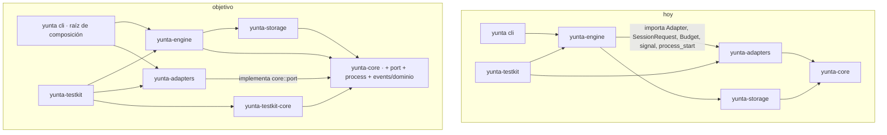
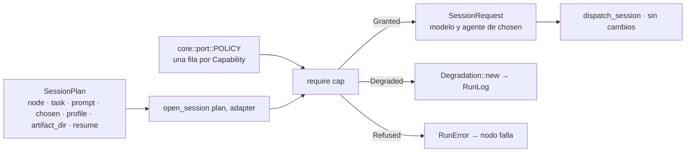
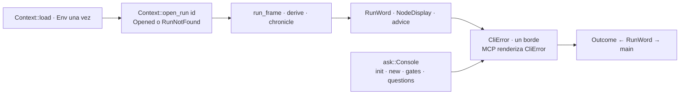
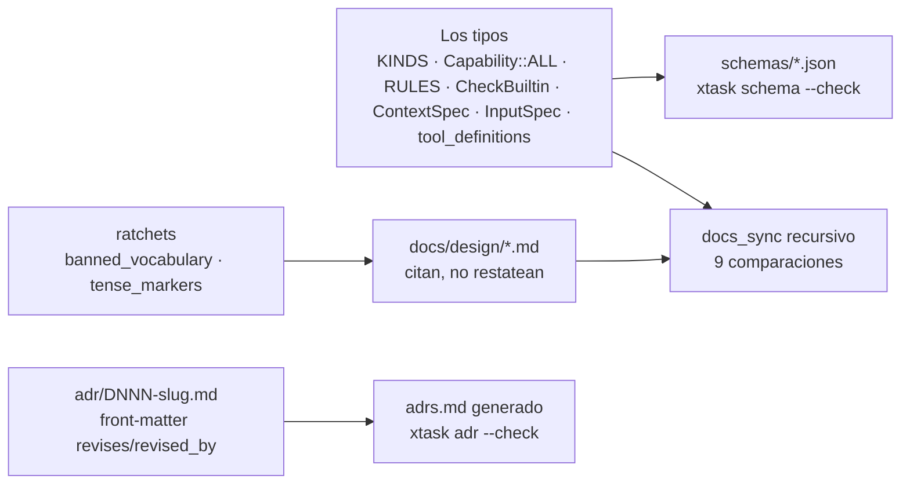

# Plan de raíz

El plan vigente de corrección arquitectónica de Yunta. Es la especificación de
todo el trabajo que sigue en la rama `feature/improve-ux`: cada ítem se
implementa tal como está escrito acá, con los nombres, los archivos y los tests
que acá se nombran. Lo que este documento no dice, no se inventa: se levanta
(§0) y decide un humano.

Fuente: ocho auditorías independientes sobre `80abe93` —eventos, engine,
artifacts, CLI, adapters, core, tests, documentación— con 198 defectos citados
por archivo y línea, reducidos a doce vicios y treinta y un mecanismos.

## Qué hay en este directorio

| archivo | qué es | quién lo lee |
|---|---|---|
| [`README.md`](README.md) (este) | el plan: régimen, diagnóstico, vicios, arquitectura, flujos, decisiones, fases, tablero, levantamientos, índice | todos, entero, antes de tocar nada |
| [`mecanismos.md`](mecanismos.md) | los 31 mecanismos con firmas exactas, archivos que tocan (nuevo · modifica · borra), tests y defectos que cierran | quien implementa un ítem, la sección del mecanismo que el ítem nombra |
| [`cronica.md`](cronica.md) | M19 completo: tipos, tabla kind→momento→kept, palabras, disposiciones, pase del pintor, archivos, tests, ADR D164 | quien implementa 5-05 |
| [`cerco.md`](cerco.md) | M25 completo: vocabulario, tipos, juez, codec, `yunta fence`, engine, adapters builtin, la muestra del mercado, archivos, tests, ADR D172 | quien implementa 3-08 |
| [`preguntas.md`](preguntas.md) | M26 completo: la regla en el tipo, el par `questions_asked`/`questions_answered`, el cierre y la ronda, las superficies, el corte del pack, archivos, tests, W-11, ADR D173 | quien implementa W-11 o un ítem que M26 nombra |
| [`artefactos/yunta-de-raiz.html`](artefactos/yunta-de-raiz.html), [`artefactos/cronica-del-run.html`](artefactos/cronica-del-run.html) | las dos propuestas tal como fueron aprobadas, con sus diagramas; el README y `mecanismos.md` son su forma normativa | quien quiera la versión legible |
| [`auditoria/01-eventos.md`](auditoria/01-eventos.md) … [`08-docs.md`](auditoria/08-docs.md) | las ocho auditorías, textuales, con toda la evidencia archivo:línea; están en inglés porque son evidencia y se conservan como se produjeron | quien implementa un ítem, la auditoría de su frente, para no re-auditar ni adivinar |
| [`auditoria/09-mercado-de-clis.md`](auditoria/09-mercado-de-clis.md) | los ocho CLIs relevados para el cerco (Gemini, Copilot, Cursor, OpenCode, Aider, Goose, Amp, Kimi), textuales, con URLs y lo no verificado marcado | quien implementa 3-08 o un adapter nuevo |

Ningún ítem se empieza sin haber leído este README entero, el mecanismo que el
ítem nombra en `mecanismos.md`, y la auditoría del frente. Lo que esos tres no
dicen, no existe: se levanta.

---

## 0. Régimen de ejecución

Estas reglas rigen para todo agente o persona que implemente un ítem de este
plan. No admiten interpretación.

1. **El plan es la spec.** Un ítem se implementa con los nombres de tipos,
   funciones, módulos, archivos y tests que el plan nombra. No se renombra, no
   se reubica, no se "mejora" el nombre. Si el plan dice `Escalation::new`, el
   constructor se llama `Escalation::new`.
2. **Lo que el plan no dice, se levanta.** Un agente que encuentra una
   contradicción, una imposibilidad, un diseño mejor, una dependencia oculta o
   un alcance mayor **se detiene**, escribe el levantamiento en §11 con
   evidencia (archivo:línea), alternativas y recomendación, y espera. No
   improvisa una solución "mientras tanto". No implementa una parte y deja una
   nota. No decide solo.
3. **Nada fuera del ítem.** Un PR cierra ítems del tablero (§10) y nada más.
   No se agregan mecanismos, tipos, archivos, dependencias ni flags que el plan
   no nombre. No se aprovecha "ya que estoy". Un refactor adyacente que el
   ítem no exige es drift.
4. **Las decisiones P1–P10 son bloqueantes.** Un ítem marcado como dependiente
   de una decisión no registrada en `adrs.md` no se empieza. Un agente no toma
   una decisión P por defecto, ni "provisoriamente".
5. **Lo marcado "se conserva" no se toca.** `RunLog`, el observer, `RunFrame`,
   `Failure`, `reserved::offer`, `FindingLedger`, `ArtifactLedger`,
   `GateResolvedPayload`, `string_id!`, `shape::read`, `spawn_governed`,
   `Delivery::choose`, `Curtain`, `Folded`, `render::state`, `advice`,
   `Layout`, `wait.rs`, `Terminal`, la nomenclatura de tests. Un mecanismo
   nuevo los generaliza; nunca los reimplementa ni los reemplaza.
6. **Cada ítem cierra con el gate completo ejecutado**, en este orden, por
   quien implementa: `cargo fmt --all --check`, `cargo clippy --workspace
   --all-targets -- -D warnings`, `RUSTDOCFLAGS="-D warnings" cargo doc
   --workspace --no-deps`, `cargo run -p xtask -- schema --check`, `cargo run
   -p xtask -- smells --check`, `cargo run -p xtask -- adr --check`, `cargo
   deny check`, `cargo test --workspace`,
   `yunta check` sobre todo workflow del repo y los packs, `yunta test` en el
   repo y en cada pack, `cargo check -p <crate>` por crate. Un resultado no
   ejecutado no existe.
7. **Primero en rojo.** Cada ítem nombra su test. El test se escribe primero,
   corre, falla por la razón exacta del ítem, y recién entonces se escribe el
   código. Un ítem sin su test en rojo no se considera empezado.
8. **El texto queda en presente.** Ningún rustdoc, ayuda, mensaje ni comentario
   del diff nombra este plan, una fase, un ítem, lo que había antes ni lo que
   vendrá. Este archivo es el único lugar del repo que planifica.
9. **El tablero se actualiza en el mismo PR.** Un ítem cerrado va en su
   commit y el tablero lo sigue en otro commit del mismo PR, citando el hash
   verdadero del que lo cierra —un commit no puede llevar su propio hash. Un
   ítem levantado cambia a `levantado` y apunta a §11 en el mismo commit.
10. **Prohibiciones que el ratchet mide** (§7, M22) y que un PR no puede subir:
    `_ =>` en un `apply` de ledger; un `format!` que construya `reason`,
    `summary`, `cause` o `policy_applied`; un `SessionRequest { … }` literal
    fuera de `open_session`; `Command::new("git")` fuera de `git.rs` y
    `repo.rs`; `std::fs` dentro de `async fn`; `SystemClock` o `Utc::now`
    fuera de `clock.rs` y `main.rs`; `std::env` fuera del boundary de `Env`;
    `execute_run(RunEnv` fuera del testkit; `fn event(` fuera del testkit;
    `sleep` en tests; vocabulario prohibido (tabla de CLAUDE.md); marcadores
    de tiempo o plan en texto (`for now`, `yet`, `today`, `the old`, `will`,
    `future`, `not yet`).
11. **Vocabulario.** La tabla de CLAUDE.md rige. `ledger` solo nombra un
    pliegue del log. El documento de tareas es `tasks`.
12. **Orden.** Los ítems de un PR respetan las dependencias de §10. Una fase
    no empieza hasta que la anterior de la que depende está cerrada.
13. **Leer antes de tocar.** README entero, el mecanismo del ítem en
    `mecanismos.md`, la auditoría del frente en `auditoria/`. Un agente que no
    puede citar la línea de la auditoría que motiva el ítem no lo empezó.
14. **Un ítem, un PR** (o una serie corta que el tablero enumera). El título
    del PR nombra el ítem (`W-03`, `2-01`); la descripción lista los defectos
    del índice que cierra por id y pega la salida del gate.
15. **Lo que deja de usarse se borra; lo que falta terminar se termina.**
    Sin uso no prueba que sobre. Antes de borrar algo hay que decir en cuál
    de estos tres cae, y sólo el primero se borra:
    - **Reemplazado**: otro mecanismo ocupó su lugar y nadie puede volver a
      consumirlo. Se borra en el mismo commit que lo dejó sin uso — el tipo,
      la función, la constante, el campo, el archivo, el test y el párrafo
      que lo describía. Un envoltorio que sólo delega y un alias "por
      compatibilidad" caen acá.
    - **Inconcluso**: está construido y todavía no conectado, y el sistema
      lo necesita conectado. No se borra: se termina en el ítem que lo
      nombra, o se levanta en §11 si ningún ítem lo nombra. Borrarlo
      esconde trabajo que falta.
    - **Planificado**: su consumidor llega en una fase que el plan nombra
      (§7, §10, `mecanismos.md`). No se toca hasta esa fase, y el plan es
      la prueba de que tiene destino.

    Lo que además se conserva a propósito lo dice §8 o una decisión
    registrada. Un barrido que no clasifica antes de borrar no es limpieza:
    es pérdida.

### Cómo se cierra un ítem

- [ ] Leídos README, mecanismo y auditoría del frente; citada la evidencia.
- [ ] Toda decisión P de la que depende está registrada como ADR.
- [ ] El test nombrado por el ítem existe, corrió y falló por la razón del ítem.
- [ ] El código usa los nombres del plan; no hay tipo, archivo, mecanismo ni
      dependencia que el plan no nombre.
- [ ] Nada marcado "se conserva" fue reimplementado ni reemplazado.
- [ ] Ningún texto del diff nombra el plan, una fase, un ítem, lo que había o
      lo que vendrá.
- [ ] Gate completo (§0.6) ejecutado, con salida en el PR.
- [ ] `xtask/smells.baseline` regenerado por medición; ningún contador subió.
- [ ] Tablero (§10) actualizado en el mismo commit, con el hash.
- [ ] Índice (§12): los defectos que este ítem cierra siguen apuntando a él.

---

## 1. Diagnóstico

| medida | valor |
|---|---|
| lugares donde se declara un kind de evento | 9 en el workspace + 2 docs; el compilador defiende 3 |
| literales de `GateWaitingPayload` sin constructor | 7, en 4 módulos |
| módulos que pliegan el ciclo de vida de un nodo | 19 |
| replays completos del log por iteración del scheduler | ≥ 3 (y ≥ 2 lecturas de storage) |
| subprocesos git con process group, registro o cancelación | 0 |
| capacidades declaradas que el engine nunca consulta | 3 (`edit_hooks`, `usage_reporting`, `permission_profiles`) |
| copias de "buscar el run dir" en el CLI / redacciones de "no run" | 6 / 10 |
| `execute_run(RunEnv{…})` a mano en tests / en el testkit | 46 / 1 |
| divergencias documentación↔código | 44; `docs/design/` no está atado por ningún test |
| tags publicados | 0 — por D141, reestructurar payloads hoy no cuesta ningún `_v2` |

Lo que está bien y se conserva (regla 5 de §0): el engine tiene cero
conocimiento de CLIs concretos; `RunLog` es una costura única con el observer
colgado; `Failure` y `reserved::offer` son hechos tipados con constructor
único; `FindingLedger` y `ArtifactLedger` son pliegues únicos; `GateResolvedPayload`
separa forma Rust de forma wire; `string_id!` valida todo id; `shape::read`
fusiona parsear y chequear; `spawn_governed` es el modelo de propiedad;
`Delivery::choose`, `Curtain`, `Folded`, `render::state`, `advice`, `Layout`
en el CLI; `wait.rs` y `Terminal` en el testkit; la calidad de los ADRs.

---

## 2. Los doce vicios y los treinta y dos mecanismos

| vicio | síntoma principal | mecanismos |
|---|---|---|
| V1 un hecho se construye en muchos lugares | `GateWaiting` ×7, `capability_degraded` ×8, `SessionRequest` ×2 divergentes, lo escribible ×4 | M03 M08 M25 |
| V2 una pregunta se responde en muchos lugares | `last_external_ref` ×2, attempt ×6, dedup ×2, run dir ×6, `RunPhase`→palabras ×5, el baseline por run, los nodos de un run por superficie, dos servidores con un nombre, lo que una unidad de trabajo cambió por dos caminos | M04 M15 M16 M28 M30 M31 M32 |
| V3 el catch-all silencioso | `replay::apply` `_ => Ok(())`, `phase.rs` `_ => Created`, `Waiting` derivado de cualquier `node_failed` | M05 M26 |
| V4 la declaración dispersa | un kind = 9+2 lugares | M02 |
| V5 prosa congelada en el log, texto en la capa equivocada | `run_paused.reason`, `{:?}` al usuario ×9, MCP re-bordea ×17, una sesión que muere sin exit ni stderr | M06 M17 M31 |
| V6 la disciplina que el tipo no impone | globs `String`, `Legacy` fresco, nombre de artifact que escapa, versión no leída, un nodo que pregunta y debe otra cosa | M12 M13 M14 M26 |
| V7 la capacidad declarada y no consultada | 3 capacidades sin consulta, 5 comportamientos prometidos-no-construidos, la memoización de D61, el corto-circuito de D62, la disjunción que `check` exige y el runtime nunca cobra | M09 M24 M25 M28 M29 M32 |
| V8 la cáscara que no gobierna | git sin grupo, 15 `std::fs` en async, 3 `SystemClock`, `target_digest` crudo, `Supervision::none` ×8, la pareja sincrónica de git | M10 M11 M27 |
| V9 el puerto del lado equivocado | el engine importa su interfaz desde `yunta-adapters` | M01 |
| V10 los caminos duplicados | `yunta test` sin `check`, `mcp::tool_resolve_gate`, 8 `Bench` sombra, la ronda de preguntas cierra sin `close_node`, `status` y la vista viva listan nodos por dos caminos, una tarea y un nodo se auditan por dos | M18 M19 M20 M26 M30 M32 |
| V11 la documentación sin atar | `docs/design/` invisible a `docs_sync`; la config de referencia no parsea; D147 `revised` sin revisor | M23 M29 |
| V12 el ratchet que mide el síntoma | `copied_test_helpers 0` falso; propiedad de resume tautológica | M21 M22 |

### Los mecanismos

- **M01 · Puerto en core.** `yunta_core::port` define `Adapter`, `AgentSession`,
  `SessionRequest`, `RunToolsEndpoint`, `Budget`, `PermissionProfile`,
  `ProbeReport`, `AgentEvent`, `AdapterError`. `yunta_core::process` recibe
  `subprocess.rs`, `signal.rs`, `process_start.rs`. `yunta-adapters` implementa
  el puerto y no lo exporta. El engine depende de core y storage únicamente.
  `MockFixture::parse(yaml, &RunPaths)` en `adapters/src/mock/fixture.rs`.
  `yunta-testkit-core` (solo depende de core) + `yunta-testkit`. Test de
  frontera `crates/engine/tests/no_adapter_crate_in_engine.rs`. El registro de
  adapters concretos en el CLI se deriva de `adapters.keys()`, no de prosa.
- **M02 · Kind declarado en su dominio.** `core/src/events/{run,node,session,
  tasks,scope,findings,artifacts,gates,children}/` con `kinds.rs`,
  `payloads.rs`, `ledger.rs`, `happening.rs`. `EventPayload` de 9 brazos
  (`Run(RunEvent)`, `Node(NodeEvent)`, …). `wire.rs`: `EventPayloadWire` plano
  por `#[serde(from/into)]`; `KINDS` concatenado de los dominios; `JsonSchema`
  a mano que emite el mismo `oneOf` de 36 ramas en el mismo orden.
  `events.json` no cambia un byte (`xtask schema --check` lo guarda).
  `kind_name`, `all_kinds()` y los "36" se derivan de `KINDS`. Versión por
  dominio.
- **M03 · Constructor por hecho.** Un constructor público por kind, en su
  dominio, que fija el invariante: `RunPaused::new(PauseReason)`,
  `RunResumed::new(OnInterrupt)`, `RunFinished::closed(terminal, &RunState)`,
  `NodeStarted::attempt(n)`, `NodeFinished::new(outcome, tokens)`,
  `NodeRerouted::new(to, RerouteCause(Failure), origin)`,
  `Degradation::new(Capability, AdapterId, Policy)`,
  `TaskStatusChanged::to(task, status, caused_by)` / `::done(task, caused_by,
  commit)`, `Escalation::new(summary, Evidence, NonEmpty<GateOption>)`,
  `QuestionsAnswered::via(Channel, Responder)`, `ChildClosed::new(run,
  terminal, tokens)`, `ArtifactAccepted::new(id, hash, RecordedOrigin)`.
  `artifact_written` sin constructor y `#[doc(hidden)]`. `RunCtx::engine_finding`
  es el único autor de findings del engine.
- **M04 · Un ledger por dominio.** `TaskLedger`, `GateLedger`, `NodeLedger`
  (dueño de las sesiones, D175), `ChildLedger`, `DegradationLedger`, `RunLedger` junto a
  `FindingLedger`, `ArtifactLedger`, `GrantLedger`. `RunState` los sostiene a
  todos en un pase O(e). `NodeHistory`, `last_external_ref` ×2, los 6 conteos
  de attempt, las 5 lecturas de tasks, `RunArtifacts::of` ×4, los scans de
  hijos ×5 desaparecen. `blackboard.rs` consume
  `FindingLedger::effective_of`. Una sola regla de dedup (`dedup_findings`),
  consumida por `inherited_findings`. `FindingLedger::effective` se llama una
  vez al final de `derive`, no por evento.
- **M05 · Replay sin comodín.** `derive` despacha por dominio; cada
  `<dominio>::apply` es exhaustivo. Lo que no mueve estado se declara
  `Audit` por nombre en su `kinds.rs`. `phase.rs` lee `RunLedger`.
- **M06 · Hechos tipados, prosa en el borde.** `PauseReason { Escalation,
  Cancelled, BudgetExhausted{spent,cap}, ExternalGate(Url),
  UncertainOrphans(Vec<NodeId>), NodeFailed{node,failure} }`, `Policy` enum,
  `RerouteCause(Failure)`, `Capability::as_str` en vez de `{:?}`;
  `RunError::Git(#[source] GitError)`; parsers de adapters como
  `#[serde(tag = "type")]` con `#[serde(other)] Unknown` y `Option<u64>` para
  conteos ausentes; `AgentError` con causa; `Diagnostic` en vez de
  `Vec<String>` en `questions::validate_answers` y
  `permission_layer_conflicts`.
- **M07 · decide/execute separados.** `schedule::next_step` en `gate_step`,
  `waiting_step`, `orphan_step`, `failure_step`, `ready_batch` compuestas por
  `decide(&Workflow, &RunState, &Policy)`. `parallel_exec` llama
  `schedule::resume_policies`. `GateStep::Waiting(PauseReason)`: `steps`
  registra `run_paused`, el gate nunca. `RunFinished::closed` único en
  `finish(terminal)`. `current_escalation` sin segundo `next_step`;
  `current_mode_name` es `run_mode()`.
- **M08 · SessionPlan único.** `SessionPlan { node, task: Option<TaskId>,
  prompt, chosen: RunnerCandidate, profile, artifact_dir, resume:
  Option<SessionId> }`; `open_session(plan, adapter) -> (SessionRequest,
  Vec<Degradation>)` en `engine/src/run/session_plan.rs`, único lugar que
  construye un `SessionRequest`, y con él la cerca de la sesión (M25).
  `prompt_exec` y `attempt.rs` lo llaman. `TypedArtifactNeedsRunTools` rige
  en ambos.
- **M09 · Capacidad→política como tabla.** `core::port::POLICY:
  [(Capability, Absence)]` con `Absence { Resting, FailAtCheck, FailNode,
  DegradeWith(Policy) }`, una fila por variante (test que recorre
  `Capability::ALL`). `require(adapter, capability, ctx) -> Decision` en el
  engine, único consumidor. `check(workflow, config, &Adapters)`. Test
  `every_capability_round_trips_through_a_fixture` para el twin
  `FixtureCapabilities`.
- **M10 · Una cáscara.** `git.rs` por `spawn_governed`; `tokio::fs` en
  `node_close`, `distill`, `context_resolve/{sources,knowledge}`,
  `workflow_exec`, `lock.rs`, `worktree`, `criteria.rs`, `process_registry`,
  `claude_code/mod.rs`, `mock/mod.rs`; `Clock` inyectado en `worktree/mod.rs`
  (3 sitios); `SecretSource` en `RunEnv` consumido por `secrets_env` y
  `context_resolve/mcp.rs`; `Env` leído una vez en `main`; `JoinHandle`
  conservado en `MockSession`; `#[instrument(fields(run_id, node_id))]` en
  `publish_gate`, `poll_gate`, `resolve_internal_gate`, `execute_ask`;
  `tokio::spawn(fut.instrument(Span::current()))` en readers y players;
  `ctx.adapters.get(&id).ok_or(RunError::AdapterMissing)`;
  `ContentHash::short()`; toda falla de `process_registry`, `interrupt`/`kill`,
  `encode_ref`, `git::success` es un `engine_finding`; `read_registry`
  distingue corrupto de ausente.
- **M11 · Secreto.** `ToolTarget { display: Option<String>, digest:
  ContentHash }` con `display` solo para paths relativos al worktree, nunca
  `command`/`url`; pase de redacción en `RunLog::record` contra el
  `SecretSource`; `scratch/mcp.json` se borra con el registro; comparación de
  bearer en tiempo constante sobre `Secret`.
- **M12 · Parsear es validar, extendido.** `ScopeGlob`, `SchemaRange`,
  `ArtifactName` + `ReservedIdentity`, `TemplateVar` (enum; `{{runner.role}}`
  → `{{runner.name}}`), `CommitSha` en `PackProvenance`/`PackLockEntry`,
  `DateTime<Utc>` en `EngineProcessFile.started_at`, `WorkflowName`,
  `SkillName`, `InputName`, `McpServerName`, `RecordedOrigin` →
  `ArtifactOrigin`, `ArtifactKind::Answers`, `Location { root, path, range }` (D175),
  `Vec<QuestionId>`, `DiagnosticCode` (una enum), `StagedHash` distinto del
  hash del store, `ArtifactRefId` con `deny_unknown_fields` por variante,
  `Answer`/`AnswersFile` estrictos, `ScopeExpansionPermissions` exportado.
- **M13 · Puertas únicas en core.** `workflow::read(bytes, path) ->
  Result<Workflow, Report>` con las reglas de `engine/src/check/` en el mismo
  `Report`; `Document` para `FindingEntry` y `Withdrawal`; `text::counted(n,
  noun)`; `Answerer { Log, Staging }`; `RunTool` enum con `name()`,
  `describe()`, `schema()` y dispatch exhaustivo; `run_dir::{manifest_path,
  progress_path, sessions_root, task_worktrees}`; `steps.rs:256` por
  `canonical::derive_findings`.
- **M14 · PersistedDoc<T>.** `schema_version` escrito **y leído**, balde
  `unknown` que aflora, en `manifest.yaml`, `yunta.lock`,
  `scratch/engine.json`, el lock de aislamiento, `receipt.json`. `Manifest`
  embebe formas persistidas tolerantes, no `Workflow`/`ConfigLayer`
  estrictos. `manifest.rs:151` reporta un `pack.yaml` ilegible.
- **M15 · Context::open_run.** `Opened { run_id, run_dir, manifest:
  PersistedDoc<Manifest>, events, project }`; `CliError::RunNotFound { id,
  roots }` con una sola oración. La usan `status`, `stats`, `receipt`,
  `verify`, `cancel`, `gc`, `graph`, `resume`, `resolve-gate`, `list --runs`,
  `drive::settle`, los 4 tools MCP y `collect_history` (que deja de tener dos
  copias).
- **M16 · Un vocabulario.** `render::state::RunWord` para el estado de un run;
  `progress::summary`, `Closing::verdict`, `Standing::heading`,
  `RunJson.outcome`, `demand_line` lo consumen; `--json` emite el mismo token
  que el texto. `Outcome` deriva de `RunWord` en un solo lugar. `RunDocument`
  versionado para run/resume/status; `receipt.json` con `schema_version`.
  `width::` en `ask/menu.rs` y `schema.rs`. `stats.rs` renderiza a `String`.
- **M17 · Un borde de texto.** `CliError` con brazos tipados; `Message(String)`
  solo para lo único; `mcp.rs` devuelve `Result<T, CliError>` y un adaptador lo
  vuelve tool result; `promote.rs` y `test.rs` tipados; `init`/`new` preguntan
  por `ask::Console`; warnings de `Console::open` por `Diagnostics`.
- **M18 · Un camino de ejecución.** `test::run_case` y `promote` entran por
  `runnable` + `drive` con `ctx.clock` y `ctx.ids`; `mcp::tool_resolve_gate`
  es `resolve_gate` con otro medio; `graph` abre storage por `ctx.storage()`;
  `check_or_refuse(&Path)`.
- **M19 · Crónica derivada.** `engine/src/view/chronicle.rs`: `Moment { seq,
  at, elapsed, node, happening }`, `Happening` de 9 brazos por dominio (cada
  dominio implementa `From<&XEvent> for x::Happening`), `chronicle(events) ->
  Vec<Moment>` pura, uno por evento, monótona. `cli/src/surface/chronicle.rs`:
  `Said`, `say`, `kept`, `graduation`. `Lines::moment`, `Region::record`.
  Desaparecen `Scrollback::{gone,leaving,restart}`, `Region::restart`,
  `view::{graduation,settled_nodes,working_nodes}`, `lines::{detail,
  resolution,counted_problems}`. `Painter` recibe `glyphs`. `Layout::aside` →
  `Layout::advice`. Tests: `every_event_is_one_moment`,
  `the_chronicle_of_a_prefix_is_a_prefix_of_the_chronicle`,
  `the_frame_agrees_with_the_chronicle`,
  `a_settled_node_carries_how_long_it_worked_and_the_children_it_bore`,
  `a_node_that_settles_twice_is_two_moments`,
  `what_a_watched_terminal_keeps_above_its_region_is_what_the_append_only_surface_writes`,
  `a_run_read_back_from_a_pipe_says_what_a_watched_terminal_kept`.
- **M20 · Un arnés por capa.** `testkit_core::Log::for_run(id).at(t).node(n,
  p).after(s).event(p).build()`; un `Bench` con `run_sabotaged`, `wake`,
  `wake_with(forge)`, `with_clock`, `with_ids`, `findings_by`, `group_output`,
  `commit_subjects`; `hermetic(cmd, dir, home)` compartido por `run_yunta` y
  `Terminal::open` (fija `YUNTA_HOME`, `YUNTA_ORG_CONFIG` a un archivo vacío,
  `HOME`, `USER`, `TERM`, quita `NO_COLOR`); `Checkout::without_yunta_home()`;
  `common/mod.rs` reducido a literales; `testkit::adapter` con `request`,
  `drain`, `write_lines`, `child_pid_fifo`, `grandchild_pid` y el test de
  secretos parametrizado; `SourceLog::record` con clock inyectado;
  `SeqIdSource` por bench; `wait.rs` cede con `sleep(1ms)`.
- **M21 · Cuatro propiedades.** Generador sobre los 36 kinds + `Unknown`
  (comparte la lista con `all_kinds()`): replay (se conserva), resume real
  (prefijo → camino de resume → estado final igual), idempotencia
  (re-entrega de subsecuencia; re-corrida tras crash = un `node_finished` por
  attempt), cadena (todo append verifica; toda mutación de un byte falla).
- **M22 · Ratchet que mide la regla.** Contadores nuevos en `xtask smells`,
  sobre `src` y `tests`: `execute_run_outside_testkit`,
  `git_command_outside_git_rs`, `system_clock_in_tests`, `sleep_in_tests`,
  `env_set_in_tests`, `event_builder_outside_testkit`,
  `bench_struct_outside_testkit`, `banned_vocabulary`, `tense_markers`,
  `test_files_over_500_lines`, `test_fns_over_50_lines`; `[workspace.lints]`
  en `Cargo.toml` con el bloque de deny (5 copias → 1); `release.yml` reusa
  `ci` por `workflow_call`; job macOS `cargo test --workspace`; `for p in
  packs/*/`; `concurrency` + `timeout-minutes`; `cargo test --release` una
  vez; CONTRIBUTING lista `smells --check`.
- **M23 · Docs atados.** `docs_sync.rs` recursivo sobre `docs/design/`: todo
  YAML parsea y chequea; Contrato §3 ≡ `KINDS`; spec-events §5.x ≡ structs;
  spec-adapter caps ≡ `Capability::ALL`, tabla de degradación completa, §6 ≡
  `capabilities()` por adapter; spec-ledger §3 ≡ `RULES`; Contrato §6.4 ≡
  `tool_definitions()` + catálogo; §7.1/§9/§2.3 ≡ variantes.
  `docs/design/adr/DNNN-slug.md` con front-matter `number, title, status,
  revises, revised_by`; `adrs.md` generado por `cargo xtask adr --check`
  (huecos, citas, recíprocos). Pase que deshace la corrupción del corpus
  (`\{\{`, `\[`, `\|`, fences `javascript`, autolinks `http://x.md`, fence sin
  cerrar en `contrato:19`). Correcciones que los tests exigen (§9). Glosario:
  `frame`, `standing`, `escalation`, `tradeoff`, `demand line`,
  `crónica`/`momento`, `puerto`. `spec-ledger.md` → `spec-tasks.md`.
- **M24 · Build-or-register.** Cada comportamiento prometido por la
  documentación y no construido se construye, o se retira con entrada `A-NN`
  en `deuda-consciente.md` y nota `Revisada` en el ADR que lo describía.
  Nunca un comentario que explique el atajo.
- **M25 · El cerco.** `yunta_core::fence::Fence { allowed: Vec<ScopeGlob>,
  roots: Vec<PathBuf> }` con `judge(worktree, target) -> Verdict`, el único
  juez de lo que una sesión escribe; `Capabilities::fence: FenceLevel { None,
  ToolCalls, Filesystem }` reemplaza `edit_hooks`; `Coverage { Exact,
  WidenedToRoots, ToolsOnly }` en `agent_session_opened`, el canal más
  débil; kind `write_refused { session_id, target }`; `FenceHook` lo arma el
  CLI y `yunta fence <adapter>` es el hook, cada adapter escribe solo el
  `FenceCodec`; las raíces salen de `fence.roots`; el cerco vive en
  `scratch_dir`, nunca bajo `cwd`; `read_only` = `allowed` vacío con raíces;
  una escritura que llega al diff bajo `Exact` es `engine_finding`.
  `edit_constraints`, `Glob`, `blocked:<path>` se borran. Especificación
  completa y la muestra de ocho CLIs del mercado: `cerco.md`.
- **M26 · Un nodo que pregunta, pregunta.** `Node::asks`; un nodo que declara
  `questions` no declara otro artifact, es `kind: prompt` y no vive en un
  `parallel` (`check` lo rechaza nombrando el corte); el hecho de preguntar es
  el kind `questions_asked` (`questions_hash`, `questions`, `tokens_used`),
  par de `questions_answered`, y el nodo espera entre los dos como un gate
  interno, sin segundo `node_started`; `close_node` lo registra y devuelve
  `NodeEnd::Asked`; `finish_node` es el único emisor de `node_finished`;
  `engine::answers::record` la única puerta de una respuesta, para la consola
  y para la tool MCP `answer_questions`; `FinishAnswered` termina un nodo
  respondido sin sesión; `node_failed` es siempre `Failed`; `interactive` se
  retira del nodo, del trait y del schema; `PauseReason::{Questions,
  AnswersRefused}`; un `questions` vacío deja respuestas vacías `Derived`.
  Especificación completa: `preguntas.md`.
- **M27 · La cáscara nace con el proceso.** `Supervision` sin `Option` en
  token y reloj, `Supervision::outside_any_run`; `create_run`,
  `build_manifest` y `RunEnv` la exigen, con un solo reloj; `Interrupt`
  en dos etapas (D181), inyectado en `Context`, y `Context::supervision()`
  / `teardown()` la bajan a todo spawn del CLI; `RunError::Cancelled` en
  toda puerta que spawnea; `AttemptEnv` y `PromotionEnv` con un dueño; `Supervision::none` y la pareja sincrónica de git se
  borran; `Owner` en el testkit. Fase 8.
- **M28 · Un baseline por linaje.** `RunEvent::BaselineCaptured` plegado
  por `RunLedger`; la raíz mide en su primer despertar por
  `Decision::MeasureBaseline` y `steps::measure_baseline`; todo run que
  nace de otro nace teniendo la medición (`CreateRunParams.baseline`,
  `BaselineOrigin::Inherited { run }`); `RunLedger::woken` reconoce el
  primer despertar; `baseline_compare` reutiliza por `Memo`; `yunta check`
  avisa (`BaselineNeverCompared`); D176. Fase 8.
- **M29 · Una decisión dice lo que el código hace.** `Status` con sus
  revisores adentro, que `Decision::parse` no deja disentir; `Surprise` y
  `surprises(task, runs)` como veredicto puro del pre-check, tipado hasta
  `TaskOutcome::Blocked`; D177 (D62, D59), D178 (D147); Contrato
  §5.2/§5.4. Fase 8.
- **M30 · Una superficie, un frame.** `NodeState::Waiting { on: NodeWait }`,
  `text::{listed, asked_questions}`, una oración; `status`, `--json` y
  `graph --run` listan el frame del manifest congelado, los hijos bajo su
  grupo; `nodes` como lista bajo `schema_version: 5`; `graph` con una sola
  fuente; un `parallel` no anida otro; D179. Fase 8.
- **M31 · Una sesión que muere dice por qué.** `SERVER_NAME = "yunta-run"`,
  `AgentSession::exit` que mata antes de recoger, `SessionEnd` cerrado,
  el stderr redactado, `Failure::SessionDied` por los dos caminos que
  abren sesiones, `doctor --session` por binding, los stubs en
  `testkit-core`; D180. Fase 8.
- **M32 · Una unidad de trabajo, un árbol.** El punto de partida de una
  auditoría es un hecho del log (`node_started.from_tree`), no el estado
  ambiente del disco; `scope_check` se parte en cáscara (`capture_tree`,
  `changed_since`) y núcleo puro (`violations`); el aterrizaje sale de
  `loop_exec` y se generaliza (`worktree::{open_unit, land}`); donde dos
  unidades corren a la vez cada una tiene su árbol, con lo que la
  disjunción que `check` ya exige pasa a ser lo que la hace sin
  conflicto; `isolation:` en el nodo, con una sola palabra; D182, P11.
  Fase 9.

---

## 3. Arquitectura objetivo

```
RunState  ← derive(events)                        // un pase, un dueño por lectura
Decision  ← decide(&Workflow, &RunState, &Policy)  // pura, total, no toca el log
Effects   ← execute(Decision, &mut Shell)          // solo I/O; produce hechos
Fact      ← <dominio>::Constructor(...)            // uno por kind
seq       ← RunLog::record(fact)                   // una costura, observer colgado
                    ↓
        run_frame(&RunState)  chronicle(events)     // dos derivaciones, un vocabulario
                    ↓
        Region · Scrollback · Lines · Closing · status · --json · MCP   // disposiciones
```

### Diagrama

```mermaid
flowchart LR
  subgraph storage
    L[(Event log<br/>wire plano · hash chain)]
  end
  subgraph core/events · por dominio
    LD[Ledgers<br/>Run Node Session Tasks Grant<br/>Finding Artifact Gate Child Degradation]
    RS[RunState<br/>= todos los ledgers, un pase O e]
  end
  subgraph engine · puro
    D[decide<br/>gate · waiting · orphan · failure · ready_batch]
    RF[run_frame<br/>estado en un instante]
    CH[chronicle<br/>qué pasó, en orden]
  end
  subgraph engine · cáscara
    EX[execute<br/>Shell: spawn_governed · tokio::fs · Clock/Env/Secrets inyectados]
    SP[SessionPlan → open_session → dispatch]
    RQ[require cap ← POLICY]
  end
  subgraph de vuelta al log
    CT[Constructores<br/>Escalation::new · Degradation::new · PauseReason …]
    RL[RunLog::record<br/>una costura, observer colgado]
  end
  L --> LD --> RS --> D --> EX --> CT --> RL --> L
  RS --> RF
  L --> CH
  EX --> SP --> RQ
  RL -.observer.-> RF
  RL -.observer.-> CH
  RF --> UI[Region · Closing · status · --json · MCP]
  CH --> UI2[Scrollback · Lines]
```

### Crates

```
yunta (cli)  → engine, adapters, core, storage        raíz de composición
yunta-engine → core, storage                          conoce el puerto, no el crate
yunta-adapters → core                                 implementa core::port
yunta-storage → core
yunta-core                                            + port + process + events/<dominio>
yunta-testkit-core → core                             FixedClock, Log, ids, Captured
yunta-testkit → core, storage, adapters, engine, cli  Bench, Checkout, Terminal
```



Test de frontera: `crates/engine/tests/no_adapter_crate_in_engine.rs`.

### Eventos: nueve dominios

| dominio | kinds | ledger |
|---|---|---|
| `run` | run_created run_paused run_resumed run_finished promotion_signaled baseline_captured (M28) | `RunLedger` |
| `node` | node_started node_finished node_failed node_rerouted hook_executed context_assembled criteria_checked scope_checked | `NodeLedger` |
| `session` | agent_session_opened agent_message capability_degraded write_refused (este último nace en 3-08, no en 2-01) | `NodeLedger` (el intento acota la sesión, D175), `DegradationLedger` |
| `tasks` | task_registered task_status_changed | `TaskLedger` |
| `scope` | scope_expansion_requested/granted/denied | `GrantLedger` (existe) |
| `findings` | finding_posted/updated/withdrawn/refused | `FindingLedger` (existe) |
| `artifacts` | artifact_accepted artifact_submitted artifact_written | `ArtifactLedger` (existe) |
| `gates` | gate_waiting gate_resolved questions_asked questions_answered (`questions_asked` nace en W-11) | `GateLedger` |
| `children` | child_run_created child_run_finished loop_iteration | `ChildLedger` |

Lo que un módulo de dominio es dueño de, y lo que se deriva:

```mermaid
flowchart LR
  subgraph core/events/findings/ · dueño de
    K[kinds.rs<br/>enum FindingEvent · KINDS · kind_name · schema_version · is_audit]
    P[payloads.rs<br/>structs + constructores]
    LG[ledger.rs<br/>FindingLedger::apply exhaustivo]
    H[happening.rs<br/>From&lt;&amp;FindingEvent&gt; for Happening]
  end
  subgraph core/events/ · derivado
    EP[EventPayload<br/>9 brazos]
    W[wire.rs<br/>EventPayloadWire plano · KINDS · JsonSchema]
  end
  subgraph ya no se escribe a mano
    D1[kind_name]
    D2[all_kinds]
    D3["36" = KINDS.len]
    D4[events.json]
    D5[lines::detail → chronicle::say]
  end
  K --> EP --> W --> D1 & D2 & D3 & D4
  H --> D5
```

Constructores por dominio, con el invariante que fijan: `mecanismos.md#m03`.

### Tipos: lo inválido, irrepresentable

| tipo nuevo | reemplaza | qué vuelve irrepresentable |
|---|---|---|
| `ScopeGlob` | `Node.scope`, `Task.scope`, `ScopeExpansion.within` (`Vec<String>`) | un glob inválido que pasa `check` y falla a mitad del run |
| `SchemaRange` | `Workflow.yunta_schema`, `PackManifest.yunta_schema` (`String`) | un rango que se parsea en el engine y no en el pack |
| `ArtifactName` + `ReservedIdentity` | `ArtifactSpec::Opaque(String)`, `ArtifactRefId::Name`, `MountArtifact.rename` | `..`, absoluto, o colisión con un nombre del engine; se re-valida después de renderizar |
| `TemplateVar` (enum) | `BTreeMap<String,String>` de `template_vars` | un input del usuario expandido donde un path no lo admite; `{{runner.role}}` → `{{runner.name}}` |
| `CommitSha` (existe) | `PackProvenance.commit`, `PackLockEntry.commit` | un commit que no es hex |
| `DateTime<Utc>` | `EngineProcessFile.started_at: String` | dos representaciones del instante en archivos hermanos |
| `WorkflowName` `SkillName` `InputName` `McpServerName` | `NodeKind::Workflow.use`, `Node.skills`, claves de `inputs`, `McpQueryParams.server` | una referencia que no puede resolver |
| `RecordedOrigin` → `ArtifactOrigin` | `ArtifactAcceptedPayload.origin` | `Legacy` en una aceptación fresca |
| `ArtifactKind::Answers` | `ANSWERS_SUFFIX` + `Opaque` | un documento que el engine escribe y se niega a leer |
| `Location { root, path, range }` (D175) | `FindingEntry.location: String`, `events::Finding.location: String`, `engine_finding(location: String)` | "path y rango opcional" solo por convención; un path absoluto del host en un artifact heredado; un finding del engine que la puerta no lee |
| `Vec<QuestionId>` | `pending_questions: Vec<String>` | un id y una violación en la misma lista |
| `DiagnosticCode` | `RuleCode` + literales de parse/file/artifact + `DiagnosticCount.code: String` | un código escrito a mano sin test que lo ate |
| `Answerer { Log, Staging }` | `answered_by_the_log` + su re-derivación | una tercera lectura de quién responde por un artifact |
| `RunTool` (enum) | literales en `catalog.rs` y `session.rs` | catálogo y dispatch que se olvidan uno del otro |
| `StagedHash` | `VerifiedArtifact.content_hash` con dos significados | un campo que es dos hashes |
| `PauseReason` `Policy` `RerouteCause` | `reason: String`, `policy_applied: String`, `cause: String` | prosa del engine congelada en el log |
| `PersistedDoc<T>` | archivos persistidos sin versión leída | un lector viejo que no marca lo que no entendió |
| `FenceLevel` | `Capabilities.edit_hooks: bool` | un sandbox y un hook dichos con la misma palabra |
| `Fence { allowed: Vec<ScopeGlob>, roots }` | `edit_constraints: Option<Vec<String>>` + `artifact_dir` como permiso | un glob inválido en una sesión; dos fuentes para lo escribible |
| `Coverage` en `agent_session_opened` | nada (la sesión no decía qué cercó) | una cobertura declarada y no construida |
| `questions_asked` (kind) + `Node::asks` + tres reglas de `check` | `node_failed { Message "asked N…" }` leído como espera; `produces: [questions, brief.md]`; `Node.interactive` | una espera deducida de un fallo; un nodo que pregunta y debe otra cosa; un flag que nadie lee |

### Sesiones y capacidades




`SessionPlan` → `open_session` → `require(cap)` por cada campo gobernado
(`fence`, `skills`, `agent`, `run_tools_endpoint`, `budget.max_turns`,
`network`) → `SessionRequest` + `Vec<Degradation>` → `dispatch_session`
(sin cambios). El cerco lo arma `Fence::for_session(profile, scope,
artifact_dir)` (M25, `cerco.md` §5).

`POLICY` (valores iniciales; una fila por variante):

| capacidad | ausencia |
|---|---|
| `resume_session` | `Resting` (sesión fresca; ya emite `capability_degraded`) |
| `fence` (`FenceLevel::None`) | `DegradeWith(PostCheckOnly)` una vez por run |
| `permission_profiles` | `FailAtCheck` cuando un nodo pide `read_only`/`edit` |
| `custom_agents` | `FailAtCheck` cuando un nodo declara `agent:` |
| `usage_reporting` | `DegradeWith(NoTokenBudget)` una vez por run |
| `skills` | `DegradeWith(NoSkills)` |
| `run_tools` | `FailNode` si el nodo declara artifact interpretado o blackboard; `DegradeWith(NoRunTools)` si no |
| `network_isolation` | `DegradeWith(NetworkOpen)` |

---

## 4. Prerequisitos: los bugs de comportamiento

Defectos que cambian lo que un run hace hoy. Los que tienen un fix propio que
es un subconjunto estricto de su mecanismo —código que la fase igual
escribiría, en el mismo lugar— son los **prerequisitos** del plan: fase W, cada
uno un ítem del tablero (W-01…W-11) con su test en rojo primero, antes de la
fase 0, para que un usuario de hoy corra. No son un plan aparte: cada fila
nombra el mecanismo del que es la primera parte, y el mecanismo la cuenta como
ya hecha. Los que no tienen fix propio van por fase o por decisión, y la fila
lo dice.

| # | bug | hoy | mecanismo | fix | test |
|---|---|---|---|---|---|
| W-01 | sesiones de `loop` en el modelo default | `task_cycle/attempt.rs:266-267` pasa `model: None, agent: None, artifact_dir: None`; `runner_resolved` registra otro modelo | M08 | `SessionSetup` gana `chosen: RunnerCandidate` y `artifact_dir: Option<PathBuf>`; `attempt.rs` copia `chosen.model`, `chosen.agent` y `artifact_dir` de ahí; `run_tools_allowed(ctx, node, adapter, id) -> Result<bool, RunToolsSetupError>` en `runner_resolve.rs` responde si el nodo puede montar las tools (y con eso rige `TypedArtifactNeedsRunTools`); `open_run_tools` y `prepare_loop` la consumen, y sólo `open_run_tools` abre un listener | `crates/engine/tests/run_concurrency.rs::a_task_session_runs_on_the_model_and_agent_the_runner_resolved`; `::a_loop_node_declaring_an_interpreted_artifact_is_refused_without_run_tools` |
| W-02 | nombre de artifact que escapa del run dir | `check/declarations.rs:133` valida el template sin renderizar; `node_exec.rs:348` renderiza `{{inputs.*}}`; `store.rs:147` une el nombre a un `PathBuf` | M12 | `core::workflow::ArtifactName::parse(&str) -> Result<Self, Problem>` (segmentos relativos, sin `..`, sin absoluto, no reservado por `ReservedIdentity`); `render_artifact_names` lo aplica **después** de renderizar y falla el nodo con `Failure::message` | `crates/engine/tests/artifacts.rs::a_rendered_artifact_name_that_leaves_the_run_dir_fails_the_node`; `crates/core/tests/artifacts.rs::an_artifact_name_with_a_parent_segment_is_refused` |
| W-03 | `target_digest` persiste comandos crudos | `claude_code/parse.rs:131-138`, `codex/parse.rs:109-138` guardan `command`/`url`/`file_path` literal | M11 | ambos parsers producen siempre `ContentHash::abbreviated()` del input; nada literal. Es el paso intermedio: M11 guarda el `ContentHash` entero y la abreviatura queda en el borde que lo muestra | `crates/adapters/tests/claude_code.rs::a_tool_use_never_persists_the_command_it_ran`; ídem en `codex.rs` |
| W-04 | blackboard muestra findings retirados | `run_tools/blackboard.rs:26-52,64-86` pliegan `finding_posted` a mano | M04 | `consolidate_blackboard` y `get_blackboard` leen `FindingLedger::of(events).effective()` filtrado por grupo; `findings::inherited_findings` llama `replay::dedup_findings` —una regla, la que colapsa espacios y mayúsculas— | `crates/engine/tests/blackboard.rs::a_withdrawn_finding_leaves_the_blackboard`; `::an_updated_finding_shows_its_last_content`; `crates/engine/tests/promotion.rs::inherited_findings_dedup_the_way_the_frame_counts_them` |
| W-05 | git sin process group ni cancelación | `git.rs:116,132,145,157,167` usan `Command::new("git")` directo | M10 | las tres funciones que un run llama (`output_bytes`, `output`, `success`) construyen `GovernedCommand` y llaman `spawn_governed` con el registro y el `CancellationToken` del run; la pareja sincrónica (`output_blocking`, `success_blocking`) corre fuera de todo run y pasa a async con `build_manifest` en 3-05 | `crates/engine/tests/process.rs::a_cancelled_run_kills_the_git_it_spawned` (git envuelto por un stub en `PATH` inyectado que espera un marcador) |
| W-06 | `parallel_exec` ignora `on_interrupt` | `parallel_exec.rs:39-47` reinicia siempre | M07 | `execute_parallel` llama `schedule::resume_policies` y honra `fail_if_uncertain`/`resume_session` | `crates/engine/tests/run_concurrency.rs::a_parallel_child_with_fail_if_uncertain_fails_instead_of_restarting` |
| W-07 | mock pierde el handle del player | `mock/mod.rs:234` `tokio::spawn` descartado; `MockSession` sin `Drop` | M10 | `MockSession { player: JoinHandle<()> }` + `impl Drop` que aborta | `crates/adapters/tests/mock.rs::a_dropped_session_stops_its_player` |
| W-08 | tests heredan `/etc/yunta/config.yaml` | `testkit/src/bin.rs:11-19` y `terminal.rs:81-88` no fijan `YUNTA_ORG_CONFIG` | M20 | `run_yunta` y `Terminal::open` fijan `YUNTA_ORG_CONFIG` a un archivo vacío bajo `home`, `USER=yunta-test`, `TERM` y quitan `NO_COLOR` — el núcleo de `hermetic()` | `crates/cli/tests/run_flow.rs::a_run_under_test_reads_no_org_config_from_the_host` |
| W-11 | un nodo con preguntas contestadas cierra debiendo lo que declaró además; el pack de referencia no corre de punta a punta | `replay.rs:242` deriva `Waiting` de cualquier `node_failed` tras un artifact `questions`; `questions_exec.rs:106-165` cierra sin `close_node` con `node_started` y `node_finished` propios; `packs/fragua`, el fixture canónico y `referencia-schema.md` declaran `[questions, brief.md]` con un prompt que espera un turno que D86 no da | M26 | `preguntas.md` §9: `Node::asks` y las tres reglas de `check`; `interactive` retirado; el kind `questions_asked` por F1; `Waiting` sólo desde `questions_asked` y `node_failed` siempre `Failed`; `close_node` registra `questions_asked`, `finish_node` único emisor, la ronda sin ciclo de nodo, `FinishAnswered`; el corte `grill`/`brief` en pack, fixture y referencia; D173 | `crates/engine/tests/run_questions_close.rs::a_node_failed_after_a_questions_artifact_derives_failed_not_waiting`; `crates/engine/tests/check.rs::a_node_that_asks_questions_declares_nothing_else` |
| — | tres capacidades nunca consultadas | AD-D2 D3 D4 | M09 · fase 3 | un quinto gate inline sería V7; depende de P3 | — |
| — | findings bloqueantes salen con 0 | CLI-D16 | M16 · fase 5 | depende de P5 | — |
| — | propiedad de resume tautológica | TE-D12 | M21 · fase 6 | ahora: renombrar a `derive_is_deterministic_from_any_prefix` y borrar el `_crashed_at_k`; la real es M21 | W-09 |
| — | `loop` sin gate de artifact tipado | EN-D3 | M08 | cae con W-01 | — |
| — | config de referencia no parsea | CO-14 | M23 · fase 0 | W-10: los números planos en `referencia-schema.md`; el recorrido recursivo de `docs_sync` es de 7-01, con `the_reference_config_parses_and_its_workflows_check` | — |

---

### El CLI: puertas, vocabulario, borde



### Documentación atada



## 5. Los siete flujos

**F1 · agregar un kind.** Variante en `<dominio>/kinds.rs`; struct y
constructor en `<dominio>/payloads.rs`; `ledger.rs::apply` no compila sin
brazo (o `Audit` por nombre); `happening.rs` no compila sin lectura; `KINDS`,
`kind_name`, `all_kinds()`, `events.json`, los "36" se derivan; el test de docs
exige fila del Contrato y sección del spec.

**F2 · un nodo corre.** `exec` lee el log una vez → `derive` → `decide` →
`Execute(node, attempt)` (attempt de `NodeLedger`) → `NodeStarted::attempt(n)`
por `RunLog::record` → por kind: `spawn_governed`, o `SessionPlan` (F3), o
`Escalation::new` + `GateStep::Waiting(PauseReason)` → `close_node` con
`Answerer` → `NodeFinished::new`/`NodeFailed::new` → `progress.md` por
`tokio::fs` desde `RunState` → observer → `Folded` → `run_frame` +
`chronicle`.

**F3 · una sesión se abre.** `resolve_node_runner` → `SessionPlan` →
`open_session` con `require(cap)` por campo → `SessionRequest` con modelo y
agente de `chosen` → `dispatch_session` → audit events con `Result`,
`ToolTarget` digest → cancel/budget: interrupt → gracia → kill; un kill fallido
es `engine_finding`.

**F4 · un artifact vive.** `ArtifactSpec::{Interpreted(kind),
Opaque(ArtifactName)}` validado como escrito y después de renderizar →
entrega por `RunTool` (`yunta_submit_<kind> {document}`) con `shape::accept`
+ `canonical` + `accept(…, RecordedOrigin::Submitted)`, o archivo en staging →
cierre por `Answerer` → `held_document`/`verify_one`, mismo camino para
`yunta_check_artifact` → `ArtifactLedger` única respuesta → `Answers` es un
kind.

**F5 · un comando abre un run.** `Context::load()` con `Env` una vez →
`ctx.open_run(&id)?` → `Opened` o `RunNotFound` → `PersistedDoc<Manifest>` →
deriva → `RunWord`/`NodeDisplay`/`advice` → `Outcome ← RunWord` → `main` mapea
una vez.

**F6 · una capacidad degrada.** `POLICY` → `require()` →
`capability_degraded(Policy)` por `RunLog` → `DegradationLedger` →
`RunFrame.degraded`, receipt, `stats`, `verify`, crónica → `check` refuta antes
lo `FailAtCheck`.

**F7 · una afirmación queda atada.** Tipo declara → doc lista en tabla fija →
`docs_sync` compara → ratchets corren → ADR con `revises` → `xtask adr
--check` exige recíproco.

---

## 6. Decisiones que van antes (paso 2)

Registradas el 2026-09-13, con la recomendación como decisión, por
aprobación explícita del dueño del repo: D165 (P1), D166 (P2), D167 (P3),
D168 (P4), D169 (P5), D164 (P6, dentro de la crónica), D170 (P7), D171 (P8),
D172 (P9, el cerco, con la muestra de ocho CLIs del mercado), D173 (P10, un
nodo que pregunta, pregunta; registrada el 2026-09-14 con el panel de tres
diseños que la respalda).
Viven en `docs/design/adr/` y las indexa `adrs.md`. Un ítem que quiera
apartarse de una de ellas la revisa con un ADR nuevo; no la reinterpreta.
Las de la fase 8 —D176 (M28), D177 y D178 (M29), D179 (M30), D180 (M31),
D181 (M27)— quedaron registradas el 2026-09-15 con la recomendación como decisión, por
aprobación explícita del dueño del repo, junto con L-106 a L-109.

| id | pregunta | decisión | ADR · desbloquea |
|---|---|---|---|
| P1 | ¿El puerto vive en `yunta_core::port` o en un crate `yunta-port`? | `core::port` | D165 · fase 1 |
| P2 | ¿La reestructura de eventos se hace antes del primer tag? | sí, y es lo primero después de P1 (D141) | D166 · fase 2 |
| P3 | Build-or-register para: baseline al crear el run (D18, §7.2); hooks de edición (spec-adapter §6); preguntas por PR (§3, §4.1); orden de criterios aprendido del log (D62); fuentes de contexto por executor (D19) | construir baseline eager y orden desde el log; registrar como deuda A-13/A-14/A-15 los otros tres; la mitad de baseline revisada por D176 (M28): la raíz mide en su primer despertar y el linaje hereda | D167 · M09, M24, fase 3 |
| P4 | `#[serde(alias = "task-ledger")]` en YAML de autor y CLI | alias solo al leer lo persistido; rechazo con diagnóstico en YAML de autor | D168 · M12, fase 4 |
| P5 | exit code de un run "finished, holding N blocking findings" | `Reported` (1) | D169 · M16, fase 5 |
| P6 | qué conserva una terminal observada (`kept`) | lo que cierra algo o pide algo a una persona | D164 · M19, fase 5 |
| P7 | umbrales sin ADR: `WAIT_DEADLINE`, stagger 60 ms, `QUEUE_DEPTH`, `REDRAW_CEILING_HZ`, `MIN_SAMPLES_FOR_ESTIMATION` | un ADR "umbrales de superficie y arnés"; el ratchet rechaza `const` numérico nuevo sin referencia a ADR | M22, fase 6 |
| P8 | los ocho fixes de §4 antes de la fase 0 | sí, cada uno como subconjunto estricto de su mecanismo | D171 · W-01…W-08 |
| P9 | ¿Cómo se cerca lo que una sesión escribe, y escala a cualquier adapter futuro? | un juez en core, un nivel por adapter, una cobertura por sesión, un rechazo como kind; el post-check sigue siendo la garantía | D172 · M25, 3-08 |
| P10 | ¿Un nodo con preguntas debe una segunda sesión con las respuestas, o declarar `questions` excluye declarar otra cosa? | excluye: un nodo que pregunta, pregunta; el hecho es `questions_asked`, par de `questions_answered`; `interactive` se retira | D173 · M26, W-11 |
| P11 | (a) ¿Quién es el dueño de las sesiones en `RunState`: un `SessionLedger` propio, o `NodeLedger` porque el intento las acota? (b) ¿Qué admite `Location.path`, y dónde ubica un finding del engine sobre el registro, el store o el worktree del run? | (a) `NodeLedger`; `SessionLedger` se retira. (b) `Location { root: Work \| Run, path: RelativePath, range }` en los dos lados, nunca absoluto; el engine pasa por la misma puerta | D175 · 4-02 |

---

## 7. Fases

| fase | ítems | desbloquea | depende de |
|---|---|---|---|
| W | W-01…W-11: los prerequisitos de §4 —los ocho fixes, el rename de la propiedad, la config de referencia, el nodo que pregunta | un usuario de hoy | P8, P10 |
| 0 | P1–P8 registrados como ADR por archivo; corpus des-corrompido; `docs_sync` recursivo; ratchets nuevos sembrados | que la documentación pueda perder | — |
| 1 | M01 | tabla de política en core; arnés único | P1 |
| 2 | M02 M03 M04 M05 | todo lo que deriva | P2, fase 1 |
| 3 | M06 M07 M08 M09 M10 M11 M25 | un engine que el compilador defiende | P3, P9, fase 2; 3-08 además 4-01 |
| 4 | M12 M13 M14 | `check` atrapa antes del primer token | P4, fase 2 |
| 5 | M15 M16 M17 M18 M19 | la misma palabra en cada superficie | P5, P6, fase 2 |
| 6 | M20 M21 M22 | que el ratchet signifique lo que dice | P7, fase 2 |
| 7 | M23 M24 | el primer tag | acompaña 2–6 |
| 8 | M27 M28 M29 M30 M31 | lo que las fases 3–7 dejaron levantado (L-67, L-87, L-91, L-92, L-93, L-95, L-105) y el reporte de Codex (L-106), cerrados con sus formas | 7 |
| 9 | M32 | que `scope:` signifique lo que promete, y que la disjunción que `check` exige la cobre el runtime (L-121) | 8 |
| M26 | W-11 ahora; el resto reparte en 2-01…2-04, 3-01, 3-02, 3-05, 4-02, 4-03, 5-05, 5-06, 6-04 | que un nodo que pregunta corra de punta a punta en toda superficie | P10 |

Orden estricto W → 0 → 1 → 2 → 3; 4, 5 y 6 dependen de 2 y pueden ir en
paralelo entre sí; 7 acompaña. M26 no es una fase: su prerequisito es W-11 y
cada parte restante entra en el ítem de su mecanismo. El primer tag se publica después de la 8.
La 9 nace de lo que el humo de la 8 encontró y no de la auditoría original: es
la única fase cuyo vicio se descubrió corriendo el binario, no leyéndolo.

---

## 8. Lo que no cambia

`RunLog`, `observer.rs`, `run_frame`/`view/`, `lock` + `hand_over` (salvo su
`std::fs`), `worktree` (integridad, `branch -d`, guard en `Drop`),
`reserved::offers`, los dos builders de `escalation`, `pre_seeded_resolution`,
`process.rs::spawn_governed`, `node_close::fail_with`, `create_run`'s
`tokio::fs`; `Failure`, `Evidence`/`Fact`, `Report`/`Diagnostic`,
`GateResolvedPayload`, `EventDraft`/`StoredEvent`, `EventBody::Unknown`,
`FindingLedger`, `ArtifactLedger`, `run_mode()`, `string_id!`, `shape::read`
+ `RULES`, `FrozenPaths::new`, `Secret<T>`, `text.rs`, `yaml.rs`,
`ArtifactKind`, `InputSpec`; hash store + view, `ArtifactId`, la entrega por
tools, el split estricto/tolerante; `Capabilities::declares`,
`RunToolsEndpoint`, `staged_paths`, `SessionObserver -> Result`,
`typed_settings`, `ConfigOverride`, `LineReader`, `note_summary`, el mock como
cliente MCP real; `Delivery::choose`, `Curtain`, la política de drop del
`Feed`, `Folded`, `Region` sin raw mode, `render::state`, `advice`, `Layout`,
`render::escalation`, `json::SCHEMA_VERSION` como regla, `error::{warn,note}`
+ `Diagnostics`; `wait.rs`, `Terminal`, `repo.rs`, `Bench`/`Checkout` como
par, `RecordingObserver`, `frames.rs`, `Env::subprocess_vars`, `yunta test`
como segunda superficie, la nomenclatura de tests, la forma del ratchet.

---

## 9. Correcciones documentales que los tests de M23 van a exigir

Contrato: los 7 tools de control en §6.4; `{document}` en §6.4; `finished` en §3.2;
§5.3 sin `free_text`/`default_on_timeout` como campos y con `external_ref`;
§5.4 con la clave real del memo y la cache por invocación; §9 sin fuentes por
executor (o P3); §2 sin `baseline/` (o P3); §12 sin `ledger` del hijo.
spec-events: `commit` en §5.11, `paths` en §5.14, `external_ref` y el modelo
de `gate_resolved` con `sha` en §5.18, `model` opcional en §5.5, sin
`[inferido]`, artifacts fuera de §5.21.x, sin "precede a los tipos".
spec-adapter: 8 capacidades, tabla de degradación completa, `SessionRequest`
real, `pgid()`, `AdapterId`, §6 verdadero por adapter, O1–O7 sin duplicar.
spec-ledger → spec-tasks: 9 reglas, regla 1 en su capa, ejemplo con path
real, sin "se escribe antes del código". referencia-schema: `2000000`,
`50000000`, `32000`, `baseline.suite` igual al fixture. compatibility: 9
schemas, todos los códigos de artifact. adrs: D132 "tasks document", D139
"nueve", D152 `Retirada por D157`, D02/D05/D07/D46 con reviser, D03 sin
nota que revisar, D147 con reviser (D178),
D140/D144 `Revisada por D156`, D06 sin `plugin`, D37 sin `subagente`. rfc-0002 `M14` → A-06;
rfc-0003 `deuda ⑪` → A-05. README: `graph <workflow> [--run <id>]`, `list`
sin "modes". concepts: `waiting` incluye preguntas. Rustdoc:
`session.rs:3-10`, `sections.rs:133-168`, `declarations.rs:9`,
`process_registry.rs:3`, `mcp.rs:1-2`, `cli.rs:141-145`, `replay.rs:1-8`,
`lib.rs:4,6`, `project.rs:46`, `create.rs:113`, `criteria.rs:25`,
`worktree/mod.rs:75`, `Task.id`. Comentarios de dev-dep: `storage/Cargo.toml`
(fixed clock), `cli/Cargo.toml` (`nix`). Todo test sin `//!`.

---

## 10. Tablero

Estados: `pendiente` · `bloqueado(Pn)` · `en curso` · `levantado(§11)` ·
`cerrado(hash)`. Se actualiza en el mismo commit que cambia el estado.

Cada ítem `N-xx` implementa los mecanismos que su fase nombra en §7; la
especificación de cada mecanismo —firmas, archivos, tests— es
`mecanismos.md#mNN`, para 5-05 es `cronica.md` y para 3-08 es `cerco.md`. Los
ítems W-xx tienen su especificación completa en §4.

| ítem | qué | depende de | estado |
|---|---|---|---|
| W-01 | `SessionSetup` con `chosen` y `artifact_dir`; `run_tools_allowed` consumida por `open_run_tools` y `prepare_loop` | P8 | cerrado(a45e19a) |
| W-02 | `ArtifactName::parse` después de renderizar | P8 | cerrado(aa437f7) |
| W-03 | `target_digest` siempre `ContentHash::abbreviated()` | P8 | cerrado(56ad092) |
| W-04 | blackboard por `FindingLedger`; una regla de dedup, la que colapsa espacios y mayúsculas | P8 | cerrado(6bf7baa) |
| W-05 | `git.rs`: las tres funciones async por `spawn_governed` | P8 | cerrado(98de13f) |
| W-06 | `parallel_exec` por `resume_policies` | P8 | cerrado(1dd753b) |
| W-07 | `MockSession` con handle y `Drop` | P8 | cerrado(48b93e3) |
| W-08 | `run_yunta`/`Terminal::open` herméticos | P8 | cerrado(99f148a) |
| W-09 | renombrar la propiedad tautológica a lo que prueba | — | cerrado(afaf173) |
| W-10 | `referencia-schema.md` parsea (números planos, CO-14) | — | cerrado(fa9d791) |
| W-11 | un nodo que pregunta, pregunta (`preguntas.md` §9): `Node::asks`, las reglas de `check`, `interactive` retirado, `questions_asked`, la derivación, `close_node`/`finish_node`/`FinishAnswered`, `answers::record`, el corte `grill`/`brief` | P10 | cerrado(45aa682) |
| 0-01 | `cargo xtask adr --check` (índice generado, huecos, citas, recíprocos); D164–D171 ya escritos | — | cerrado(ebd4d16) |
| 0-02 | corpus des-corrompido (Contrato, rfc-0001, rfc-0002, rfc-0003) | — | cerrado(d9306bf) |
| 0-03 | ratchets `banned_vocabulary` y `tense_markers` sembrados | — | cerrado(8edcdeb) |
| 1-01 | `core::port` + `core::process`; engine sin `yunta-adapters`; test de frontera | P1 | cerrado(38f99dc) |
| 1-02 | `MockFixture::parse(yaml, &RunPaths)`; `commands/test.rs` y `Bench` lo usan | 1-01 | cerrado(874ea82) |
| 1-03 | `testkit-core`; `core` y `adapters` lo enlazan; `testkit::adapter` | 1-01 | cerrado(6290870) |
| 1-04 | registro de adapters derivado en `refuse_unrunnable`, `doctor`, `init` | 1-01 | cerrado(5313f8c) |
| 2-01 | dominios `run` `node` `session` `tasks` `scope` `findings` `artifacts` `gates` `children` con `kinds`/`payloads` (y los tres `ledger` movidos); `wire.rs`; `events.json` idéntico (37 kinds con `questions_asked`) | P2, 1-01 | cerrado(f0a8815) |
| 2-02 | constructores M03 en cada dominio; todos los emisores los usan; `QuestionsAsked::new` con `NonEmpty`; `finish_node` absorbe los tres `node_finished` de `gate_exec` (M26) | 2-01 | cerrado(79193d3) |
| 2-03 | ledgers nuevos; `RunState` los sostiene; `NodeHistory` y los pliegues ad hoc borrados; `members_of` en el host del blackboard (M24 I-09); `GateLedger::rounds`, `pending_questions`, `answered_unfinished` (M26) | 2-01 | cerrado(1267f9a) |
| 2-04 | `derive` por dominio, `apply` exhaustivo, `Audit` por nombre; `phase.rs` por `RunLedger` | 2-03 | cerrado(1267f9a) |
| 3-01 | `PauseReason` (con `Questions` y `AnswersRefused`, M26), `Policy`, `RerouteCause`; `Capability::as_str`; `RunError::Git(#[source])` | 2-02 | cerrado (ebe09c2) |
| 3-02 | `decide` en seis (con `answered_step`, M26); `GateStep::Waiting`; `RunFinished::closed` único; `current_escalation` sin doble derive | 2-03 | cerrado (62c9f2c) |
| 3-03 | `SessionPlan` + `open_session`; `attempt.rs` y `prompt_exec` lo llaman; el brief de tarea lleva `notes` (M24 I-03) | 2-02 | cerrado (6d1f2b3) |
| 3-04 | `POLICY` + `require()`; `check(…, &Adapters)`; twin test | 1-01, 3-03 | cerrado (7fb92c7) |
| 3-05 | Shell: `tokio::fs` ×15+, `Clock` en worktree, `SecretSource`, spans, `get()`, degradaciones como `engine_finding`; `build_manifest` async y la pareja sincrónica de `git.rs` por `spawn_governed`; `cancel` compara el arranque del pid con `started_at` (M24 I-06) | 2-02 | cerrado (be698b2) |
| 3-06 | `ToolTarget`; pase de redacción; `mcp.json` limpiado; bearer constante | 3-05 | cerrado (a3793e4) |
| 3-07 | parsers tagged con `Unknown`; `AgentError` con causa; codex falla en settings; cada adapter lee `adapter_settings` (M24 I-10) | 1-01 | cerrado (a84dcd0) |
| 3-08 | el cerco (`cerco.md`): `core::fence`, `FenceLevel`, `Coverage`, `FenceHook`, `write_refused`, `yunta fence`, codec claude-code, sandbox codex, claude `read_only` con `Write`/`Edit` solo si hay archivos declarados (§6), mock por el juez, `fence_breach`, docs y glosario | 3-03, 3-04, 3-06, 3-07, 4-01 | cerrado (9c3a0d1) |
| 4-01 | `ScopeGlob`, `SchemaRange`, `WorkflowName`, `SkillName`, `InputName`, `McpServerName`, `CommitSha`, `DateTime`; `pack add` rechaza un rango que excluye la versión (M24 I-04) | 2-01 | cerrado (4f124c7) |
| 4-02 | `ReservedIdentity`, `TemplateVar`, `ArtifactKind::Answers` (con `declarable`, `AnswersFile::against`, el montaje `kind: answers` y sus dos reglas de `check`, M26), `RecordedOrigin` (cerrado en `51a259c`), `Location` (con los findings del engine por la misma puerta, L-45), `QuestionId`, `DiagnosticCode`, `StagedHash` | 4-01, P11 | cerrado (`6c095f8`, `60a9b6c`, `89d8b59`, `18b6704`, `67fd28d`) |
| 4-03 | `workflow::read`; `Document` para `FindingEntry`/`Withdrawal`; `text::counted`; `Answerer`; `RunTool`; `run_dir::*`; `steps.rs:256` por canonical | 4-01 | cerrado (`d843f37`, `c707dbb`, `e8a446b`) |
| 4-04 | `PersistedDoc<T>` en manifest, lock, engine.json, lock de aislamiento, receipt | 4-01 | cerrado (`914f685`) |
| 5-01 | `Context::open_run`; `collect_history` único | 4-04 | cerrado (`d1d7314`) |
| 5-02 | `RunWord`; `Outcome` de `RunWord`; `RunDocument`; receipt versionado; `width::`; `stats` publica entregas y findings (M24 I-05) | 5-01 | cerrado (`25260e2`, `c40db08`) |
| 5-03 | `CliError` en MCP/promote/test; `ask::Console` en init/new; `Diagnostics` en `Console::open` | 5-01 | cerrado (`48aefb0`) |
| 5-04 | `test`/`promote` por `runnable`+`drive`; `mcp::resolve_gate` único; `graph` por `ctx.storage()`; `Env` una vez; un script sin reclamar falla el caso y `expect: promoted` (M24 I-11, I-13) | 5-01 | cerrado (`406b78a`) |
| 5-05 | crónica: `view/chronicle.rs`, `surface/chronicle.rs`, `Lines::moment`, `Region::record`, borrados, `Layout::advice`, tests; los hijos bajo su grupo (M24 I-08); `Gates::{Asked, Answered}` y el modificador de `NodeDisplay` (M26) | 2-01, P6 | cerrado (`1f341e1`, `276c5f5`); el modificador de `NodeDisplay` y `status` agrupado quedaron en L-67 y los construye 8-04 |
| 5-06 | `answer_questions` por MCP: la segunda superficie de `engine::answers::record`, como `resolve_gate` (M26, M24 I-01) | 5-04, W-11 | cerrado (`9c4f9c4`) |
| 6-01 | `Log` builder; 10 `fn event()` borrados; `SourceLog` con clock | 1-03 | cerrado (`ea3b021`) |
| 6-02 | un `Bench` con las cinco capacidades; 46 `execute_run` y 8 sombra migrados; `common/mod.rs` a literales | 6-01 | cerrado (`0c6f70d`) |
| 6-03 | `hermetic()`; `Checkout::without_yunta_home`; `SeqIdSource` por bench; `sleep`→`wait_until_async`; los armados a mano por `Checkout` (M24 I-12) | 6-01 | cerrado (`4657188`, `0c6f70d`, `300b099`) |
| 6-04 | cuatro propiedades sobre generador completo; `an_ask_answered_after_any_crash_point_derives_one_finished_node` (M26) | 2-01 | cerrado (`1e63961`) |
| 6-05 | ratchet: 11 contadores nuevos sobre `src`+`tests`; `[workspace.lints]`; CI `workflow_call`, macOS, glob de packs, timeouts, `--release`; CONTRIBUTING | — | cerrado (`8bddf80`, `487aecb`) |
| 7-01 | `docs_sync` recorre `docs/design/` y ata los conjuntos cerrados (§2 M23); `the_reference_config_parses_and_its_workflows_check` | 2-01, 3-04 | cerrado (`988e3ec`) |
| 7-02 | ADR por archivo, índice generado, recíprocos | 0-01 | cerrado (`6c43345`) |
| 7-03 | correcciones de §9 | 7-01 | cerrado (`988e3ec`, `2f11e6c`) |
| 7-04 | glosario; deuda: `yunta replay/diff` (rfc-0003 §2) y la verificación en vivo (status.md) entran como A-16/A-17 con ids estables; `spec-tasks.md` | 7-03 | cerrado (`a9249a4`) |
| 7-05 | baseline eager en `create_run` (M24, D167) con su test | 3-05 | cerrado (`d1f59fc`) |
| 7-06 | orden de criterios aprendido del log desde `TaskLedger` (M24, D167) con su test | 2-03 | cerrado (`419387e`) |
| 7-07 | el inventario de M24: `manual_review` y `justification` se retiran con D174 (I-02); lo que se construye cierra en el ítem de su mecanismo | 7-04 | cerrado (`cb8c531`); I-08 quedó en L-67 y cierra en 8-04 |
| 8-01 | M27: `Supervision` con token y reloj, un solo reloj por nacimiento; `create_run`, `build_manifest`, `RunEnv` y `AttemptEnv` la exigen; `Interrupt` en dos etapas (D181) inyectado en `Context`, `supervision`/`teardown`; `PromotionEnv { ctx }`; `RunError::Cancelled`; `Owner` (en `testkit`, L-113); `Supervision::none` y la pareja sincrónica de git se borran | 8-02 | cerrado (`6858989`) |
| 8-02 | M28: `RunEvent::BaselineCaptured` en `RunLedger`; `Decision::MeasureBaseline` y `baseline::measure`; todo run nace teniendo la medición de la raíz; `RunState::woken` (L-112); `baseline_compare` por `Memo`; `BaselineNeverCompared`; D176; L-107 | — | cerrado (`15a5d9c`) |
| 8-03 | M29: `Status` con revisores, rechazado en `parse`; «Retirada por» en el índice; `Surprise`/`surprises`; `TaskOutcome::Blocked { cause: BlockedCause }` (cinco causas, L-115); Contrato §5.2/§5.4 | — | cerrado (`559707f`) |
| 8-04 | M30: `NodeState::Waiting { on: NodeWait }`; `text::{listed, asked_questions}`; `status`, `--json`, `graph --run` por el frame; `nodes` como lista, `schema_version: 5`; `graph` con una sola fuente; `ParallelInsideParallel` (en `check/gates.rs`, L-116); D179 | — | cerrado (`cdd8f7f`) |
| 8-05 | M31: `yunta-run`; `AgentSession::exit` que mata antes de recoger (y espera al drenaje de stderr, L-118); `SessionEnd`; stderr redactado; `Failure::SessionDied` por prompt y por `loop`; `doctor --session` por binding; stubs en `testkit-core` (`STDERR_FILE`, L-117); D180 | 8-01, 8-03 | cerrado (`801a012`) |
| 9-01 | M32: `TreeId`; `node_started.from_tree`; `scope.rs` partido en cáscara (`capture_tree`, `changed_since`) y núcleo puro (`violations`); `scope_check` borrado; nodo y tarea auditan contra el árbol del que partieron; D182 | — | cerrado (dd4b99b) |
| 9-02 | M32: `worktree::{Unit, UnitId, open_unit, commit_work, rebase_onto, land}` extraído de `loop_exec`; `integrate_task` conserva su re-verificación y delega el aterrizaje; `task_worktrees` → `unit_worktrees`, `task_branch` → `unit_branch` | 9-01 | cerrado (df53fc3) |
| 9-03 | M32: un nodo que declara `scope:` abre su unidad y aterriza (D184); `OverlappingScope` y `OverlappingFanOutScope` pasan a ser load-bearing; el texto de `UndeclaredParallelScope` deja de prometer de más | 9-02, D184 | cerrado (bdd609e) |
| 9-04 | M32: `WorkflowIsolation` y su traductor borrados; queda `none` (D183); `inherit` deja de parsear en YAML de autor y se tolera en un manifest congelado por `Persisted::reconcile`; resume de una unidad con árbol sin aterrizar | 9-03 | cerrado (2bd06c1) |

Ya cerrado en esta rama, antes del plan: merge de `main` con la costura del
observer en `RunLog` (`6fe9ccc`), `Evidence` como hechos etiquetados
(`365aa41`), ofertas con tradeoff por constructor (`reserved::offers`),
`hand_over` del lock en `--detach`, la vista viva como default (D162),
correcciones de docs (`8582c01`, `80abe93`).

---

## 11. Levantamientos

Un agente que se detiene por la regla 2 de §0 escribe acá, con fecha, ítem,
evidencia (archivo:línea), alternativas y recomendación, y espera. El humano
responde en el mismo lugar. Lo decidido se escribe donde rige —la fila de §4 o
§10, el mecanismo de `mecanismos.md`, la regla de §0, el ADR— y la entrada
queda reducida a una fila de esta tabla: qué se levantó, qué se decidió y dónde
vive ahora. Un levantamiento no es un plan aparte: abierto, bloquea su ítem;
resuelto, ya está en el plan. La evidencia y las alternativas completas de cada
uno están en el commit que lo escribió.

| id | ítem | qué se levantó | decisión | dónde vive ahora |
|---|---|---|---|---|
| L-01 | W-01 | `open_run_tools` decide y además abre el listener; llamarla desde `prepare_loop` abría uno por nodo `loop` y un bind fallido dejaba sin tools a todos los intentos | partir la decisión del bind: `run_tools_allowed(ctx, node, adapter, id) -> Result<bool, RunToolsSetupError>` en `runner_resolve.rs`, consumida por `open_run_tools` y `prepare_loop` | filas W-01 (§4, §10); M08 |
| L-02 | §0.9 | un commit no puede llevar su propio hash | el ítem va en su commit y el tablero lo sigue en otro del mismo PR, con el hash verdadero | §0.9 |
| L-03 | W-05 | gobernar `output_blocking`/`success_blocking` vuelve `build_manifest` async: 102 llamadas en 33 archivos, un alcance mayor que "subconjunto estricto" | W-05 gobierna las tres funciones async que un run llama; la pareja sincrónica y `build_manifest` async son de 3-05 | filas W-05 y 3-05 (§4, §10); M10 |
| L-04 | W-10 | el recorrido recursivo de `docs_sync` arrastra la composición `release-cycle` de `referencia-schema.md`, cuyos `use:` no existen en ningún documento | W-10 corrige sólo los números de CO-14; el recorrido recursivo entra en 7-01 con `the_reference_config_parses_and_its_workflows_check`, que sostiene esos bloques | filas W-10 y 7-01 (§4, §10); M23 |
| L-05 | W-03 | `sha256_hex(input)[..12]` trunca en el productor y M11 fija `digest: ContentHash` entero | el log guarda el hash entero y doce dígitos son cómo se lee: W-03 escribe `ContentHash::abbreviated()` como paso intermedio y M11 lo reemplaza | fila W-03 (§4, §10); M11 |
| L-06 | W-04 | dos normalizaciones de dedup, y la fila no decía cuál sobrevive | la que colapsa espacios y mayúsculas, en `dedup_findings`, para las dos lecturas; `provenance.yaml` pasa a contar desde el mismo pliegue | fila W-04 (§4, §10); M04 |
| L-07 | §4 | el nodo con preguntas contestadas cierra debiendo `brief.md`: la derivación borra el `node_failed` que nombra el faltante, la ronda de respuestas cierra sin `close_node`, y el prompt de `grill` supone un turno después de las respuestas que D86 no da | un nodo que pregunta, pregunta: M26, con W-11 como el subconjunto que hace correr el pack de referencia hoy, y D173 que revisa D86 | M26 (`mecanismos.md#m26`); filas W-11 y las de M26 (§4, §10); P10 (§6) |
| L-08 | §0.15 | D26 llama "append-only" al blackboard que W-04 dejó plegado; ningún ADR revisa esa palabra | como propiedad del canal sigue siendo verdad y un ADR no se reescribe: D26 queda, el Contrato dice el pliegue en presente | Contrato §5.9 y §6.4 |
| L-09 | 0-02 | `rfc-0003.md` carga el mismo tag `javascript` sobre un bloque de texto que el ítem nombra en los otros tres, y el pase de corpus se borra en el commit que lo corre | el ítem des-corrompe los cuatro documentos: el pase corre una vez, y lo que no arregle queda sin herramienta que lo arregle | fila 0-02 (§10); M23 |
| L-10 | 1-01 | el engine importa `Forge` y sus tipos de `yunta_adapters`, así que "quita `yunta-adapters`" los mueve al puerto; `ForgeError::{Transport,Response}` llevan `reqwest::Error` (`adapters/src/forge/mod.rs:35,60`), y moverlos tal cual mete un cliente HTTP en `yunta-core` | el puerto lleva `Forge` con las dos causas como `Box<dyn Error + Send + Sync>`: nadie matchea el tipo concreto (`engine/src/run/mod.rs:164` sólo la encadena) y la causa se conserva; `GitHubForge` la envuelve al construirla | fila 1-01 (§10); M01 |
| L-11 | 1-03 | "el test de secretos duplicado se vuelve uno parametrizado" supone que es un test del adapter; las dos copias son idénticas byte a byte y lo que afirman es el `Debug` de `SessionRequest`, que desde 1-01 es un tipo de core (`adapters/tests/{claude_code.rs:524,codex.rs:645}`) | un solo test en `core/tests/port.rs`, donde vive el tipo; parametrizar dos entradas idénticas no prueba nada de ningún adapter | fila 1-03 (§10); M01 |
| L-12 | 2-01 | `EventPayload` pasa de 37 variantes planas a 9 brazos y 686 sitios las nombran; 2-02 es el que migra a los constructores, así que 2-01 sola deja el árbol sin compilar | los dos ítems entran juntos, en un commit por ítem sobre un árbol que compila al final: decisión del humano | filas 2-01 y 2-02 (§10); M02, M03 |
| L-13 | 2-01 | el bloque de estructura de M02 lista cuatro archivos por dominio, pero `ledger.rs` nuevo es de 2-03 y `happening.rs` de 5-05, que es quien tiene lector y la forma de `RunState` que necesita | 2-01 crea lo que hay para crear: `kinds.rs` y `payloads.rs` en los nueve, más los tres `ledger.rs` que M02 marca "movido" (scope, findings, artifacts); los demás llegan en su ítem | filas 2-01, 2-03 y 5-05 (§10); M02 |
| L-14 | 2-01 | M02 pide `KINDS = concat_kinds!(RunEvent, NodeEvent, …)` con "orden = orden actual" y a la vez `events.json` sin cambiar un byte; los dominios se intercalan en el orden actual (`run_created`, `runner_resolved`, … `run_finished`), así que una concatenación por dominio no lo reproduce | el orden del wire manda: `EventPayloadWire` conserva las 37 variantes en el orden de hoy y `KINDS` se deriva de él con la macro, así que el literal y las variantes no pueden separarse; el test prueba que la unión de los `<Dominio>::KINDS` es ese conjunto exacto y que cada dominio va en el orden global | fila 2-01 (§10); M02 |
| L-15 | 2-02 | `RunFinished::closed(terminal, &RunState)` no puede vivir en core: `RunState` es del engine; y `gate_exec.rs:119` publica una escalación con `options: Vec::new()`, que `NonEmpty` vuelve imposible aunque para un gate externo sea la forma correcta —la decisión se toma en el PR, ninguna respuesta local cuenta | `closed(terminal, tokens, tasks_done)` deriva el CPTV en core y `stats::cptv` lo consume; `Escalation::published_to(summary, evidence, external_ref)` es el constructor de una escalación sin menú, y `offers()` rechazando todo es su verdad y no un defecto | fila 2-02 (§10); M03 |
| L-16 | 2-02 | M03 pide `ArtifactWrittenPayload` "solo Deserialize", y el enum del wire deriva `Serialize` sobre las 37 variantes: una de ellas sin `Serialize` no compila | el tipo queda sin constructor y con `#[doc(hidden)]`, que es lo que "sin constructor no se construye" alcanza acá; `Serialize` lo exige el wire, no un escritor | fila 2-02 (§10); M03 |
| L-17 | 2-03 | M02 manda `GrantLedger` al `ledger.rs` de scope y M04 lo pone en `RunState`, pero el `GrantLedger` que existe es el `Mutex` de la ventana atómica del cap (`engine/src/scope_expansion.rs:169`), no un pliegue del log | el nombre es del pliegue: `scope::GrantLedger` cuenta lo concedido y los paths por tarea; el dispositivo de concurrencia se queda en el engine, con el nombre de lo que hace | fila 2-03 (§10); M02, M04 |
| L-18 | 2-03 | `NodeState::Finished.tokens` era el gasto del intento y `NodeRecord.tokens_closed` es el de todos: leerlos con el mismo campo cambia lo que un nodo reintentado reporta | el registro lleva las dos: `tokens_closed` acumula y `tokens_this_attempt` cierra con el terminal, así que el estado sigue diciendo lo que costó ese intento | fila 2-03 (§10); M04 |
| L-19 | 2-04 | M05 define auditoría como "el brazo del ledger no hace nada", y `NodeLedger` marca `last_event_at` antes del match: los cinco kinds de auditoría de un nodo mueven ese campo | el test compara lo que el kind deriva, no que su nodo se haya hecho oír: cuándo un nodo habló por última vez es del sobre y no del kind, y `RunState::derives_nothing` es quien lo separa | fila 2-04 (§10); M05 |
| L-20 | 3-01 | El `PauseReason` de M06 lista seis brazos y el log tiene diez sitios: la cancelación tras un crash (`cli/commands/cancel.rs`), el tope de iteraciones de un loop, un gate resuelto en abortar y el hijo de un nodo que quedó parado no tienen brazo donde entrar | el enum lleva los cuatro que faltan —`CancelledAfterCrash`, `LoopOverrun{node,cap}`, `GateAborted{node,free_text}`, `ChildPaused{node,reason}`—: un hecho que el log escribe hoy y el tipo no representa es una prosa que sobrevive, que es lo que M06 viene a sacar | fila 3-01 (§10); M06 |
| L-21 | 3-01 | M06 escribe `AnswersRefused { node, report: Report }`, y `Report` en una negativa de respuestas llega con `AnswersFile::against`, que el plan agenda en 4-02 | el brazo lleva `violations: Vec<String>`, que es lo que `AnswersError::Refused` da hoy, y pasa a `Report` en 4-02 junto con el constructor que lo produce; adelantar el tipo acá sería construir la mitad de un ítem de otra fase | fila 3-01 (§10); M06, M12 |
| L-22 | 3-01 | M06 escribe `RunError::Git(#[source] GitError)`, y `GitError` ya imprime su propia causa dentro del `Display`: con `#[source]` y sin `transparent`, `describe` la recorre y la repite | `Git(#[from] GitError)` con `#[error(transparent)]` —el idioma que `RunError::Storage` ya usa— y `GitError` deja de imprimir su `source`: la causa se produce una sola vez y sigue siendo alcanzable por la cadena | fila 3-01 (§10); M06 |
| L-23 | 3-02 | M07 escribe `GateStep { Resolved(Resolution), Waiting(PauseReason) }` y no define `Resolution`; darle contenido exige mover la escritura de la consecuencia (el reroute, el cierre, la promoción) de `gate_exec` a `steps`, que la lista de archivos del mecanismo no agenda | `Waiting(PauseReason)` entra tal cual —es la parte que el mecanismo persigue: el gate dice que espera y por qué, y el run escribe el `run_paused`— y `Resolved` sigue sin carga; el tipo `Resolution` entra con el ítem que mueva la consecuencia | fila 3-02 (§10); M07 |
| L-24 | 3-02 | M07 firma `decide(workflow, state, policy)` sin decir qué es `policy`, y firma `resume_policies(state, workflow)` sin el `default_on_interrupt` que la resolución necesita —el `on_interrupt` de un nodo es opcional y el default vive en la config | `Policy { max_parallel_nodes, on_interrupt, on_failure, mode_nodes }` con `Policy::of(manifest, mode)`, construida una vez al despertar el run; `resume_policies` se conserva como está (§8 la lista entre lo que no cambia) | fila 3-02 (§10); M07 |
| L-25 | 3-03 | M08 firma `open_session(ctx: &RunCtx, …)` y pide que `attempt.rs` la llame, pero `task_cycle` no tiene `RunCtx`: `run_task` es API pública que sus tests ejercen sin uno, y dárselo los rompe a todos. El `SessionPlan` firmado tampoco alcanza: `cwd`, `budget` y el scope del edit difieren entre una sesión de prompt y una de tarea, y ninguno está en la firma | dos puertas, cada una única para su mitad: `resolve_setup(ctx, node, chosen)` resuelve lo que el nodo decide una vez (skills y su degradación, si sus sesiones pueden tener las tools, secretos, settings, runner) y `open_session(setup, plan, adapter, observer)` es el único sitio del workspace que escribe un `SessionRequest`; `SessionPlan` lleva además `cwd`, `budget` y el `Task` entero, que es de donde sale el scope | fila 3-03 (§10); M08 |
| L-26 | 3-03 | La refusal por listener caído (`TypedArtifactListenerFailed`, `ListenerFailed`) vivía en `open_run_tools`, que este ítem borra, y `open_session` no puede rederivarla: saber si un nodo es de un grupo blackboard o declara un artifact interpretado exige el `RunCtx` que no tiene | `SessionSetup` lleva `run_tools_required: Option<RunToolsNeed>` —lo que vuelve obligatorias las tools de ese nodo— resuelto en `resolve_setup`, y `open_session` lo consulta: un bind caído falla el nodo cuando es obligatorio y degrada cuando es una oferta, en las dos puertas por igual (antes sólo en la de prompt) | fila 3-03 (§10); M08 |
| L-27 | 3-04 | La `POLICY` de M09 lista ocho filas con `Capability::Fence`, que es de M25 (ítem 3-08) y hoy no existe, y omite `EditHooks`, que sí; y firma `check(workflow, config, adapters) -> Result<Vec<CheckWarning>, CheckError>`, que colapsa `check` y `check_warnings` y pierde la propiedad de reportar todos los errores de una vez, que es de lo que vive `yunta check` | la tabla lleva las ocho capacidades de hoy con `EditHooks → PostCheckOnly` en el lugar que M25 le dará a `Fence`; `check(workflow, config, declared)` conserva `Vec<CheckError>` y toma qué declara cada adapter, y la regla `FailAtCheck` vive adentro, así que ninguna superficie puede saltearla | fila 3-04 (§10); M09, M25 |
| L-28 | 3-04 | `RunTools` como `DegradeWith(NoRunTools)` haría que todo nodo sobre un adapter sin la capacidad registre una degradación, incluso los que no entregan nada: las tools del run son una oferta (findings, scope expansion) que ningún nodo declara pedir | la fila es `FailNode`: un nodo que declara un artifact interpretado o está en un grupo blackboard se rechaza, y cualquier otro simplemente corre sin ellas, en silencio, porque no le faltó nada. `Policy::NoRunTools` queda para el listener que no pudo abrir —un montaje roto, no una capacidad ausente | fila 3-04 (§10); M09 |
| L-29 | 3-04 | Los fixtures del mock emitían `usage` sin declarar `usage_reporting`: con el budget atado a la capacidad, un run que no puede contar lo que gasta dejaba de repartir el cap y cuatro tests de límite pasaban a terminar verdes | el fixture declara lo que hace (`capabilities: { usage_reporting: true }` en `BUDGET_FIXTURE`), que es la misma regla que el adapter: se declara exactamente lo que se construyó | fila 3-04 (§10); M09, M18 |
| L-30 | 3-05 | M10 pide el `Clock` inyectado en `worktree`, y el `started_at` que el lock escribe se compara contra la tabla de procesos del host: con el reloj de un run —un `FixedClock` en los tests, o uno corrido respecto del host— todo dueño vivo lee como un extraño y el lock de mutación se roba mientras su dueño trabaja (`git worktree add` concurrente, `commondir` a medio escribir) | el lock escribe el arranque que reporta la misma tabla que `holder_state` consulta (`taken_at`), y el reloj queda sólo como respaldo de un host que no puede decirlo —donde la comparación tampoco puede ocurrir—; `Supervision` lleva el `Clock` igual, que es lo que M10 persigue | fila 3-05 (§10); M10 |
| L-31 | 3-05 | M10 firma `ContentHash::short()` (12 dígitos) y `ContentHash::abbreviated()` ya es exactamente eso | no se agrega: una segunda forma de decir lo mismo es la copia que el plan viene a sacar | fila 3-05 (§10); M10 |
| L-32 | 3-05 | "todo disco por `tokio::fs`" no admite dos contextos: un `Drop` no tiene `await` que dar, y el `create_new` de un lock es la operación cuya atomicidad es el mecanismo entero | la excepción se escribe: una línea `// blocking:` con su razón, que el test de pureza reconoce y nadie puede tomar sin decir por qué. Los módulos sin runtime alrededor (`catalog.rs`, `check/`, `pack_audit.rs` —responden lo que el CLI preguntó, antes de que nazca un run) y la cáscara (`process.rs`, `process_registry.rs`) quedan fuera del test por nombre | fila 3-05 (§10); M10 |
| L-33 | 3-06 | M11 pone `clear()` borrando `scratch/mcp.json`, y el archivo no vive ahí: cada sesión que tuvo las tools del run escribe el suyo en su propio directorio (`scratch/<nodo>/mcp.json`), con su bearer | `clear()` barre todo `mcp.json` bajo `scratch/`, a cualquier profundidad: es lo que la regla quiere decir, y un credencial que ya no sirve es uno que nadie debería poder seguir leyendo | fila 3-06 (§10); M11 |
| L-34 | 3-06 | El `cargo deny` del gate pasó a fallar por una advisory de `rustls 0.23.43` publicada mientras corría el ítem —no la trae este cambio—, y el bump a 0.23.45 que la cierra reordena la resolución de `getrandom` en `tempfile`, que es dev-only | se toma el bump, porque una vulnerabilidad conocida con arreglo de una línea no se deja, y el par `getrandom`/`r-efi` entra a los `skip` de `deny.toml` con su razón, igual que los cuatro desfases que el archivo ya documenta | fila 3-06 (§10); M11 |
| L-35 | 3-07 | M06 firma `AgentError { kind: AgentErrorKind, cause }` y nombra `AgentErrorKind` una sola vez, sin definir un solo brazo: el conjunto no sale del resto del plan —los fallos que los adapters producen hoy son una línea del protocolo que no se puede leer, una CLI que contestó algo antes de abrir la sesión y el mensaje libre de un fixture del mock— y el único consumidor (`DispatchOutcome::Failed`) registra una oración | se construye la mitad que el plan sí especifica y que un test puede ejercer: la causa se conserva (`#[source] cause`, `AgentError::caused_by`), los dos parsers la llevan donde el id o el modelo no pasan su regla, y el engine registra la cadena entera (`describe`) en vez del mensaje solo. El `kind` queda para cuando alguien decida sus brazos: inventarlos acá es una taxonomía que nadie eligió | fila 3-07 (§10); M06 |
| L-36 | 3-07 | "codex falla en settings" no dice con qué error, y envolver el `AdapterError` que `typed_settings` ya devolvió lo imprime dos veces (`adapter `codex`: adapter `codex`: …`) | el rechazo es un brazo propio, `AdapterError::UnreadableSettings { adapter, detail }`, que nombra al adapter una vez y lleva el detalle como texto: es el mismo trato que `UnknownSetting`, la fila vecina del mismo enum | fila 3-07 (§10); M06, M09 |
| L-37 | 3-07 | La fila 3-07 del tablero incluye "claude `read_only` con `Write`/`Edit` sólo si hay archivos declarados (`cerco.md` §6)", y `cerco.md` §6 es la especificación de M25: el perfil depende de `Fence`, `FenceLevel` y `Coverage`, que el ítem 3-08 construye | esa mitad se deja íntegra para 3-08, que es donde el cerco existe; el ítem cierra las tres mitades que no dependen de él (parsers tagged, `AgentError` con causa, cada adapter leyendo su `adapter_settings`) y la fila lo dice | filas 3-07 y 3-08 (§10); M06, M25 |
| L-38 | 4-01 | M12 pide `WorkflowName` con la regla de nombre (`^[A-Za-z][A-Za-z0-9_-]*$`), y el `use:` de un nodo `kind: workflow` y el `--workflow` del catálogo aceptan además la forma calificada `publisher/workflow`, que `resolve_workflow` parte por la barra: un `WorkflowName` no puede sostenerla | el `name:` del workflow, la fila del catálogo y el campo `workflow` de cada superficie llevan `WorkflowName`, que es lo que el plan nombra; el `use:` y el error del catálogo siguen llevando la referencia tal cual se escribió, porque eso es lo que son. El tipo de una referencia al catálogo —`PackRef` más nombre— no está en el plan y no se inventa acá | fila 4-01 (§10); M12 |
| L-39 | 4-01 | `ScopeGlob` deja sin sentido dos brazos de error: `ScopeCheckError::InvalidGlob` y `ScopeExpansionError::InvalidGlob` nombran un patrón que no compila, y un patrón que no compila ya no llega a esas funciones | los dos brazos pasan a nombrar lo único que sigue pudiendo fallar —el tope de patrones que un `GlobSet` sostiene (`GlobSet { source }`)— y `an_invalid_glob_is_a_typed_error` se borra: prueba algo que el tipo ya impide, y lo que probaba vive ahora en `an_invalid_glob_is_refused_at_parse` | fila 4-01 (§10); M12 |
| L-40 | 4-01 | Los `paths` de una ampliación de scope son globs que terminan en el mismo `GlobSet` que el scope declarado, y el plan no los nombra: quedaban como `String` de punta a punta | toman `ScopeGlob` en el archivo que el agente escribe (un pedido con un glob que no compila se reporta como archivo inválido, donde se lee), en el `within` de la config, en los dos payloads de la ampliación y en el `GrantLedger`: es el mismo concepto y la regla de M12 no admite dos formas de escribirlo | fila 4-01 (§10); M12 |
| L-41 | 3-08 | `cerco.md` §2 firma `Fence { allowed: Vec<ScopeGlob> }` con `everything()` construyendo `["**"]`, y compilar ese patrón es una operación falible: el único camino para un literal que siempre compila es un `expect`, que el lint de pánico en producción rechaza —y con razón, porque un `Vec` vacío ya significa otra cosa (`read_only`) | `allowed` pasa a `Option<Vec<ScopeGlob>>`: `None` es "sin techo" y `Some([])` es "un techo que no admite nada", que son dos hechos distintos y hoy se distinguen por tipo en vez de por un patrón mágico. El juez no compila ningún globset para el primer caso, y no queda ningún camino de fallo imposible. D172 §1 y spec-adapter §2 llevan la firma construida | fila 3-08 (§10); M25, D172 |
| L-42 | 3-08 | `cerco.md` §3 pide `SessionLedger::{coverage_of, refused_by}` y `RunState.sessions: SessionLedger`, y el ítem 2-03 —cerrado— no construyó tal ledger: las sesiones de un nodo viven en `NodeLedger` (`NodeRecord.sessions`, `apply_session`), que es donde un attempt las acota | la cobertura y los rechazos se pliegan donde las sesiones ya viven: `OpenSession.fence` y `NodeRecord.refused: Vec<RefusedWrite>`, leídos por `RunCtx::last_coverage`. Mover las sesiones a un ledger propio es rehacer 2-03, que no es este ítem. **Resuelto por D175 §6**: `NodeLedger` es el dueño y `SessionLedger` se retira del plan | fila 3-08 (§10); M25, M04 |
| L-43 | 3-08 | `cerco.md` §5 ata el `advice` a "si la sesión monta `yunta_request_scope_expansion`", y una sesión de prompt que declara un artifact interpretado también monta run tools —sin esa tool, que es task-keyed— así que "tiene run tools" concede un consejo que la sesión no puede seguir | el consejo sigue a la tool: `RequestExpansion` sólo cuando la sesión tiene run tools **y** es de una tarea, que es exactamente cuando `yunta_request_scope_expansion` se monta (`run_tools/session.rs`) | fila 3-08 (§10); M25 |
| L-44 | 3-08 | Los stubs de los dos adapters repetían cada línea del guión con `echo "$line"`, y un `echo` que lee escapes de barra —el de `dash`, el `/bin/sh` de este host— parte en dos una línea JSON que lleva `\n` dentro de un string: ninguna mitad es el protocolo, y cualquier fixture con texto multilínea se pierde en silencio | los dos stubs pasan a `printf '%s\n'`, que nunca interpreta escapes. Es el arreglo de un defecto latente del arnés, no una tolerancia nueva: el primer fixture que lo cruzó fue el del rechazo del cerco | fila 3-08 (§10); M25 |
| L-45 | 4-02 | M12 pone `Location { path, range }` en `FindingEntry.location`, y el ítem se detuvo por dos cosas que el plan **sí** decide y una que **no**. Decididas: `RuleCode::EmptyLocation` queda inalcanzable —lo que la puerta rechaza es `parse` en `findings[i].location` (`compatibility.md` §problem; `TaskId` en `tasks[i].id` es el precedente: `tests/shape.rs:163`), la cadena de `vocabulary.rs` obliga a borrar una regla que ningún documento puede romper, y §0.15 la borra en el mismo commit; y no hay logs viejos que tolerar (0 tags, D141). No decidida: los findings del engine. `engine_finding(location: String)` escribe paths absolutos en `exec.rs:228,272` y `steps.rs:83,96` y una lista de globs en `escalate.rs:110,296`; `inherited_findings` los deriva a un documento que el sucesor lee por la puerta, y con `Location` tipado ese documento no se lee. M12 no nombra ninguno de esos sitios | (1) la regla muerta se borra y la puerta responde `parse`; (2) el engine pasa por la misma puerta: `engine_finding(location: Location)`, la denegación ubica en el primer path y `Breach` ya lo hace; (3) `derive_findings` devuelve `Result` y una location que no lee es `Broken` nombrando el finding; (4) qué admite `Location.path` y dónde ubica un finding del engine lo decide D175 (§11 L-48): raíz `Work` o `Run`, nunca absoluto — y con `Location` también en `events::Finding`, (3) queda sin objeto: `derive_findings` sigue total | fila 4-02 (§10); M12, M13 |
| L-46 | 4-02 | 3-08 dejó `ArtifactOrigin::Legacy(Unrecorded)`: un enum `Unrecorded { Legacy }` que existe sólo para que `serde(untagged)` conserve el wire `{"kind":"legacy"}` —un artefacto de serialización dentro del tipo que el plan firma `Legacy` a secas | corregido en 4-02: `ArtifactOrigin { Recorded(RecordedOrigin), Legacy }` como el plan, y la forma persistida vive donde viven todas, en `events/wire.rs` (`ArtifactOriginWire`), con `serde` moviendo entre las dos como ya hace `EventPayloadWire`; `RecordedOrigin` deja de derivar serde porque nunca viaja solo | fila 4-02 (§10); M12, M02 |
| L-47 | 3-08 | `cerco.md` §4 lee `YUNTA_FENCE` en la frontera (`Env::fence_var()`), y 3-08 lo leyó con `std::env::var` en `cli.rs`: `process_env()` es el único lugar que lee el entorno, y el ratchet que lo atrapa (M22) es de 6-05 | corregido: `yunta_core::Env.fence_var`, leído en `process_env()` y consumido por el subcomando | fila 3-08 (§10); M25 §4, M22 |
| L-48 | 4-02 | Dos contradicciones del plan que 3-08 y 4-02 cruzan y nadie decidió. **(a) Sesiones.** M04 lista `NodeRecord.sessions: Vec<OpenSession>` *y* `SessionLedger { sesiones por (node, attempt) }` en `RunState`; §7 manda `session` → `SessionLedger`; `cerco.md` §3 dice que `SessionLedger` es el dueño y `NodeRecord.sessions` no repite nada. 2-03 (cerrado) construyó la mitad de `NodeLedger` sin levantar la otra, y L-42 cerró 3-08 sobre esa mitad. **(b) La ubicación de un finding.** M12 firma `Location { path: RelativePath, range }` para el documento de un agente, y los findings del engine ubican el registro (`scratch/engine.json`), el store (`objects/`) y el worktree —cosas fuera del trabajo— con paths absolutos, que además no son un hecho portable en un artifact que un sucesor hereda en otra máquina | decidido: D175 (P11). (a) `NodeLedger` es el dueño y `SessionLedger` se retira de M04, §7 y `cerco.md` §3; 2-03 queda cerrado porque lo que construyó es la decisión. (b) `Location { root, path, range }` en `FindingEntry` y en `events::Finding`, nunca absoluto; el engine pasa por la misma puerta con la raíz de cada sitio; `derive_findings` sigue total | filas 2-03, 3-08, 4-02 (§10); M04, M12, M25 §3 |
| L-49 | 4-02 | D175 §4 mapea cada sitio de finding del engine a su raíz y no nombra uno: `gate_exec.rs:241` construye un finding desde un comentario de review del forge y escribía `comment.path.unwrap_or("(pull request)")` —un texto que no es un path, y que con `Location` tipado no lee. El plan tampoco nombra el detalle de la denegación de ampliación: la location era la lista de globs entera (`listed_globs`), y una lista no es una ubicación | resuelto por aplicación directa de D175 §1–2, sin ampliar la decisión: el comentario es sobre el proyecto, así que `Work` en el path que el comentario nombra, y `Work` en `.` —la raíz del work— cuando no nombra ninguno, que es lo que significa un comentario sobre el cambio entero. La denegación ubica en el primer path pedido y la lista completa pasa al `detail`, donde ya vivía la razón del agente. `RelativePath::here()` es ese `.` en un solo lugar | fila 4-02 (§10); M12; D175 §4 |
| L-50 | 4-02 | M12 cierra el conjunto de variables de template con `TemplateVar`, y el conjunto estaba escrito dos veces con nombres distintos: `node_exec.rs::template_vars` rinde `run.dir`, `run.worktree`, `run.branch`, `node.artifacts`, `runner.role`, `project.*` e `inputs.*`; `mock/fixture.rs::parse` rinde `run.dir`, `worktree` y `staging` por su cuenta. Un tipo tiene una ortografía por variante, así que las dos superficies no pueden seguir deletreando lo mismo de dos maneras, y el plan no dice cuál gana | gana la superficie que un autor escribe y la referencia documenta: `{{worktree}}` pasa a `{{run.worktree}}` y `{{staging}}` a `{{run.staging}}`, consistentes con `{{run.dir}}` y `{{run.branch}}`; el fixture del mock deja de armar su propio mapa y rinde contra el mismo `TemplateVar`. `{{runner.role}}` pasa a `{{runner.name}}` como M12 manda, y se agregan `{{node.id}}` y `{{run.staging}}` a la superficie de nodos, que antes sólo tenía la del fixture. Un nombre fuera del conjunto deja de ser `Undefined` en el render y pasa a rechazarse al leer el template (`UnknownVariable`), nombrando las que existen; `yunta check` no gana un error nuevo —hoy tampoco lo tenía— así que la superficie de check no cambia | fila 4-02 (§10); M12; `referencia-schema.md`; `packs/fragua/.yunta/tests/fixtures/build-feature.yaml` |
| L-51 | 4-02 | M12 firma `VerifiedArtifact { …, staged: Option<StagedHash> }` con «el hash del store lo devuelve `accept()`», y lo segundo cierra AR-D17 por sí solo: los dos lectores del campo viejo pasan a leer la aceptación —`artifact_submitted` toma el hash de su propio `accept`, y `questions_asked` resuelve el suyo del ledger, como ya hace la ronda que responde—. Con eso el campo `staged` queda construido y sin lector: nadie en el repo pregunta por el hash del archivo que el nodo dejó en su staging, y la auditoría misma ofrece la alternativa de no tenerlo (`auditoria/03-artifacts.md:174`: «or simply drop `content_hash` from `VerifiedArtifact` and let `accept`'s return be the only hash anyone names») | construido tal como M12 lo firma, y levantado acá por §0.15 («lo construido y no conectado se termina o se levanta, nunca se borra»). Tres salidas: (a) darle su lector —lo que el nodo escribió es un hecho que hoy se pierde: un `artifact_accepted` que lleve `staged` cuando difiere del canónico le diría a un lector que el run guardó una reescritura de lo que el agente entregó, que es degradación explícita; (b) dejar el campo como está hasta que un ítem lo consuma, sabiendo que nada lo agenda; (c) borrar tipo y campo y quedarse sólo con la mitad que cierra el defecto, que es la alternativa de la auditoría y contradice la firma de M12. Recomiendo (a): el defecto que M12 nombra es «un campo que es dos hashes», y la respuesta completa no es borrar uno de los dos significados sino nombrar los dos — pero el evento nuevo es alcance que el plan no da, así que decide el humano | fila 4-02 (§10); M12; `auditoria/03-artifacts.md` D17 |
| L-52 | 4-03 | M13 firma `workflow::read(bytes, path) -> Result<Workflow, Report>` con las reglas de grafo «en el mismo Report», y el vocabulario de diagnósticos de hoy no puede hablar de un workflow: `DocumentRef.kind` es un `ArtifactKind` (`diagnostic/mod.rs:40`) y un workflow no es un artifact; `Subject` tiene `Document | Task | Criterion | Finding | Question` (`diagnostic/subject.rs:56-69`) y no un nodo. Las dos son públicas y viajan por el log (`node_failed`), por `status --json` y por el recibo, así que ampliarlas cambia forma publicada, y el plan no lo nombra | (a) `DocumentKind { Artifact(ArtifactKind), Workflow }` en `DocumentRef` y un brazo `Subject::Node(Named<NodeId>)`: un workflow es un documento del sistema como el documento de tareas, y esa es exactamente la unificación que M13 busca —«puertas únicas en core»—; el recibo cuenta un problema de workflow bajo `workflow` igual que cuenta uno de `tasks` bajo su kind. (b) `DocumentRef.kind: Option<ArtifactKind>`, con `None` significando workflow: menos cambios, pero un centinela donde el tipo podía decirlo. (c) un `Report` propio para workflows: no es «el mismo Report» que M13 firma, y deja dos vocabularios de diagnóstico. Recomiendo (a) y se implementa con el ítem; lo que cambia en el wire es que `kind` admite el valor `workflow` y `of` admite `node`, ambos aditivos —un lector viejo ve un valor que no conoce, que es lo que `compatibility.md` ya promete para lo persistido | fila 4-03 (§10); M13; `docs/compatibility.md` §problem |
| L-53 | 4-04 | M14 pide `PersistedDoc<T>` sobre cinco documentos —manifest, lock de packs, `engine.json`, lock de aislamiento, recibo— y dos de los cinco no encajan con el trait tal como está firmado. (a) El recibo: `Persisted: Serialize + DeserializeOwned`, y nadie lee un `receipt.json` de vuelta —`yunta receipt` lo deriva del log cada vez—, así que darle `Deserialize` sería una capacidad que nada usa. (b) El test: M14 lo pone en `core/tests/persisted.rs` «sobre los 5 tipos», y tres de los cinco son tipos del engine, invisibles desde core | (a) el recibo lleva `schema_version` como salida versionada —una constante en `Receipt`— y no implementa `Persisted`, con el porqué en su rustdoc: la versión es para quien consume `receipt.json` fuera de yunta, que no tiene log del que derivarlo; los otros cuatro sí se leen de vuelta y sí lo implementan. (b) la regla se enuncia una vez en `yunta-testkit-core::persisted::holds_its_version` y cada crate la asserta de los documentos que declara: `core/tests/persisted.rs` sobre el manifest y el lock, `engine/tests/persisted.rs` sobre el registro y el lock de aislamiento —una sola redacción de la regla, dos sitios que la invocan. Además `Persisted::ENCODING`, que M14 no nombra: `engine.json` se llama `.json` y un proceso separado lo parsea al crashear, así que lo que se escribe es lo que su nombre promete; leer es una sola puerta porque YAML lee JSON | fila 4-04 (§10); M14 |
| L-54 | 5-02 | M16 firma `RunWord::{word() -> &str, token() -> &str /* --json */}` y `RunDocument.outcome: RunWordToken`: dos deletreos para una palabra. El §10 del propio plan pide lo contrario en su remedio 2 —«es una palabra con un deletreo, y `--json` emite el mismo token que imprime el texto»— así que la firma se contradice con el remedio que la motiva. Aparte, `run --json` publicaba hoy `outcome: "detached"`, que no es una fase de ningún run sino una propiedad de la invocación, y `auditoria/04-cli.md` D4 lo lista como vocabulario retipeado (`drive.rs:422`) | (a) un solo deletreo: `RunWord::word()` es la palabra, `Serialize` escribe esa misma palabra, y `RunWordToken` no existe porque no hay un segundo vocabulario que nombrar; `--detach` deja de inventar una palabra y publica el documento del run recién creado, que su propio log llama `created` o `running`. (b) conservar `token()` como alias de `word()`: un envoltorio que sólo delega, que es deuda con otro nombre (§Juicio). (c) conservar `detached` como un brazo aparte del documento: un reader que lo lee no sabe si el run arrancó, y la respuesta verdadera está en el log. Recomiendo (a) y se implementa con el ítem; lo que cambia en el wire es que `run --json` deja de emitir `detached` y emite el documento completo del run —aditivo salvo por ese valor, y el `schema_version` sube a 4, que es exactamente para lo que existe | fila 5-02 (§10); M16; `auditoria/04-cli.md` D4, D5, remedios 2 y 7 |
| L-55 | 5-03 | M17 pide `ask::Console::ask_line` y `ask::choose` en `init`/`new`, y el legado que esas puertas imprimen no es cierto fuera de un run: `PARKS` (`ask/mod.rs:44`) dice «esc parks the run», y `menu::choose` lo imprime en su línea de teclas (`ask/menu.rs:69`). En `yunta new` no hay run que estacionar, y en `yunta init` tampoco: lo que Escape deja es el valor que el comando detectó solo | (a) `Escape { Parks, KeepsDefault }` con `said()`, guardado en la `Console` al abrirla, y toda puerta que nombra las teclas lo lee de ahí: sigue siendo un solo lugar, y la consola —que sabe si hay un run detrás— es quien lo sabe. (b) pasar la frase por parámetro a `choose`/`ask_line`: la decide cada llamador, que es la segunda copia que M17 viene a matar. (c) dejar `PARKS` y aceptar que `yunta new` diga que estaciona un run que no existe: un texto falso en la superficie que el ítem viene a unificar. Recomiendo (a) y se implementa con el ítem | fila 5-03 (§10); M17; `auditoria/04-cli.md` D14 |
| L-56 | 5-03 | M17 firma `ask::Console::ask_line`, un método; hoy `ask_line` es una función libre de `ask/field.rs:149` que `form.rs` ya consume con la consola como primer argumento. Convertirla en método deja un envoltorio que sólo delega, que §Juicio llama deuda con otro nombre | (a) reexportar `ask::ask_line` junto a `ask::choose` desde el módulo `ask`, que es la puerta única que M17 busca, y dejar la función donde está: `init` la llama igual que `form` la llama. (b) moverla a `impl Console` y que `form.rs` pase por el método: un cambio de forma sin cambio de sentido, en código que §8 marca «se conserva». Recomiendo (a) y se implementa con el ítem | fila 5-03 (§10); M17; §8 |
| L-57 | 5-02 | El survey del frente 5 encontró que 5-02 cerró sin su mitad de P5: M16 firma `impl From<RunWord> for Outcome` con el comentario «único mapeo; P5 decide Finished-con-bloqueantes», y P5 está decidido (D169: un run `Finished` con findings bloqueantes sale `Reported`). Un `From<RunWord>` no puede expresarlo: le falta el conteo | se corrigió dentro del mismo frente, antes de 5-03: el mapeo pasa a `RunWord::verdict(self, blocking_findings: usize) -> Outcome` —una sola función, los dos hechos que la pregunta necesita— y el documento lleva `blocking_findings`, como D169 pide. Queda dicho acá porque la firma de M16 es la que no alcanza, no la decisión | fila 5-02 (§10); M16; D169; P5 (§6) |
| L-58 | 5-04 | M18 pide que `run_case` ejecute «por `runnable` + `create_run_from` + `drive`», y `drive()` es el camino con superficie: abre consola, dibuja región y pregunta. Un caso no tiene a quién preguntar —su `human_interaction` es `NoInteraction`— así que llamar a `drive()` entero le daría una consola que nadie atiende. Aparte, `drive()` y el lazo de promoción escribían dos `RunEnv` a mano que sólo coincidían por atención | (a) extraer `drive::execute(Executing)` —la única llamada a `execute_run` del binario— y que los tres la usen: `drive()` con su consola, el lazo de promoción con la del predecesor, y el caso con `NoInteraction`. Es literalmente «un camino de ejecución», y de paso mata la segunda copia del `RunEnv` que la auditoría no numeró. (b) llamar a `drive()` desde el caso y apagar la superficie por bandera: una bandera más en `Driving` para una superficie que el caso nunca quiere. Recomiendo (a) y se implementa con el ítem | fila 5-04 (§10); M18; `auditoria/04-cli.md` D13 |
| L-59 | 5-04 | I-13 dice que el caso «siembra la resolución del gate en el log del sandbox, que `steps.rs:186` ya lee», y sembrar un `gate_resolved` a mano exige que el CLI redacte un payload de evento —lo que §Fronteras le prohíbe: el engine es dueño de lo que se apendea al log de un run—. `yunta_engine::resolve_gate` es la puerta, y rechaza con `NotPaused` si el run todavía no paró | (a) el caso declara `decisions: { <nodo>: <opción> }` y el harness responde como responde una persona: el run para, `yunta_engine::resolve_gate` deja la decisión en el log, y el run se vuelve a manejar por la misma llamada —el engine consume la decisión presembrada por su único camino de consecuencia—. Cada respuesta se gasta una vez, así que un workflow que para dos veces en el mismo gate para de verdad la segunda. Esto hace alcanzable `expect: promoted` sin API nueva y sin que el CLI escriba un evento. (b) abrir una puerta `seed_gate_decision` en el engine: API que sólo `yunta test` usaría. (c) dejar `FinalState::Promoted` inalcanzable: es el defecto que I-13 nombra. Recomiendo (a) y se implementa con el ítem | fila 5-04 (§10); M18; M24 I-13; §Fronteras |
| L-60 | 5-04 | I-11 («un script sin reclamar falla el caso siempre») encontró dos casos reales que mienten: `full-pauses-at-approve-plan` y `standard-pauses-at-approve-plan` leen `fixtures/build-feature.yaml`, que guiona la sesión del ejecutor, y ninguno de los dos modos la abre —paran en `approve-plan` antes de que corra tarea alguna— | se parte el fixture: `build-feature.yaml` queda para `quick`, que sí abre las cuatro sesiones, y `up-to-the-plan.yaml` lleva las tres que abren los modos que paran en el gate. El encabezado del fixture compartido decía «A mode that never reaches a session leaves its script unused», que era la regla al revés, y se reescribe. No hay alternativa que evaluar: la regla del plan es absoluta y los fixtures eran los que estaban mal | fila 5-04 (§10); M24 I-11 |
| L-61 | 5-06 | `preguntas.md` §5 llama a `engine::answers::record` «la misma puerta» que el CLI debe usar, y el CLI no la alcanza: `record` toma `&RunLog<'_>`, que es `pub(crate)`, igual que `accept` y `RunArtifacts`. Además la tool tiene que releer las preguntas del documento desde el que el nodo preguntó —la verificación de hash incluida— y eso vive privado dentro de `execute_ask` | (a) una puerta pública del engine, `yunta_engine::answer_questions(manifest, storage, run_id, run_dir, clock, node, reply)`, con la misma forma que `resolve_gate`: abre el `RunLog` ella misma con el redactor del manifest, y la relectura de la ronda se extrae a `answers::asked_from`, que ahora usan las dos superficies —la consola y la tool— así que ninguna puede contestar un documento que la otra habría rechazado. (b) hacer públicos `RunLog`, `accept` y `RunArtifacts`: abre media cocina del engine para una sola llamada. (c) que el CLI escriba el evento a mano: §Fronteras se lo prohíbe. Recomiendo (a) y se implementa con el ítem | fila 5-06 (§10); M26 §4, §5; §Fronteras |
| L-62 | 5-06 | El test que `preguntas.md` §8 nombra pide que un `resume` termine el nodo, y un run creado con `--adapter mock --fixture` no se puede resumir: `resume` construye los adapters que el manifest congelado nombra, y `mock` no es uno que el binario construya —lo dice el propio refusal de `detach.rs`—. El caso del test no es por eso menos real: es que el fixture del test tenía que nombrar un adapter que exista | el test declara `runners: { executor: [{ adapter: claude-code }] }` y corre la primera vuelta con `--adapter mock --fixture`, que rellena el registro con el mock. En el `resume` nadie abre sesión: el nodo ya hizo su trabajo y sólo debe su cierre, que `FinishAnswered` le da sin sesión —así que el adapter se construye y jamás se invoca—. No hay alternativa que evaluar; queda dicho porque es una trampa que el próximo test de esta forma va a cruzar | fila 5-06 (§10); M26 §8; `commands/run/detach.rs` |
| L-63 | 5-05 | `cronica.md` §La derivación pone los nueve `happening.rs` en `crates/core/src/events/<dominio>/` con `impl From<(&XEvent, &EventMeta, &RunState)>`, y `RunState` es un tipo del engine (`engine/src/replay.rs:49`): core no puede depender del engine y el compilador lo impone. Es la misma forma que L-15, que sacó `RunFinished::closed(terminal, &RunState)` de core cambiándole los argumentos | (a) el `From` toma los ledgers de core que cada dominio realmente necesita, y resulta que sólo uno los necesita: `node::Happening::of(event, meta, before, after, children)` —el estado que un nodo alcanzó es un hecho del ledger *después* del evento, y cuánto trabajó el intento lo es del de *antes*, porque el cierre es lo que termina el intento—; los otros ocho leen su payload y nada más, con un `From<&XEvent>` liso. Los enums se quedan en core, que es donde M02 los pone. (b) mover los nueve al engine: contradice M02 y aleja la lectura de un kind del kind. (c) que la lectura viva sólo en `engine/src/view/chronicle.rs`: un match de 38 brazos en un archivo, que es el defecto que el ítem viene a matar. Recomiendo (a) y se implementa con el ítem | fila 5-05 (§10); `cronica.md` §La derivación; L-15; §Fronteras |
| L-64 | 5-05 | Tres brazos que `cronica.md` firma no son derivables del log tal como se persiste. (a) `Run::Paused(PauseReason)`: `RunPausedPayload` guarda `reason: String` y el enum sólo existe al construirlo. (b) `Run::Resumed(OnInterrupt)`: el payload lleva `policies: Vec<ResumePolicy>` y el `resume_policy_applied` está ausente cuando dos huérfanos difieren. (c) `findings::Happening::Finding{ id, severity, title }` con campos no opcionales: un `finding_refused` puede no nombrar id ni severidad | llevan lo que el log lleva: `Paused { reason: String }`, `Resumed { policies }`, y `Finding { id: Option<_>, severity: Option<_>, .. }`. Un momento dice lo que el evento dice; inventar un enum que el log no guarda sería afirmar un hecho que nadie escribió. Si algún día el payload guarda el `PauseReason` tipado, el brazo lo sigue — pero eso es un cambio de wire que este ítem no nombra | fila 5-05 (§10); `cronica.md` §La derivación; `core/src/events/run/payloads.rs` |
| L-65 | 5-05 | `cronica.md` §Archivos manda el fixture `moment(...)` a `crates/testkit-core/src/frames.rs`, que no existe: `testkit-core` depende sólo de `yunta-core`, y `Moment` es un tipo del engine. El archivo de frames es `crates/testkit/src/frames.rs`, en el crate que sí depende del engine | va ahí, junto a `run_frame` y `node_frame`, por la misma razón que ellos: un momento se ubica con cuatro campos que un test rara vez mira, y deletrearlos en cada llamada es lo que deja a dos tests del mismo surface en desacuerdo sobre lo que un campo intacto lleva. Sin alternativa que evaluar | fila 5-05 (§10); `cronica.md` §Archivos |
| L-66 | 5-05 | El ítem manda «ningún `{:?}`» y siete enums de core no publican su palabra: `Phase`, `HookPhase`, `AgentMessageType`, `FindingSeverity`, `FindingOperation`, `Channel`. `lines.rs::detail` los imprimía con `Debug`, que es exactamente el defecto —un lector recibía un identificador de Rust—. Aparte, `Decider` no es `{ Policy, Human }` como `cronica.md` supone sino `{ Rule, Person { id } }` | cada uno gana su `as_str()` con la palabra que el log deletrea, una sola vez y en el tipo: es la misma regla que `Capability::as_str` y `ArtifactKind::as_str` ya siguen, y lo que hace que un diagnóstico y una superficie no puedan llamar distinto a la misma cosa. `Decider` se lee como el tipo es. Sin alternativa que evaluar: la palabra de un enum vive en el enum | fila 5-05 (§10); `cronica.md` §Cada evento, un momento; §Un lugar |
| L-67 | 5-05 | Dos mitades del ítem quedan fuera y se dicen: (a) el modificador de `NodeDisplay` para un nodo que preguntó (`preguntas.md`) necesita que `NodeDisplay::of` reciba la ronda pendiente, y ni `NodeFrame` ni `RunState.nodes` se la dan —es un parámetro nuevo en dos sitios de llamada—; (b) I-08 «y en `status`» pide agrupar los hijos bajo su nodo en `status`, que hoy imprime desde `RunState.nodes` en orden alfabético: pasarlo al frame cambia el orden a declaración y empieza a listar nodos `to_go`/`skipped` que el ledger no nombra, salida visible que el ítem no describe | la crónica sí agrupa los hijos bajo el nodo que los parió —`graduation` los indenta, y es donde el ítem lo pide—. Para (a) recomiendo `NodeDisplay::of(state, Option<&QuestionsAskedPayload>)` y para (b) mover `print_derived` al frame, ambas con su propio ítem: son cambios de superficie visible, y meterlos acá los escondería dentro de un commit sobre la derivación. El ítem propio es 8-04, aprobado con la fase 8: (b) sale como se recomendó y (a) sale mejor —la ronda no entra por un parámetro nuevo sino que vive en el estado del nodo, `NodeState::Waiting { on: NodeWait::Questions { asked } }`, con lo que `NodeDisplay::of` conserva su firma y `GateLedger::pending_questions` se borra— | filas 5-05 y 8-04 (§10); M30; D179 |
| L-68 | 6-01 | M20 §Archivos manda «los 10 `fn event()` (auditoría 07 §2B)», y el árbol lleva trece: los nueve de la tabla, el grupo de `src` que la décima fila junta (`engine/src/findings.rs`, `engine/src/run/distill.rs`, `cli/src/surface/{painter,fold,turns}.rs`), y tres que la auditoría no pudo contar porque son posteriores a ella —`engine/tests/chronicle.rs:17` y `cli/src/surface/draw.rs:50`, que trajeron 5-05, y el armador de `blackboard.rs:386`, que construye `StoredEvent` con `Utc::now()` para barajarlo— | van todos. La cuenta del plan nombra un defecto, no un cupo: §Un lugar dice que la segunda copia señala el sitio que falta, y dejar tres copias vivas junto al `Log` que las reemplaza es la deuda que el ítem viene a pagar. `turns.rs` es el único que no pedía un log sino un beat por vez, y se lee como lo que hace: `beats(n)` entrega los primeros `n` eventos del run, y el test toma los que necesita | fila 6-01 (§10); M20 §Archivos; auditoría 07 §2B; §Un lugar |
| L-69 | 6-01 | M20 firma «`SourceLog::record` con clock» sin decir de dónde sale el reloj, y `record` es un método de `&self`: o lo recibe por parámetro en cada llamada, o el log lo guarda | el log lo guarda: `SourceLog::open(storage, run_id, Arc<dyn Clock>)`. Un log plantado es el pasado de *un* run, y dos eventos suyos sellados por relojes distintos son un orden que ninguna aserción puede leer; pasarlo por llamada deja esa incoherencia representable. La alternativa —`record(payload, clock)`— repite el mismo argumento en cada línea del test para permitir exactamente lo que nadie quiere | fila 6-01 (§10); M20 §Firmas; §Núcleo puro |
| L-70 | 6-01 | M20 manda borrar `stored` con la evidencia de que no tiene usuarios (auditoría 07 §2B: «0 test files»), y desde entonces los ganó: siete sitios lo llaman, cuatro de ellos `stored_for`, en `engine/src/tasks/{mod,crossing}.rs` y en `engine/tests/{promotion,blackboard,run_questions_close}.rs` | se borra igual, y los siete sitios pasan a `Log`, que es lo que `stored` no podía darles —un nodo y un eje de tiempo—. La orden del plan no dependía de que nadie lo llamara: dependía de que `Log` lo reemplaza entero. Borrarlo sin migrarlos habría sido esconder trabajo; dejarlo vivo, la segunda copia de §Un lugar | fila 6-01 (§10); M20 §Archivos; auditoría 07 §2B |
| L-71 | 6-02 | M20 firma `wake_with(&mut self, forge)` y `Bench::run_sabotaged/wake/wake_with` con `&mut self`. Dos cosas no cierran: (a) un `&mut self` obliga a `let mut bench` en los 264 sitios que construyen uno, por una mutación que ningún test observa —el bench ya guarda lo que dejó su corrida bajo interior mutability—; (b) `wake_with(forge)` no alcanza a la *primera* vuelta, y una compuerta externa publica su PR ahí: `external_gate.rs` abre siete escenarios cuya primera vuelta necesita el forge | (a) los métodos quedan en `&self` y los tres `Mutex<Option<_>>` que había se funden en uno, `driven`, que es lo que la corrida dejó: una lectura, un candado, y dos respuestas que no pueden venir de corridas distintas. (b) el forge pasa a ser parte del mundo del bench, `with_forge(Arc<dyn Forge>)`, junto al reloj y a la fuente de ids —una compuerta cruza vueltas, y las dos que publican y resuelven leen un mismo forge—; `wake_with` se borra porque `with_forge` lo cubre entero | fila 6-02 (§10); M20 §Firmas; §Un lugar |
| L-72 | 6-02 | Los ocho benches sombra no piden una capacidad cada uno sino catorce, y M20 nombra cinco. Las nueve que faltaban, con el archivo que las probó: `in_mode` y `try_run` (`modes.rs`), `manifest`/`manifest_for` (`receipt.rs`, `escalation.rs`), `wake_on_fixture` (`escalation.rs`, `cancel.rs`), `with_inputs` (`run.rs`, `factory_packs.rs`, `workflow_compose.rs`, `promote_knowledge.rs`), `with_workflow_dir` y `with_subprocess_vars` (`factory_packs.rs`), `with_cancel` (`cancel.rs`), `with_id_source` (`workflow_compose.rs`), `beside` (`run_sessions.rs`, `workflow_compose.rs`), `birth`/`create`/`try_create` y las variantes que conservan el rechazo (`run.rs`, `resume_integrity.rs`, `resume_worktree.rs`, `run_gates_limits.rs`) | van todas al `Bench`, cada una levantada por el archivo que no podía migrar sin ella y con la firma que ese archivo necesitaba. El criterio es el de M20: una sombra existe porque falta una capacidad, no porque falte un bench. Ninguna se construyó por adelantado: la que nadie pidió no está | fila 6-02 (§10); M20 §Firmas; auditoría 07 §5.2 |
| L-73 | 6-02 | `run_tools.rs:42` está en la lista de los ocho benches sombra de la auditoría, y no es un arnés de corridas: monta un `RunToolsHost` sobre una corrida que existe en el log y cuyos nodos no ejecutan nunca, abre listeners MCP y lee lo que una tool dejó. Meterlo en `Bench` le habría dado una segunda personalidad —`hosting`, `session_listener`, `seeding`, `hosted_staging`, `attempt_dir`— que ninguna corrida usa | un arnés por capa, que es el título de M20: `testkit::ToolsHost` es el mundo del listener, con su corrida nacida, sus directorios y sus sesiones, y vive en el crate de soporte como manda §Código. `Bench` queda siendo lo que dice ser. Sin alternativa que evaluar: la otra era una sola estructura con dos oficios | fila 6-02 (§10); M20 §Un arnés por capa; auditoría 07 §2A |
| L-74 | 6-02 | Los ocho `run*` de `Bench` devolvían `(RunTerminal, RunState)` y M20 firma los tres nuevos con `RunReport`, que es exactamente esos dos campos con nombre. Dos formas para un mismo acto | una: `RunReport` en los once, que es el tipo que el engine ya publica y el que M20 eligió. Los ~115 destructurings pasan a `let RunReport { terminal, state } = …`, mecánico y verificado por el compilador. La alternativa —los tres nuevos en tupla— desobedece la firma del plan para conservar la forma peor | fila 6-02 (§10); M20 §Firmas; §Un lugar |
| L-75 | 6-02 | `static IDS: SeqIdSource` (los doce de TE-D11) y el `tokio::time::sleep(100ms)` de `run_tools.rs:580` los agenda la fila 6-03, y los dos viven dentro del `RunEnv` y del arnés que 6-02 borra: no hay forma de migrar el archivo y dejarlos | salen con 6-02. Un `static IDS` es el argumento `ids:` del `execute_run` que se borra, y el `sleep` esperaba el cierre del socket que el `ToolsHost` de este ítem abre —hoy es un `wait_until_async` que dice qué no pasó—. Lo que queda de 6-03 es lo suyo: `hermetic()` y los `Checkout` | filas 6-02 y 6-03 (§10); M20 §Archivos; §Código |
| L-76 | 6-03 | M20 §Archivos nombra cuatro sitios de hermeticidad (`check_keys_cmd.rs:19`, `docs_sync.rs:123-152`, `factory_packs.rs:54`, `run_flow.rs:2872`), y TE-D7 dice «22 archivos leen la capa org del host». Los que faltaban: `check.rs`, `integration.rs`, `fence_cmd.rs`, `pack_cmd.rs:303`, `parked_runs.rs:474`, seis de `run_flow.rs` y quince de `mcp_flow.rs` —estos últimos con `tokio::process::Command`, que `hermetic(&mut Command, …)` no aceptaba | cierran todos, que es lo que el ítem dice cerrar. `hermetic` pasa a ser genérico sobre `Spawning`, un trait con dos implementaciones —la `Command` de la biblioteca estándar y la de tokio— porque dos maneras de arrancar el mismo proceso no pueden significar dos entornos. Los que conservan el hijo para señalarlo construyen el `Command`, lo pasan por `hermetic` y siguen | fila 6-03 (§10); M20 §Archivos; TE-D7; §Un lugar |
| L-77 | 6-03 | Dos tests se desvían de `hermetic` a propósito: `tilde_in_storage_path_resolves_under_home` mide dónde cae el state root cuando nadie lo nombra, y `a_run_under_test_reads_no_org_config_from_the_host` mide qué refusa una capa org. La auditoría pide `Checkout::without_yunta_home()` y `Checkout::with_org_config()` sin decir cómo llega eso al proceso | el `Checkout` sabe arrancar el binario: `command(bin)` lo pasa por `hermetic` y después aplica lo que ese checkout dice de su home y de su capa org, y `yunta_at!(checkout, args)` lo corre. Un `Checkout` es el mundo de un test, y quién lo arranca es parte del mundo; la alternativa —que cada test desviado vuelva a construir su `Command`— es el defecto que TE-D7 nombra | fila 6-03 (§10); M24 I-12; auditoría 07 §5.4 |
| L-78 | 6-04 | El generador completo que M21 manda vuelve falsas dos propiedades que el ítem dice conservar: `derive_is_prefix_monotonic` recorre `prev.nodes.iter()` —todo `NodeRecord`— y pregunta `cur.nodes.has_state(id)`, y un kind de auditoría (`runner_resolved`, `hook_executed`, `context_assembled`, `criteria_checked`, `scope_checked`, `baseline_captured`) crea un record con `state: None`, así que el nodo «desaparece» en el evento siguiente; `the_artifact_fold_…` arma su conjunto de referencia sólo con `Accepted`, y el ledger también sostiene lo que nombra un `artifact_written` (`ArtifactOrigin::Legacy`) | se corrigen las dos, y las dos quedan diciendo lo que su propia prosa ya decía: «los nodos una vez vistos siguen vistos» es `contains`, no `has_state`; «un ref por `(productor, identidad)` que el log nombró» incluye lo que un `artifact_written` nombra. Para lo segundo, `legacy_identity` —qué identidad declara un `artifact_written`— pasa a ser pública en core: es un hecho del formato, y duplicarla en el test sería la segunda copia de §Un lugar. No son debilitamientos: las dos siguen fallando en ambas direcciones, verificadas a 2000 casos | fila 6-04 (§10); M21; `core/src/events/node/ledger.rs`; `core/src/events/artifacts/ledger.rs` |
| L-79 | 6-04 | «Una vuelta por intento» es literalmente falso: bajo `restart_node` el intento que la caída cortó nunca recibe su terminal, y así es como el log dice que fue interrumpido (D99, contrato §I23). La propiedad de M21 `a_node_rerun_after_a_crash_finishes_exactly_once_per_attempt` afirmada al pie de la letra falla contra el engine correcto | la propiedad enuncia la excepción: todo intento cierra con exactamente un terminal salvo el que la caída cortó, que cierra con ninguno. Es la regla verdadera y sigue teniendo dientes —falla si un resume paga el terminal del intento que además re-corre, o si re-corre uno que ya había cerrado—. La alternativa, afirmar el enunciado literal, sería un test que exige que el engine mienta sobre la interrupción | fila 6-04 (§10); M21; D99; `contrato-del-run.md` §I23 |
| L-80 | 6-05 | M22 manda `[workspace.lints.clippy]` con el bloque de deny y los cinco `#![deny]` de los crate roots a `[lints] workspace = true`. No se puede: un lint de workspace alcanza a *todos* los targets del paquete, los tests de integración incluidos, y los interruptores de `clippy.toml` (`allow-unwrap-in-tests`, `allow-expect-in-tests`, `allow-panic-in-tests`) no reconocen `#[tokio::test]` ni las funciones auxiliares de un test de integración. Medido: el árbol pasa de 0 a cientos de errores, empezando por `crates/adapters/tests/claude_code.rs` | los cinco quedan en los crate roots, que es donde efectivamente expresan «producción sí, tests no»: el `#![deny]` de un root no alcanza a los crates de test de integración, y eso es justamente la distinción que se quiere. Lo que sí se corrige es `clippy.toml`, cuyo comentario decía que los lints viven en `[workspace.lints.clippy]` —era falso—: ahora nombra dónde están. Las alternativas eran anotar ~110 archivos de test con `#![allow(…)]`, que es ruido, o perder el lint en producción | fila 6-05 (§10); M22; `clippy.toml` |
| L-81 | 6-05 | Dos contadores nuevos son la versión fuerte de dos que ya estaban: `git_command_outside_git_rs` mide sobre `src` y `tests` lo que `git_command_new_files` medía sólo sobre `src` por archivo —ciega a los cinco sitios en `tests/` que la auditoría nombra—, y `system_clock_outside_boundary` mide `SystemClock` y `Utc::now` sobre las dos donde `utc_now_outside_clock` medía sólo `Utc::now` sobre `src` | los dos viejos se borran en el mismo commit, que es §0.15: lo reemplazado no queda. Dejar los cuatro sería el árbol midiendo dos veces la misma regla con dos números que pueden discrepar. `copied_test_helpers` se queda: cubre `fn git(`, `fn yunta_in(` y `fn init_repo(`, que ningún contador nuevo alcanza | fila 6-05 (§10); M22; auditoría 07 §6; §0.15 |
| L-82 | 6-05 | Dos contadores nacían midiendo lo que no dicen. `bench_struct_outside_testkit` daba 2 sobre dos falsos positivos —`pub struct SystemClock;`, que es *el* reloj del producto, y una línea de comentario que dice «same struct is an `Arc<dyn Clock>`»— y `session_request_literal_outside_plan` daba 3, de los cuales uno es la declaración misma del tipo y dos son el andamio de test de los adapters que M20 ya movió a `testkit-core/src/adapter.rs`. Un número que nunca puede llegar a cero mide sus propios falsos positivos | una marca no se lee en un comentario —prosa que nombra un mecanismo es un lector a quien se lo explican, y un contador que sube cuando alguien explica la regla mide la explicación—, y las listas de dueños nombran el sitio que posee el patrón: `core/src/clock.rs` para el reloj del producto, `core/src/port/session.rs` para la declaración del tipo, `testkit-core/src/adapter.rs` para lo que la tabla llama «tests de adapters». Los dos quedan en 0, que es lo que M22 quiere decir con que el número signifique lo que dice | fila 6-05 (§10); M22 §Contadores nuevos; auditoría 07 §6 |
| L-83 | 6-05 | La tabla de M22 escribe `numeric_const_without_adr` como `const NAME: <int> = <literal>;`, y leído al pie deja fuera `MAX_LINE_BYTES: usize = 1024 * 1024;` (`core/src/process/subprocess.rs`), un umbral real sin decisión detrás | el contador lee «el número queda fijado acá»: un literal, o aritmética entre literales y nada más. Un valor que nombra otra constante sigue sin contar, porque su número lo fijó aquella. D170 dice «un `const` numérico nuevo en `src` lleva en su rustdoc la referencia a esta decisión», y `1024 * 1024` es un `const` numérico cuyo número no está fijado en ningún otro lado. La lectura estricta medía de menos y el ítem existe para que el número signifique la regla | fila 6-05 (§10); M22; D170 |
| L-84 | 6-04 | La propiedad `derive_is_prefix_monotonic` que cerró 6-04 afirma `cur.effective_findings().len() >= prev.effective_findings().len()`, y el generador completo la refuta: `finding_withdrawn` está entre los 38 kinds, y una retirada saca un finding del conjunto que está en pie. Falló una vez en una corrida de workspace con el caso mínimo `posted f-1 → run_created → withdrawn f-1` | la propiedad enuncia lo que sí es monótono, que es lo que su propia prosa decía: un finding que estaba en pie en un prefijo más corto o sigue en pie, o el ledger dice quién lo retiró. Sigue teniendo dientes —falla si un finding sale del conjunto por cualquier otra razón— y pasa a 800 casos. La alternativa, contar sólo los posteados, mediría algo que ningún consumidor lee | fila 6-04 (§10); `core/src/events/findings/ledger.rs` |
| L-85 | 7-02 | El plan no dice qué es 7-02. Leído de una manera ya lo cerró 0-01, que construyó `xtask adr --check`; leído de la otra es la migración de las 163 decisiones que viven como prosa en `adrs.md` a un archivo cada una, que es el cambio documental más grande del plan. La evidencia está del lado de la segunda: la fila dice «ADR **por archivo**», el checker comparaba byte a byte 12 de 175, y la regla de reciprocidad que M23 exige es imposible para una entrada de prosa —el árbol la violaba y el check pasaba: `adrs.md` decía «Revisada por D165» y D165 declaraba `revises: []` | la migración. Dos contenedores para un mismo hecho es el defecto del que salen todos los demás, y una decisión sin dirección propia sólo se puede citar por número de línea. 175 archivos, índice generado, y las cinco exigencias de M23 verificadas rompiendo cada una y viendo el rechazo. Salen con ella: la prosa de respaldo del checker (§0.15) y las seis secciones de agrupación, que era DO-D33 | fila 7-02 (§10); M23 §`adr --check`; DO-D33 |
| L-86 | 7-02 | Cuatro decisiones están marcadas `Retirada por Dnnn` y el front-matter de cinco campos que M23 firma no tiene dónde ponerlo: `status` es una cadena libre y el respaldo de prosa sólo reconocía la palabra `Revisada` | `status` se cierra en tres palabras —`accepted`, `revised`, `retired`—, elegidas por lo que el registro contiene y no por lo que podría contener: ninguna decisión está propuesta, y un estado que nadie usa es el segundo contenedor que este ítem viene a borrar. Una retirada es una revisión más una posición: las cuatro llevan `revised_by` al reviser y `status: retired`. La alternativa —dejar `status` abierto— reproduce exactamente la falla que el mecanismo previene | fila 7-02 (§10); M23 §`adr --check`; §Parsear es validar |
| L-87 | 7-02 | Seis decisiones (D02, D03, D05, D07, D46, D147) llevan una nota de revisión que no nombra reviser, y 7-02 tiene que escribir su front-matter. §9 asigna el arreglo a 7-03, que no depende de 7-02 | `revised_by: []`, la nota íntegra en el cuerpo, y `status: revised`: la degradación es explícita y visible, y 7-03 la cierra. Inventar un número sería decidir solo (§0.2). Cuatro de las seis nombran una decisión dentro del texto de la nota (D02→D77, D05→D77, D07→D53, D46→D162); D03 y D147 no nombran ninguna. §9 sólo pide «D03 con reviser»: las otras cinco hay que agregarlas a esa línea | fila 7-02 (§10); §9; fila 7-03 (§10); D147: fila 8-03 (§10), M29, D178 |
| L-88 | 7-02 | Cerrar 7-02 exige mover una exención del ratchet que pertenece a M22 y a 6-05, y §0.3 lo prohíbe. Medido: con las decisiones fuera de `adrs.md`, `banned_vocabulary` sube 73 → 91 | la exención sigue al texto a su nueva dirección, que es el mismo hecho cambiando de domicilio y no una regla de medición nueva. Hicieron falta las dos: `docs/design/adr/` se agrega y `adrs.md` se conserva, porque el índice generado sigue llevando palabras retiradas en cuatro líneas —el título de una decisión nombra la grafía que retiró, que es literalmente lo que el rustdoc de esa constante describe—. Queda dicho acá porque una definición de contador moviéndose dentro de un ítem que no es el de M22 es la deriva que §0.3 existe para frenar | fila 7-02 (§10); M22; §0.3 |
| L-89 | 7-04 | Tres filas del tablero reclaman la misma edición del mismo archivo: §9 (7-03) manda «spec-ledger → spec-tasks: 9 reglas, regla 1 en su capa, ejemplo con path real», la fila 7-04 nombra `spec-tasks.md`, y 7-01 debe atar §3 contra `RULES` con un test que no puede estar verde hasta que el archivo diga nueve | la reescritura de §3 y el renombre son una sola edición de un solo archivo, y 7-04 ya lo posee por nombre: van juntas, con su test (`the_tasks_spec_states_every_rule_the_engine_publishes`) en el mismo commit. `ledger` en esa ruta es la palabra que CLAUDE.md retira y el contador `banned_vocabulary` sólo puede bajar. Consecuencia para el tablero: la línea de §9 sobre spec-tasks queda hecha y sale de 7-03, y la fila de esa tabla de M23 la satisface 7-04 | filas 7-01, 7-03, 7-04 (§10); §9; M23 |
| L-90 | 7-04 | M24 exige que toda registración `A-NN` lleve nota `(Revisada por Dnnn: …)` en el ADR que describía el comportamiento, y la fila 7-04 no nombra ningún Dnnn para A-16 ni para A-17 | no se escribe nota, y la razón es que no hay nada que retractar: ni D55 (`yunta replay`/`yunta diff`) ni `status.md` prometen un comportamiento construido —los dos ya dicen que no existe—. La nota de M24 existe para que un lector de un ADR que prometía algo se entere de que la promesa se retiró; acá la referencia inversa es una cita llana. Inventar el número sería decidir solo. Si se prefiere M24 al pie de la letra, la nota es una línea en el archivo de D55 y el número lo pone quien decide | fila 7-04 (§10); M24 §Regla |
| L-91 | 7-05 | La captura del baseline al nacer el run corre sin gobierno: `create_run` no recibe token de cancelación, `engine.json` lo escribe `execute_run`, y el token de Ctrl-C del CLI se crea dentro de `drive()`, después de crear el run. Para un run de primer nivel es defendible —nada de afuera puede nombrar un run que todavía no existe—; para un hijo `kind: workflow` no lo es: `workflow_exec` llama a `create_run` dentro de un `execute_run` vivo, así que la suite del hijo queda siendo el único subproceso de ese run al que ni Ctrl-C ni `yunta cancel` llegan. Que una suite pueda ser interminable no es hipotético: un test declaraba `tail -f /dev/null` | (a) `create_run` recibe la cancelación del llamador como infraestructura, igual que `storage` y `clock`; el CLI sube `cancel_on_ctrl_c` por encima de crear el run y `workflow_exec` pasa el token del nodo —lo mismo cubre `prepare_worktree` y el git del nacimiento—. (b) dejarlo. (c) un timeout, que es un umbral que nadie fijó. Recomiendo (a) **como ítem propio**: cambia una firma pública que el plan no nombra en ningún lado y es más ancho que el baseline. Construido como (b) en 7-05; el ítem se abrió: (a) es 8-01 para el git, el worktree y el manifest, y 8-02 saca la suite del nacimiento, con lo que deja de haber nada que gobernar ahí | filas 8-01 y 8-02 (§10); M27 (git, worktree y manifest), M28 (la suite corre bajo `execute_run`) |
| L-92 | 7-05 | Ahora todo run paga la suite, la declare o no el workflow un `baseline_compare`, y una composición la paga una vez por sub-run. Es lo que dice el Contrato §7.2 («al crear el run … el engine ejecuta la suite declarada en config»), y la consecuencia se ve: `.yunta/config.yaml` de este repo declara `cargo test --workspace` y ninguno de sus dos workflows tiene `baseline_compare`. El mismo §7.2 dice que ambos comandos entran en la memoización de §5.4 para no pagarse dos veces sobre el mismo árbol, y esa mitad no está construida —7-06 es el *orden* de criterios, no esto— | (a) construir la mitad baseline de la memoización de D61 como ítem propio; (b) que un hijo con `isolation: inherit` herede la captura del padre; (c) aceptar el costo. Recomiendo (a) o (b) como ítem nuevo: el Contrato ya decidió que no se pague dos veces sobre el mismo árbol, así que no es una decisión nueva sino una promesa suya sin construir | fila 8-02 (§10); M28; D176 |
| L-93 | 7-05 | `yunta run --detach` deja de ser instantáneo: el CLI crea el run antes de lanzar el proceso desacoplado, así que la suite corre en primer plano antes de que vuelva el id. Lo mismo la tool MCP `run_workflow`. Es fiel a D167 y al Contrato §7.2, y es un cambio de superficie visible | queda dicho, no corregido: lo que cambia es cuándo se paga algo que el Contrato manda pagar, y adelantar la captura es exactamente lo que el ítem construye. Si se quiere que `--detach` vuelva a ser instantáneo, la captura tiene que mudarse al proceso desacoplado, que es un ítem de superficie y no de este mecanismo | fila 8-02 (§10); M28 (el nacimiento no mide: `--detach` y `run_workflow` devuelven el id sin esperar) |
| L-94 | 7-06 | `criteria_checked` deja de ser un kind de auditoría: ahora mueve estado, porque el pliegue de tareas lee sus duraciones. M05 fija la regla («un kind que no mueve estado se declara con `is_audit() == true`») y el par se prueba aplicando el constructor de ejemplo | `is_audit()` pasa a `false` para ese kind y el ejemplo de `all_kinds()` lleva un `duration_ms` real. No es una elección libre: es la regla de M05 aplicada, con el precedente de `write_refused`, que hizo lo mismo cuando pasó a mover el `NodeLedger`. Verificado que el par es evidencia y no suerte: dejando `is_audit` en `true` el test falla nombrando el kind. Nada en producción lee `is_audit` | fila 7-06 (§10); M05; `cerco.md` §`write_refused` |
| L-95 | 7-06 | La otra mitad de D62 sigue prometida y sin construir: el Contrato §5.4 y el ADR dicen que la fase termina en el primer criterio no-`guard` en rojo, y `pre_check` corre todos y lo explica en su propio rustdoc. D167 resuelve sólo la mitad del orden, así que queda una promesa con un comentario que explica el atajo —el vicio exacto de M24, no listado entre sus cinco | (a) construirlo; (b) registrarlo como deuda `A-NN` con nota de revisión en D62 y corregir §5.4; (c) decidir que el comportamiento actual es el correcto y corregir §5.4 y D62 para decir que la fase evalúa todos los criterios y el orden sólo decide cuándo llega la evidencia. Recomiendo (c): el trabajo del pre-check es validar al validador, y `TrivialCriterion`/`BrokenGuard` son veredictos sobre el conjunto completo —una fase que parara en el primer rojo dejaría de buscar el criterio trivial que vacía la tarea entera—. Cualquiera de las tres quiere un ADR; se decidió (c) en D177, que revisa D62 y D59, y 8-03 lo construye | fila 8-03 (§10); M29; D177 |
| L-96 | 7-07 | Retirar `manual_review` deja a `Task` sin ningún campo booleano, y siete sitios lo usaban como la única sonda de «un valor del tipo equivocado se ubica por su path». I-02 nombra uno solo y no nombra reemplazo. Peor: dos de las tres sondas de `core` habrían seguido compilando y pasando por el camino de clave desconocida, con el nombre del test mintiendo | la sonda pasa a `scope: "src/**"` —una cadena donde va una secuencia— en los siete: `core/tests/shape.rs`, `shape_roundtrip.rs`, `engine/tests/submit.rs`, el rustdoc de `Problem::Parse`, `docs/compatibility.md`, `docs/guide.md`, `docs/troubleshooting.md`, y **`contrato-del-run.md` §4.1**, que ni I-02 ni el relevamiento contaban. `scope` es clave obligatoria de todo documento de tareas y el tipo equivocado se ve de un vistazo. Dejar el sitio del Contrato habría hecho que la norma publique un path que este sistema ya no puede producir, sin test que lo atrape | fila 7-07 (§10); M24 I-02; D174 |
| L-97 | 7-07 | El barrido del inventario de M24 da once de trece cerradas, y las dos que faltan no tienen ítem abierto que las construya: **I-08** (`NodeFrame.group` se escribe y no lo lee nadie) y **I-09** (`members_of` no existe; el host sigue con el `HashMap` cuya mitad-valor nadie usa y `node_exec` sigue recalculando los miembros). Las filas que las cargaban —5-05 y 2-03— dicen `cerrado` | I-09 se construye acá, porque la fila 2-03 la reclama y no está: el host publica `members_of(&NodeId) -> &[NodeId]`, que responde igual al grupo cuando cierra y a un miembro mientras corre, y el join deja de armar su propia lista. I-08 queda abierta y dicha: depende de **L-67**, resuelta al aprobar la fase 8 con el ítem 8-04, que lee `NodeFrame.group` desde `status` y `--json`. El inventario se reporta como once cerradas, una construida acá y una que cierra en 8-04 | fila 7-07 (§10); M24 I-08, I-09; filas 2-03, 5-05 y 8-04 (§10); L-67 |
| L-98 | 7-07 | Al sacarle los dos campos, la tarea `review-contrast` de `tasks/shape.yaml` queda siendo un título de juicio («Check the dark palette reads at AA contrast») verificado por `test -f src/theme/tokens.css` — publicado en el ejemplo que un autor copia, en el mismo commit cuyo spec dice que eso no es una tarea y que un criterio falso es lo que el pre-check en rojo existe para rechazar | la entrada entera sale, no sólo sus cuatro líneas: §0.15 «Reemplazado» nombra también «el párrafo que lo describía», y esa tarea existía para describir el par retirado. Nada depende de ella —el ejemplo sigue escribiendo toda clave que el tipo acepta—. Si se prefiere conservarla sin los dos campos, es un parche de cuatro líneas | fila 7-07 (§10); §0.15 |
| L-99 | 6-04 | La corrección de L-84 dejó un agujero: preguntaba por la retirada con `FindingLedger::status(node, id)`, que exige un `NodeId`, y un finding de nivel de run no tiene nodo. El generador emite entradas sin nodo a propósito, así que un finding sin nodo retirado no podía satisfacer la condición nunca. Proptest lo encontró y persistió la semilla | la propiedad lee el log, que es de lo que habla: el único evento que el prefijo agregó es lo único que pudo sacar un finding, así que compara contra él. No hace falta abrir `status` a un nodo opcional —esa frontera existe para que las tools de un nodo no alcancen los findings que el engine postea sobre el run—. La semilla queda en `properties.proptest-regressions`, de modo que el caso que lo encontró lo sigue vigilando | fila 6-04 (§10); `core/src/events/findings/ledger.rs` |
| L-100 | 7-01 | Los nueve tests de 7-01 no pueden estar verdes sin las correcciones documentales que §10 asigna a 7-03, y 7-03 depende de 7-01. O el ítem cierra con el workspace en rojo —lo prohíbe §0.6— o alguien decide de qué lado va cada corrección | 7-01 trae los nueve tests **y exactamente las correcciones que esos tests exigen**, cada una en el commit de su test: rojo sobre el documento sin corregir, verde con la corrección. Es lo que la fila dice («ata los conjuntos cerrados»), mantiene honesto el rojo primero, y le deja a 7-03 un alcance real y separable —lo que §9 pide y ningún test ata: `[inferido]`, rustdoc, ADRs, rfc, README, concepts, compatibility—. Las dos mitades se hicieron en paralelo sobre archivos disjuntos | filas 7-01, 7-03 (§10); M23; §0.6 |
| L-101 | 7-01 | Tres conjuntos cerrados que M23 manda comparar no los publica ningún tipo: `CheckBuiltin` no tiene `ALL`, `ContextSpec::KEYS` es privada, e `InputSpec` es un enum sin lista. El test o los escribe a mano —que es la copia que M23 viene a borrar— o los lee de otro lado. Además `tool_definitions()` es una función privada de un crate sin librería, y el plan escribe `RunTool::ALL` donde el tipo publica `RunTool::all()` | los tres se leen del schema publicado en `crates/core/schemas/workflow.json`, que `xtask schema --check` mantiene atado a los tipos: la cadena tipo → schema → documento es la que el plan ya dibuja, y no agrega nada que el plan no nombre. La lista de tools de control la lee un `yunta mcp` arrancado de verdad, por su propio `tools/list`: compara el Contrato contra lo que el binario sirve, sin mover código para comodidad de un test. Queda dicho que el plan escribe `ALL` y el tipo publica `all()` | fila 7-01 (§10); M23 §Tests; §Un lugar |
| L-102 | 7-01 | La columna de obligatoriedad de las tablas de spec-events pasa a ser contrato: el test la lee, así que su vocabulario queda congelado, y una celda que restringe una fila a un kind tiene que nombrarlo exacto —por eso «solo en `denied`» pasó a «solo en `scope_expansion_denied`»—. Lo mismo vale para §5.15, cuya fila nombraba `failure`, un campo conceptual que ningún payload tiene | se congela, y se lee como M23 lo escribe («nombre y `Option`»): un campo es opcional si y sólo si su schema admite `null`. Eso mueve `depends_on` y `origin` a obligatorios —no son `Option`, tienen `default`— y deja `tokens` y `policies` obligatorios. La alternativa, leer la columna como prosa, deja el test comparando contra una opinión | fila 7-01 (§10); M23 §Tests; `crates/core/schemas/events.json` |
| L-103 | 7-03 | Cuatro cuentas de §9 estaban desactualizadas en la misma dirección: «6 tools MCP» (son 7), «compatibility: 8 schemas» y D139 «ocho» (son 9), «O1–O6 sin duplicar» (la sección tiene siete obligaciones), «19 tests sin `//!`» (eran 16 al tocar el árbol) | §9 se corrige a lo que el árbol tiene, y la última pasa de instantánea a regla: «todo test sin `//!`», porque un número congelado en un commit viejo vuelve a mentir al siguiente. La línea de `adrs` gana las cinco decisiones que L-87 encontró además de D03. No se agrega un contador nuevo al ratchet por esto: la lista de M22 está cerrada y 6-05 ya cerró | §9; fila 7-03 (§10); L-87 |
| L-104 | 7-03 | Dos correcciones de §9 no eran de comentario sino de dependencia: `storage/Cargo.toml` describía un uso de `yunta-testkit` que no tiene —sus tests sólo alcanzan `yunta-testkit-core`, y `yunta-testkit` depende de `yunta-storage`, así que era además un ciclo de dev-dep—, y el `nix` de las dev-dependencies del CLI no lo usa ningún test desde que la pty vive en el arnés | salen las dos dependencias, no sólo sus comentarios: §Sin basura dice que lo reemplazado se borra en el mismo commit que lo dejó sin uso. El `nix` normal del CLI se queda: `ask/mod.rs` usa `nix::sys::termios`. §9 pedía corregir el comentario; corregirlo y dejar la dependencia habría sido describir con precisión algo que sobra | §9; fila 7-03 (§10); §Sin basura, con criterio |
| L-105 | 7-03 | §9 manda «D152 `Revisada por D157`», y la nota de D152 dice «Retirada por D157». Las otras tres decisiones retiradas dicen todas «Retirada por», y desde 7-02 la reciprocidad se verifica sobre el front-matter, no sobre la prosa: el índice ya renderiza «Revisada por D157» a partir de `revised_by: [D157]` | la prosa queda como está. L-86 fijó que una retirada es una revisión más una posición —`status: retired` más `revised_by`—, así que lo que §9 pide está satisfecho en la superficie que lleva la reciprocidad, y cambiar sólo el cuerpo de D152 la volvería la rara entre cuatro. Queda dicho porque §9 lo pide literal y no se hizo literal; es una edición de dos palabras si se decide lo contrario | fila 8-03 (§10); M29 (§9 dice «Retirada por»; el índice también) |
| L-106 | 8-05 | Reportado desde Codex: con el control plane registrado como `[mcp_servers.yunta]`, el adapter inyecta el servidor per-run sobre la misma tabla (`-c mcp_servers.yunta.url=…`) y Codex rechaza `url is not supported for stdio`; el nodo falla con «session ended without a terminal event» y 0 tokens, sin exit ni stderr, y `doctor` dice sano porque sólo corre `--version` | tres partes de un mismo defecto, un mecanismo: el servidor per-run tiene nombre propio (`yunta-run`), una sesión que muere falla con un hecho tipado (`Failure::SessionDied`, con exit y las últimas líneas de stderr) y `doctor --session` abre una sesión real por runner por el mismo camino que un workflow; aprobado por el dueño del repo | fila 8-05 (§10); M31; D180 |
| L-107 | 8-02 | `.yunta/config.yaml` de este repo declara `baseline.suite: cargo test --workspace` y ninguno de sus dos workflows compara, ni los dos del pack `starter` que CI verifica bajo la misma config (`ci.yml:68-71`): con M28, `yunta check` lo avisaría cuatro veces por corrida de CI, y cada `yunta run` y cada caso de `yunta test` sobre este repo miden minutos que nadie lee | `baseline:` sale de la config del repo; la alternativa —un `baseline_compare` en `lint-fix` o `run-tasks`— pone una verificación que esos workflows no piden. Decidido por el dueño del repo al aprobar la fase 8 | fila 8-02 (§10); M28; `.yunta/config.yaml` |
| L-115 | 8-03 | M29 firma `BlockedCause` con dos variantes —«las dos respuestas que el ciclo da hoy»—, y el ciclo da cinco: además del pre-check y de los criterios que siguen rojos, `attempt.rs:169,185` bloquean por una expansión de scope que debe una decisión humana y por una falla que nadie reintenta, y `mod.rs:386` por un comando que los permisos del run rechazan | `BlockedCause` lleva las cinco (`PreCheck`, `Unmet`, `ScopeDecisionOwed`, `NonRetryable`, `CommandDenied`), cada una con su oración en `Display` —las cuatro que existían, byte a byte—. Levantado sin detener el ítem: un tipo que cubriera dos de cinco dejaría tres `format!` donde el mecanismo dice que no haya ninguno | fila 8-03 (§10); M29; `engine/src/task_cycle/mod.rs` |
| L-116 | 8-04 | La lista de archivos de M30 pone `ParallelInsideParallel` en `engine/src/check/graph.rs`, y sus dos hermanos de la misma regla —`GateInsideParallel` y `QuestionsInsideParallel`— se emiten en `check/gates.rs`, dentro del mismo `check_no_gate_in_parallel` que ya recorre los hijos de un `parallel` | se emite en `gates.rs`, junto a los dos hermanos y en el único recorrido que tiene el grupo y el hijo a la vez; ponerlo en `graph.rs` habría abierto un segundo recorrido de lo mismo para respetar una línea de la lista de archivos. El enum sí queda donde el mecanismo lo firma, en `check/error.rs` junto a los tres `*InsideParallel`. Queda dicho porque es una línea de §Archivos que no se siguió | fila 8-04 (§10); M30; §0.1 |
| L-117 | 8-05 | M31 da a los stubs un `<NAME>_STUB_STDERR` que lleva *el texto* a escribir en stderr, y la misma sesión redacta todo valor de su entorno: el texto viajaría por el entorno del hijo, así que la cola diría `[redacted]` entera y el test que afirma qué dijo el CLI no afirmaría nada | el knob es `<NAME>_STUB_STDERR_FILE` y lleva un path, como los otros cuatro knobs de archivo que el stub ya tiene (`ARGS`, `ENV`, `STDIN`, `LINES`): el valor del entorno es una ruta que nunca aparece en la salida, y el test de redacción pone el token en `YUNTA_RUN_TOOLS_TOKEN` —donde de verdad vive— y ve `[redacted]` en su lugar y el resto de la línea intacto. La alternativa era aceptar `["[redacted]"]` como expectativa, que es un test que pasa sin probar nada | fila 8-05 (§10); M31; D180 §2 |
| L-118 | 8-05 | M31 fija para `exit()` el orden `kill_group()` → `close_pipes()` → `child.wait()`, y `close_pipes` aborta el drenaje de stderr: la cola que `exit()` existe para devolver se pierde cuando el hijo escribió su última línea y el drenaje todavía no la leyó. Medido: el test de redacción devolvía `[]` con ese orden | el grupo muere primero, como manda; se aborta el lector de stdout —su stream ya está agotado, que es por qué alguien pregunta— y se **espera** al de stderr, que termina solo porque el único escritor de esa cañería es un proceso ya muerto; la salida se recoge al final. La invariante que `close_pipes` protege —que nadie quede sentado sobre una cañería que nadie lee— la cumple mejor leerla hasta el EOF que cortarla | fila 8-05 (§10); M31; D180 §2 |
| L-119 | 8-05 | M31 firma `fn sandboxed_checkout(cwd) -> Result<SandboxedCheckout, CliError>` —sincrónica— y su rustdoc dice que arma «un repo git, y el contexto enraizado ahí», que son un `await` y un `Context`. Las dos cosas no caben en esa firma | queda sincrónica y arma lo que puede sin I/O gobernada: el root temporal y el worktree sembrado con el catálogo. `init_git` y `ctx.sandboxed` los llama quien la usa —`run_case` siembra su propio `worktree:` entre medio, y `doctor --session` escribe su workflow—, que es justamente por qué la costura va ahí. Aparecido al hacerlo: `copy_dir_all` escribía en un destino que nadie creaba y funcionaba sólo cuando el catálogo empezaba por un directorio; un `.yunta` de puros archivos fallaba. Corregido en el mismo ítem | fila 8-05 (§10); M31; §0.1 |
| L-120 | 8-05 | `cli/tests/console_interaction.rs::a_keystroke_in_the_list_goes_back_over_the_rows_the_list_drew_and_no_further` falló una vez en una corrida de `cargo test --workspace` y pasa siempre sola y en corridas repetidas de su propio archivo: cuenta filas dibujadas contra filas borradas leyendo un pty, y bajo carga lee un repintado a medio escribir. Nada de este ítem toca la región ni la lista | queda dicho, no corregido: la sincronización del test es `wait_for("> 2  abort")`, que dice que la lista se movió pero no que terminó de moverse, y el arreglo —esperar a que el repintado cierre, no a que empiece— es una lectura nueva del terminal en el testkit, que es un ítem propio y no éste. Decide el humano si abre uno o si prefiere que se mida primero cuántas veces en cien | fila 8-05 (§10); `crates/testkit/src/terminal.rs` |
| L-121 | humo de la 8 | Corriendo el binario real sobre seis proyectos aparte apareció que `scope:` en un nodo de nivel superior se audita contra el diff acumulado de TODO el run, no contra lo que ese nodo cambió: `scope_check` diffea contra `HEAD` y nada commitea entre nodos. Un nodo con scope declarado falla por archivos de un nodo anterior, sin concurrencia ninguna (`second diff: ['bar/x.txt', 'loose.txt'] violations: ['loose.txt']`); bajo concurrencia dos hijos de un `parallel` con scope disjunto se culpan mutuamente. Las tareas de `kind: loop` no lo sufren: corren en su propio árbol y aterrizan. `docs/guide.md:77-79` promete «the engine diffs what actually changed», así que la documentación gana | no es un borde de `parallel` sino una pregunta —«¿qué cambió esta unidad?»— respondida por dos caminos, uno roto (V2), con la disjunción que `check` exige sin cobrar (V7) y dos auditorías para lo mismo (V10). Se corrige generalizando el mecanismo que ya funciona —un árbol por unidad, un aterrizaje— y no agregando un segundo. Es M32 y abre la fase 9. Descartado en el camino: un snapshot en memoria por nodo (no sobrevive al replay y no cubre el fan-out, donde los concurrentes son un conjunto de runtime) y un commit por nodo (no arregla la concurrencia y cambia la historia visible de la rama) | fase 9 (§7); filas 9-01…9-04 (§10); M32; D182; P11 |
| L-122 | 9-01 | M32 firma `capture_tree(cwd, scratch, …)` y `changed_since(cwd, from, supervision)`: un directorio de scratch para la primera y ningún índice para la segunda. Ninguna de las dos es implementable así. `changed_since` mide contra *ahora*, y «ahora» sólo se nombra capturando un árbol, con lo que necesita el mismo índice privado; y derivar el nombre del índice del directorio no distingue dos unidades que comparten `cwd`: `run_concurrency::a_parallel_group_with_join_all_finishes_when_every_child_finishes` falló con `fatal: Unable to create '…/index/index-3688e….lock': File exists`, los dos hijos peleándose un archivo. La unicidad tiene que venir de quién captura, no de dónde | las dos toman `index: &Path` —la ruta completa del archivo, no un directorio—, y `run_dir` expone `node_index(run_dir, &NodeId)` y `task_index(run_dir, &TaskId)` sobre un `index_for` privado que hashea `"node/<id>"` o `"task/<id>"`: la convención de nombres vive en un solo lugar y un nodo y una tarea homónimos de un mismo run no colisionan. El rustdoc de `capture_tree` enuncia las dos condiciones (fuera del worktree, una por unidad concurrente) porque ninguna se ve desde la firma | `engine/src/scope.rs`, `engine/src/run_dir.rs` |
| L-123 | 9-01 | M32 firma `violations(...) -> Vec<PathBuf>`, sin `Result`, y el juicio no es infalible: `scope_globset` construye un `GlobSet` que puede fallar por el límite del set, que es justo lo que `ScopeCheckError::GlobSet` ya nombra. Un `violations` que no devuelve error tendría que entrar en pánico o mentir, y ninguna de las dos está permitida en código de producción | devuelve `Result<Vec<PathBuf>, ScopeCheckError>`. Sigue siendo pura —función de sus argumentos y nada más, que es lo que M07 pide de un núcleo—; lo que no es es total | `engine/src/scope.rs` |
| L-124 | 9-01 | M32 pone `TreeId` en `core/src/ids.rs` «junto a `CommitSha`» con `rule = HEX40_RULE, check = is_hex40`, y ni el archivo ni la regla existen: `CommitSha` vive en `core/src/hash.rs` y se valida con `COMMIT_SHA_RULE`/`is_commit_sha`, «7 a 64 dígitos hex», porque git abrevia. `HEX40_RULE` fijaría 40 y rechazaría lo que `git write-tree` imprime bajo SHA-256 | `TreeId` va en `hash.rs`, al lado de `CommitSha` como el plan quiso, y las dos comparten regla: `COMMIT_SHA_RULE`/`is_commit_sha` se renombran a `GIT_OBJECT_RULE`/`is_git_object`, porque un commit y un árbol son objetos de git con la misma forma y una sola regla los cubre. Siguen siendo dos tipos: un árbol es lo que un commit apunta, y confundirlos es un diff contra lo que no era | `core/src/hash.rs` |
| L-125 | 9-01 | M32 no firma `audit`, y los tres sitios que auditan necesitan las dos mitades juntas más el `ScopeCheckResult` que el plan conserva: sin un solo punto, la secuencia `changed_since` → `violations` → armar el resultado se copia tres veces, que es el vicio V10 que este mecanismo viene a cerrar | se agrega `pub async fn audit(cwd, from, index, scope, staged, supervision) -> Result<ScopeCheckResult, _>`, que es exactamente esa composición y nada más. `capture_tree`, `changed_since` y `violations` quedan públicas como el plan las firma, y `audit` es lo que llaman `node_close`, `attempt` y `integrate` | `engine/src/scope.rs` |
| L-126 | 9-01 | M32 manda los cuatro tests de la auditoría a `engine/tests/scope.rs`, que ejercita las funciones contra un checkout git crudo y no tiene run: tres de los cuatro necesitan nodos, un predecesor y un log. Y el cuarto, `a_write_outside_every_glob_still_fails_the_node`, ya existe con otro nombre —`run_scope::writing_outside_scope_without_a_request_is_a_plain_violation_never_an_implicit_expansion`—, que es la no-regresión que el plan pide | los tres van a `engine/tests/run_scope.rs`, donde está el arnés de run; el cuarto queda el que ya estaba, y en su lugar se agrega `a_start_records_the_tree_its_attempt_began_from`, que es el hecho del log que M32 introduce y que ningún test anterior cubre. `engine/tests/scope.rs` se porta a la API nueva y sigue verde | `engine/tests/run_scope.rs`, `engine/tests/scope.rs` |
| L-127 | 9-01 | Un índice privado necesita una ruta que padre e hijo resuelvan igual, y `SessionSetup::bare` —el constructor «que no lleva nada»— dejaba `run_dir: PathBuf::new()`. Nadie leía ese campo en `task_cycle` hasta que la captura lo leyó, y entonces `create_dir_all` lo resolvía contra el cwd del proceso y git contra el cwd del checkout: `task_cycle.rs` entero falló con `Unable to create 'scratch/index/<hash>.lock': No such file or directory`. Con el cwd del proceso, además, el índice caería dentro del repo de yunta. Un directorio de run vacío no es «nada declarado», es una ruta que miente | dos arreglos, uno por causa. `capture_tree` absolutiza el índice antes de tocarlo, así que las dos resoluciones nombran el mismo archivo y ninguna ruta relativa puede aterrizar dentro del árbol que mide; y `SessionSetup::bare` toma el directorio del run, porque toda sesión tiene uno. El único llamador es `engine/tests/task_cycle.rs`, donde cada caso le da un tempdir propio, aparte del checkout | `engine/src/scope.rs`, `engine/src/task_cycle/session.rs`, `engine/tests/task_cycle.rs` |
| L-128 | 9-02 | M32 firma `land` como una sola llamada que «rebasea sobre el árbol compartido como está ahora y lo fast-forwardea», y en la misma línea dice que `integrate_task` conserva su re-verificación «sobre el árbol rebasado». Las dos cosas no caben en una llamada: la verificación pasa *entre* el replay y el fast-forward, y su veredicto es de quien es dueño de la unidad —emite eventos, falla con `RunError`—, no de este módulo. Un `land` que la tomara por closure arrastraría el error del llamador hasta `worktree`, que está por debajo | el aterrizaje son dos momentos y se nombran dos: `rebase_onto(unit, into, sup) -> Rebase` replaya, y `land(unit, into, sup) -> CommitSha` mueve el árbol. `Landing` no existe; lo que el plan le puso adentro —los paths del conflicto— lo lleva `Rebase::Conflicts(Vec<PathBuf>)`, que es el momento que los produce. `Rebase::Onto` no lleva el commit sino el árbol, porque es lo que la verificación de en medio necesita (ver L-130) | `engine/src/worktree/unit.rs` |
| L-129 | 9-02 | M32 firma `open_unit(run_dir, who, attempt, supervision)` y nombra un tipo `UnitId` que no existe en ninguna parte. Faltan tres datos sin los cuales no se puede abrir nada: el repositorio al que se enlaza el checkout, el commit del que se saca y el run que da nombre a la rama. Y `UnitId` hay que inventarlo: `run_dir::index_for` de 9-01 ya había tenido que distinguir `"node/<id>"` de `"task/<id>"` a mano, que es la segunda copia señalando el lugar que falta | `UnitId { Node(NodeId), Task(TaskId) }` en `worktree/unit.rs`, con un `Display` que es la única forma en que una unidad se nombra —directorio, rama, hash del índice—, y `run_dir::index_for` pasa a tomarlo en lugar de componer la etiqueta. Los tres datos faltantes viajan juntos como `UnitHome { repo, run_dir, run_id, base }`, idénticos para todas las unidades de un run, y sólo `who` y el intento varían. `worktree::task_branch` pasa a `unit_branch(run_id, &UnitId, attempt)` —el plan no lo nombra, pero `open_unit` compone la rama y no puede seguir pidiendo un `TaskId`— y el espacio de refs pasa de `yunta/task/…` a `yunta/unit/…`, que sigue siendo hermano de `yunta/run/…` como exige `branches.rs` | `engine/src/worktree/{unit.rs, branches.rs}`, `engine/src/run_dir.rs` |
| L-130 | 9-02 | La re-verificación post-rebase auditaba contra un punto de partida vacío. `commit_task_work` commitea todo antes del rebase, así que el árbol queda limpio: el `scope_check` original diffeaba contra `HEAD` sobre un árbol sin cambios, y el `head_tree` que 9-01 puso en su lugar hace lo mismo. En los dos casos `scope_checked` post-integración reportaba `diff: []` siempre, y su comentario decía auditar «lo que agregó sobre la base contra la que aterrizó». Al hacerla real aparecieron dos cosas más: la auditoría usaba `task.scope` pelado, ignorando las ampliaciones que el log ya había autorizado y que el intento sí había aplicado, y `run_scope::a_granted_expansion_widens_what_the_final_scope_check_accepts` falló porque la tarea volvía a `Pending` por un `b.txt` concedido | el punto de partida es el árbol sobre el que la unidad quedó rebasada, que `rebase_onto` devuelve en `Rebase::Onto` —pedido a `into`, no al checkout rebasado, porque el `HEAD` de la unidad ya lleva su trabajo—, y el scope es el efectivo: lo declarado más lo que el log concedió a esa tarea, derivado del log y no arrastrado del intento. Es un cambio observable, que 9-02 decía no tener, y no dejarlo sería sostener una verificación que no verifica | `engine/src/run/loop_exec/integrate.rs`, `engine/src/worktree/unit.rs` |
| L-131 | 9-02 | `scope::head_tree` le preguntaba a un checkout dónde está, que es exactamente lo que `worktree::head_commit` dice ser «el único lugar» donde se pregunta, y ahora `open_unit` y `rebase_onto` —los dos en `worktree`— necesitan la respuesta. Dejarla en `scope` obligaba a `worktree` a depender del módulo de auditoría para preguntarle una coordenada a git, que es la frontera al revés | `head_tree` pasa a `worktree/mod.rs`, al lado de `head_commit` y con su mismo error tipado (`WorktreeError::NotATree`, espejo de `NotACommit`). `scope::capture_tree` se queda donde está con su `ScopeCheckError::NotATree`, que es de `git write-tree` y no de `rev-parse`, y el rustdoc de cada una nombra a la otra | `engine/src/scope.rs`, `engine/src/worktree/mod.rs` |
| L-132 | 9-02 | `Unit.from` sería una capacidad declarada y no consultada (V7) si sólo `open_unit` la escribiera: la única auditoría por intento la calculaba `attempt.rs` con su propio `head_tree`, que es la segunda respuesta a «¿de dónde partió esta unidad?» que M32 existe para borrar | `AttemptEnv.cwd: &Path` pasa a `unit: &Unit`: el intento corre en el worktree de la unidad y se juzga contra el árbol que la unidad registró al abrirse, y `attempt.rs` deja de preguntarle a git. El helper de `engine/tests/task_cycle.rs` arma la unidad que cada caso corre en | `engine/src/task_cycle/{mod.rs, attempt.rs}`, `engine/src/run/loop_exec/dispatch.rs`, `engine/tests/task_cycle.rs` |
| P12 | 9-03 | Darle un árbol propio a cada nodo concurrente cambia dos cosas que M32 no pesó. **Una:** lo ignorado por git no cruza. Una unidad es un `git worktree add` limpio y `commit_work` stagea con `add -A`, que respeta `.gitignore`, así que lo que un nodo concurrente produzca bajo un path ignorado no existe en su árbol al abrir ni aterriza al cerrar. Hoy sí cruza —binario real, `.gitignore` con `build/`, un hijo de `parallel` que escribe `build/out.bin` y un nodo posterior que lo lee: el run termina 4/4—. **Dos:** para el fan-out, la visibilidad de archivos pasaría a depender de `max_parallel_nodes`, que es una perilla de rendimiento: el mismo workflow comparte árbol en 1 y no en 2. `run_concurrency::independent_nodes_run_concurrently_up_to_max_parallel_nodes` lo usa de canal —cada nodo espera a ver dos `*.started` en el mismo directorio— y con árboles separados no clarea nunca | tres opciones. **(A)** Lo que el plan dice: aislar todo lo concurrente, con los dos costos de arriba. **(B)** Aislar sólo los hijos de `parallel` —que es una concurrencia que el autor declara— y no el fan-out, que es una perilla; deja abierta la mitad del hallazgo L-121 que es del fan-out. **(C)** Aislar a quien declara `scope:`: pedir que te auditen es pedir un árbol propio. Cierra L-121 entero —un nodo con scope nunca ve escribir a un hermano, tenga scope el hermano o no— y un nodo sin scope no tiene auditoría que pueda equivocarse, así que no necesita árbol. `OverlappingScope` y `OverlappingFanOutScope` son reglas *sobre scopes declarados*, con lo que pasan a ser load-bearing exactamente donde aplican, y el texto de `UndeclaredParallelScope` —«declarar scope lo hace real»— se vuelve cierto al pie de la letra. Lo que nunca pidió un límite conserva el árbol compartido, así que ningún workflow que hoy dependa de ver lo del otro cambia. **Descartada:** copiar lo ignorado al abrir y al aterrizar, que es un segundo mecanismo y «cuáles archivos ignorados» no tiene respuesta de principios. **resuelta: D184.** (C), con la regla en una frase: declarar `scope:` es pedir un árbol propio. Decidida por el dueño del repo con la herramienta en manos de tres personas que la prueban, donde el cambio de comportamiento cuesta un mensaje y no una migración | fila 9-03 (§10); M32; D184; L-121; `UndeclaredParallelScope` |
| L-133 | 9-03 | Una unidad no puede salir del `HEAD` del árbol compartido: entre dos nodos de nivel superior nadie commitea —es el hallazgo L-121 mismo—, así que lo que dejó el nodo anterior está sin commitear y un `worktree add` desde `HEAD` no lo lleva. Un `setup` sin scope seguido de un `review` con scope perdería todo lo del primero | la unidad sale de `worktree::snapshot_commit`: `capture_tree` del árbol compartido y `commit-tree` sobre su `HEAD`, un commit que no apunta nadie más que la rama de la unidad, con lo que la rama del run no se mueve y lo sin commitear sigue sin commitear. Y el replay pasa a ser `rebase --onto <head> <base de la unidad>`: sin eso arrastraba también el commit del snapshot, y el fast-forward chocaba contra los mismos archivos todavía sucios en el árbol compartido —`NotFastForward` real en `receipt::build_receipt_derives_every_section_from_a_real_runs_own_log`—. `Unit` lleva ahora su `base` además de su `from` | `engine/src/worktree/unit.rs`, `engine/src/run/node_exec.rs` |
| L-134 | 9-03 | El aterrizaje de dos unidades concurrentes no puede ser concurrente: `rebase_onto` lee dónde está el árbol compartido y `land` afirma que no se movió desde entonces, así que dos que aterrizan a la vez replayan cada una sobre lo que la otra está por reemplazar y el segundo `merge --ff-only` deja de ser fast-forward. Falló así `fan_out_nodes_under_max_parallel_two_do_not_blame_each_other` | `RunCtx` lleva un `landing: Arc<Mutex<()>>` que se toma alrededor del replay y del movimiento, con lo que los dos son un solo paso. El aterrizaje es serial, en el orden en que las unidades terminan, exactamente como la integración de un `loop` ya lo era | `engine/src/run/ctx.rs`, `engine/src/run/node_close.rs` |
| L-135 | 9-03 | Un nodo que trabaja en su unidad tiene que ver *su* checkout en cada comando, sesión, hook, fuente de contexto y auditoría —43 sitios leen `ctx.worktree`—, y `RunCtx` no se podía derivar: tenía por valor el `Memo`, el `AtomicBool` del presupuesto y el registro de procesos, que son estado de run compartido y duplicarlos rompería que un `continue` de un humano lo vean los hermanos | los tres pasan a `Arc` —que es lo que su propia documentación ya decía que eran— y `RunCtx::in_unit` deriva un contexto que comparte todo y sólo cambia el árbol, más el `NodeUnit` que recuerda dónde aterrizar. Cada sitio que lee `ctx.worktree` queda correcto sin tocarlo. Y el futuro de `execute_node` va en `Box::pin`: la ejecución anida —un grupo dentro de un workflow dentro de un grupo— y con un `RunCtx` más vivo por nivel `workflow_compose::the_release_cycle_reference_runs_with_mock` desbordó la pila | `engine/src/run/{ctx.rs, exec.rs, node_exec.rs}` |
| L-136 | 9-03 | `snapshot_commit` necesita capturar el árbol de un checkout, y `capture_tree` vivía en `scope`: `worktree` habría dependido del módulo de auditoría para preguntarle a git una coordenada, que es la frontera al revés que L-131 ya había corregido para `head_tree` | `capture_tree` se muda a `worktree`, al lado de `head_tree` y `head_commit`: ese módulo responde qué es un checkout como objeto de git, y `scope` qué significa eso contra los globs. `ScopeCheckError::NotATree` se borra —la única que quedaba era la de `rev-parse`, ya en `WorktreeError`— y `ScopeCheckError` gana un `Worktree` transparente | `engine/src/scope.rs`, `engine/src/worktree/mod.rs` |
| L-137 | 9-04 | M32 firma `Node.isolation`: que `isolation:` deje de ser exclusivo de `kind: workflow` y todo nodo declare si se aísla. D184 lo contradice: el árbol propio lo pide `scope:`, y un campo que dijera lo mismo por otra vía sería justo la declaración dispersa (V4) que D183 y D184 vienen a cerrar —dos formas de pedir lo mismo, y un nodo con `scope:` e `isolation: none` sería una contradicción representable | `Node.isolation` no se agrega. `isolation:` queda donde estaba, en el nodo `kind: workflow`, porque ahí decide otra cosa: no si *este* nodo se aísla —eso lo decide su `scope:`— sino si el run hijo recibe un árbol nuevo o el que este nodo ya está usando. Los dos se componen: un nodo de composición con `scope:` trabaja en su unidad, y su hijo con `isolation: none` comparte esa unidad | `core/src/workflow/node.rs` (sin cambios), `core/src/workflow/node_kind.rs` |
| L-138 | 9-04 | D183 pide dos lecturas distintas de una misma palabra —rechazo en YAML de autor, tolerancia en un manifest congelado— y las dos pasan por el mismo `Deserialize` de `Isolation`: el manifest congela un `Workflow` entero, con los mismos tipos que el autor escribe | el tipo es estricto, que es lo que «parsear es validar» quiere por default, y su `Deserialize` está escrito a mano para que `inherit` devuelva un error que nombra `none` en vez de listar alternativas. La tolerancia va donde D183 la pone: `Persisted` gana un `reconcile(&mut Value)` que corre antes de que el documento tome forma, y `Manifest` lo implementa reescribiendo `isolation: inherit` a cualquier profundidad. Es el lugar que `persisted.rs` dice ser —«un solo lugar, porque la alternativa es cinco archivos decidiendo cada uno por su cuenta»— y queda disponible para la próxima palabra que se retire | `core/src/config/sections.rs`, `core/src/persisted.rs`, `core/src/manifest.rs` |
| P11 | 9-04 | `Isolation { Worktree, None }` (config) y `WorkflowIsolation { Worktree, Inherit }` (nodo) son dos enums con dos palabras —`none`, `inherit`— para «comparte el árbol de quien lo parió», con un traductor entre ellos en `workflow_exec/mod.rs:295`. M32 pone `isolation:` en el nodo en general, así que dejar las dos sería la declaración dispersa (V4) generada por el propio mecanismo: unificar no es alcance arrastrado, es forzado | **resuelta: D183.** Queda `none` y se retiran `inherit` y `WorkflowIsolation`. La razón no es precedencia sino alcance: `none` es cierta en todos los niveles y `inherit` sólo en algunos, porque un run de primer nivel no tiene unidad padre sino un checkout — el rustdoc de `Isolation` ya lo había argumentado y el encuadre contrario («toda unidad tiene padre») es falso justo en ese borde. El rechazo va en el YAML de autor, con un error que nombra el reemplazo; la tolerancia va en el manifest congelado. Decidida por el dueño del repo con la herramienta en manos de tres personas que la prueban: retirar una palabra cuesta un mensaje, no una migración, y la decisión deja esa condición escrita | fila 9-04 (§10); M32; D183; V4 |
| L-113 | 8-01 | M27 pone `Owner` en `testkit-core`, que por su propia doc no conoce al engine y no lo tiene como dependencia (`testkit-core/Cargo.toml`): no puede nombrar `Supervision`. Y los unit tests del engine tampoco pueden usarlo desde `testkit`, porque la lib bajo test es otra construcción del mismo crate y los tipos no son el mismo | `Owner` vive en `yunta-testkit`, que ya depende del engine, y los cinco unit tests de `crossing.rs` arman la supervisión con `Supervision::outside_any_run` —el constructor, no una copia del helper—. Levantado sin detener el ítem: la ubicación es lo único que cambia | fila 8-01 (§10); M27; `testkit/src/owner.rs` |
| L-114 | 8-01 | D181 dice que el segundo Ctrl-C «devuelve la señal a la disposición por defecto del proceso». Restaurar `SIG_DFL` es `unsafe` y `[workspace.lints.rust] unsafe_code = "forbid"` (Cargo.toml:72) no admite excepción; además tokio deja su handler instalado aunque se suelte el `Signal`, así que una tercera señal tampoco llegaría al default. Salir desde el listener saltearía `ask::restore_terminal` y dejaría la terminal en raw | las dos etapas se implementan; la tercera señal no vuelve al default y el comando desenrolla y sale. Falta decidir entre: aceptar el límite y decirlo en D181, traer una dependencia que emule el default de forma segura, o levantar el `forbid` para el módulo de señales de core | fila 8-01 (§10); M27; D181; `cli/src/interrupt.rs` |
| L-110 | 8-02 | M28 dice que `run_all_criteria` consume `Memo::exit_code`. Cada criterio pasaría entonces por el hash del árbol —una llamada a git por criterio en vez de una por tarea (`criteria.rs`)— y la duración que el evento registra incluiría esa vuelta, así que un criterio reusado mediría lo que no corrió | `Memo::exit_code` existe con la firma que el plan fija y `baseline_compare` la consume; el lazo de criterios sigue con su huella compartida y su duración propia. Levantado sin detener el ítem porque no cambia ninguna firma ni ningún evento: es qué lector usa la puerta nueva | fila 8-02 (§10); M28; `task_cycle/criteria.rs` |
| L-111 | 8-02 | Un run que compone maneja el future de su hijo dentro del suyo, así que cada nivel anida uno en otro: en debug, tres niveles desbordan los 8 MiB de un hilo de test (comprobado sin baseline, así que es anterior a M28), y el default de referencia de `limits.max_workflow_depth` es 4 (`config/mod.rs:199`). Ningún mecanismo acota lo que la composición cuesta de pila, y un worker de tokio trae 2 MiB | los tests de composición profunda corren con `on_a_deep_stack` (testkit), y `DEEP_STACK` entra en D170. Lo que falta decidir es si el engine acota su recursión —`Box::pin` en cada nivel, o un límite atado a la pila y no sólo a la profundidad— o si el default de 4 es la garantía | fila 8-02 (§10); D170; `testkit/src/stack.rs` |
| L-112 | 8-02 | M28 pone `woken()` en `RunLedger` y enumera entre sus cuatro condiciones «un node start», que es un hecho de otro dominio: `RunLedger::apply` sólo pliega `RunEvent` (`run/ledger.rs:130`), y una invocación que murió sin escribir su pausa deja exactamente eso. Los tests de `resume_integrity` lo prueban: sin la condición, un log con `node_started` se lee como un primer despertar | `RunLedger::woken()` contesta por los eventos del run y `RunState::woken()` contesta por el log entero —los nodos que quedaron y un replay que se detuvo—; el llamador de `exec.rs` lee el segundo. Un ledger por dominio no puede ver otro dominio (M02), así que la pregunta vive donde se componen | fila 8-02 (§10); M28; `engine/src/replay.rs` |
| L-108 | 8-01 | Con todo spawn bajo el token de la invocación, `released()` —que corre *porque* el token disparó— devolvería la toma con un git que ese mismo token cancela: el lock del checkout quedaría tomado por un pid muerto, lo contrario de lo que Ctrl-C promete (`drive.rs:376-378`) | la interrupción tiene dos etapas, como «interrupt, then kill» ya lo tiene para las sesiones: el primer Ctrl-C detiene el trabajo (`Context::supervision`), el segundo aborta lo que detenerlo todavía sostiene (`Context::teardown`) y devuelve la señal al proceso. Aprobado con la fase; D181 | fila 8-01 (§10); M27; D181 |
| L-109 | 8-04 | Un `parallel` dentro de un `parallel` es representable (`node_kind.rs:52`), ningún check lo rechaza y el iterador empareja cada nodo con su grupo inmediato: «cada grupo con sus hijos un paso debajo» sería falso a la segunda profundidad, y ninguna superficie ni el scheduler lo tratan como un caso | `check` lo rechaza (`CheckError::ParallelInsideParallel`, junto a sus tres hermanos `*InsideParallel`) y un paso de sangría es exacto; anidar entra el día que alguien lo pida, con su diseño. Aprobado con la fase; D179 | fila 8-04 (§10); M30; D179 |

---

## 12. Índice: cada defecto, su mecanismo

Ids de las auditorías: EV eventos, EN engine, AR artifacts, CLI, AD adapters,
CO core, TE tests, DO docs.

| id | defecto | mecanismo | fase |
|---|---|---|---|
| EV-D1 | kind declarado en 9 sitios, 3 defendidos | M02 | 2 |
| EV-D2 | `KINDS` sin vínculo de compilación con la enum | M02 | 2 |
| EV-D3 | `replay::apply` `_ => Ok(())` silencioso | M05 | 2 |
| EV-D4 | 30+ brazos comodín en 13 módulos | M04 M05 | 2 |
| EV-D5 | `phase.rs` responde `Created` a lo desconocido | M04 | 2 |
| EV-D6 | `GateWaitingPayload` sin constructor, 7 literales | M03 | 2 |
| EV-D7 | escalación con menú vacío representable | M03 | 2 |
| EV-D8 | `run_paused.reason` con 10 strings | M03 M06 | 2 |
| EV-D9 | 4 bypass de `engine_finding` | M03 | 2 |
| EV-D10 | `capability_degraded` sin constructor, prosa ×8 | M03 M09 | 2–3 |
| EV-D11 | blackboard repliega findings | M04 · W-04 | W |
| EV-D12 | `last_external_ref` ×2 idéntica | M04 | 2 |
| EV-D13 | tasks plegadas en 5 lugares | M04 | 2 |
| EV-D14 | ciclo de nodo en 19 módulos; dos "sesión" | M04 | 2 |
| EV-D15 | `artifact_written` escribible sin emisor | M03 | 2 |
| EV-D16 | spec-events numera artifacts bajo findings | M23 | 7 |
| EV-D17 | `schema_version` constante | M02 | 2 |
| EV-D18 | tres "36" a mano | M02 M23 | 2 |
| EV-D19 | `payloads.rs` 989 líneas | M02 | 2 |
| EV-D20 | el log registra la respuesta y no la pregunta: `questions_answered` sin par | M26 · W-11 | W |
| EN-D1 | git sin process group/registro/cancel | M10 · W-05 | W |
| EN-D2 | `parallel_exec` ignora `on_interrupt` | M07 · W-06 | W |
| EN-D3 | loop sin gate `TypedArtifactNeedsRunTools` | M08 · W-01 | W |
| EN-D4 | dos dedup de findings divergentes | M04 · W-04 | W |
| EN-D5 | `derive` O(e+F²) | M04 | 2 |
| EN-D6 | ≥2 lecturas, ≥3 replays por iteración | M04 M07 | 2–3 |
| EN-D7 | `progress.md` con replay + fs síncrono | M04 M10 | 3 |
| EN-D8 | índice de HashMap ×2 | M10 | 3 |
| EN-D9 | `encode_ref` traga error | M10 | 3 |
| EN-D10 | registro de procesos a tracing | M10 | 3 |
| EN-D11 | registro corrupto = ausente | M14 | 4 |
| EN-D12 | kill fallido descartado | M10 | 3 |
| EN-D13 | `git::success.unwrap_or(false)` | M10 | 3 |
| EN-D14 | `StillWaiting` ambiguo sobre `run_paused` | M07 | 3 |
| EN-D15 | `node_finished` ×4, `node_started` ×3 | M03 | 2 |
| EN-D16 | gate/questions sin span | M10 | 3 |
| EN-D17 | 15 `std::fs` en async | M10 | 3 |
| EN-D18 | 3 `SystemClock` en el engine | M10 | 3 |
| EN-D19 | `std::env` en el engine ×2 | M10 | 3 |
| EN-D20 | 5 archivos >500, 56 fns >50 | M07 M02 | 2–3 |
| EN-D21 | `verification_effectiveness` 5 pases | M04 | 3 |
| EN-D22 | `current_escalation` deriva ×2 | M07 | 3 |
| EN-D23 | `RunArtifacts::of` ×4 | M04 | 2 |
| EN-D24 | `clippy.toml` apunta a lints inexistentes; deny ×5 | M22 | 6 |
| EN-D25 | literales `distilled`/`manifest.yaml` | M13 | 4 |
| EN-D26 | `GitError` stringificado | M06 | 3 |
| EN-D27 | `replay` deriva `Waiting` de cualquier `node_failed` tras un artifact `questions` | M26 · W-11 | W |
| EN-D28 | la ronda de preguntas cierra fuera de `close_node`, con `node_started` y `node_finished` propios | M26 · W-11 | W |
| EN-D29 | un hijo de `parallel` que pregunta nunca es preguntado: `next_step` recorre sólo `workflow.nodes` | M26 · W-11 | W |
| EN-D30 | `Supervision::none()` en producción: el git del nacimiento (`create.rs:398`) y la suite (`create.rs:274`) sin registro, sin token y con el reloj del host; `Supervision.cancel`/`clock` son `Option`; `process.rs:45` lee `SystemClock` | M27 | 8 |
| EN-D31 | `RunEnv.cancel: Option` y el token inventado de `build_ctx` (`exec.rs:378`); `AttemptEnv.clock: Option` (`task_cycle/mod.rs:242`) | M27 | 8 |
| EN-D32 | `git::{output_blocking, success_blocking}` lanzan `Command::new("git")` sin gobierno desde `build_manifest` (`manifest.rs:203`), `init` y `yunta test` | M27 | 8 |
| EN-D33 | un hijo `kind: workflow` y un sucesor de promoción miden el baseline de nuevo sobre un árbol que el padre ya tocó (`workflow_exec/mod.rs:372`, `run/promote.rs:126` → `create.rs:249`); un nacimiento interrumpido deja un run sin medición que ningún despertar repone | M28 | 8 |
| EN-D34 | `baseline_compare` y `coverage_gate` corren su comando cada vez (`check_exec.rs:103,163`): la memoización que D61 y §7.2 prometen no existe para ellos | M28 | 8 |
| EN-D35 | `pre_check` devuelve la primera sorpresa en el orden aprendido (`criteria.rs:199-217`): con un criterio trivial y un guard roto a la vez, el veredicto depende del orden | M29 | 8 |
| EN-D36 | una sesión que muere sin evento terminal llega como `Failure::message("session ended without a terminal event")` sin exit ni stderr (`prompt_exec.rs:222-231`); `subprocess.rs:171-174` drena stderr a `tracing` | M31 | 8 |
| EN-D38 | un nodo `kind: loop` cuya sesión muere no dice nada: el intento guarda `dispatch: Crashed` (`task_cycle/attempt.rs:137-146`) y nadie lo lee; la tarea termina «criteria still red or scope violated after N attempt(s)» (`task_cycle/mod.rs:400-405`) | M31 | 8 |
| EN-D37 | `start()` lee el primer despertar de un run nacido con una suite o con documentos como una reanudación (`exec.rs:214-218`, «anything beyond `run_created`»): escribe `run_resumed` y verifica una historia que no existe; `baseline_captured` «carries no node» y vive en `NodeEvent`, sin ledger que lo pliegue y con un pliegue propio por lector (`check_exec.rs:136`, `receipt/mod.rs:348`) | M28 | 8 |
| AR-D1 | blackboard repliega (confirmación) | M04 · W-04 | W |
| AR-D2 | loop en modelo default, sin agente | M08 · W-01 | W |
| AR-D3 | `SessionRequest` ×2 campo a campo | M08 | 3 |
| AR-D4 | gate de artifact tipado solo en prompt | M08 · W-01 | W |
| AR-D5 | `answered_by_the_log` re-derivado | M13 | 4 |
| AR-D6 | nombres de tools como literales | M13 | 4 |
| AR-D7 | `manifest.yaml` ×15, paths fuera de `run_dir` | M13 | 4 |
| AR-D8 | nombre de artifact escapa el run dir | M12 · W-02 | W |
| AR-D9 | `ANSWERS_SUFFIX` no reservado | M12 | 4 |
| AR-D10 | findings heredados fuera de `canonical` | M13 | 4 |
| AR-D11 | `Legacy` representable en fresco | M12 | 4 |
| AR-D12 | Contrato §6.4 `{name, document}` | M23 | 7 |
| AR-D13 | Contrato §5.2 brief con ruta | M23 | 7 |
| AR-D14 | spec-ledger regla 1 en dos capas | M23 | 7 |
| AR-D15 | `Vec<String>` por `QuestionId` | M12 | 4 |
| AR-D16 | `location: String` | M12 | 4 |
| AR-D17 | `content_hash` con dos significados | M12 | 4 |
| AR-D18 | `{{runner.role}}` | M12 | 4 |
| AR-D19 | un nodo que no preguntó nada no deja respuestas; el nodo siguiente falla al montarlas | M26 · W-11 | W |
| CLI-D1 | sin puerta `open_run` | M15 | 5 |
| CLI-D2 | `collect_history` saltea `Project::run_dir` | M15 | 5 |
| CLI-D3 | `collect_history` ×2 | M15 | 5 |
| CLI-D4 | run parado con 4 palabras | M16 | 5 |
| CLI-D5 | `RunPhase`→palabras ×5 | M16 | 5 |
| CLI-D6 | `{:?}` al usuario ×9 | M06 | 5 |
| CLI-D7 | 25 `(s)`, 3 pluralizadores | M13 | 4 |
| CLI-D8 | dos derivaciones para las superficies | M19 | 5 |
| CLI-D9 | `Scrollback::gone` | M19 | 5 |
| CLI-D10 | `mcp::tool_resolve_gate` duplicado | M18 | 5 |
| CLI-D11 | MCP re-bordea 17 errores | M17 | 5 |
| CLI-D12 | `promote` aplana errores, `SystemClock` | M17 M18 | 5 |
| CLI-D13 | `test` cuarto camino, sin `check` | M18 M13 | 4–5 |
| CLI-D14 | `init`/`new` fuera de `ask` | M17 | 5 |
| CLI-D15 | cwd/HOME leídos ×2 | M10 | 5 |
| CLI-D16 | dos exit codes; findings bloqueantes = 0 | M16 · P5 | 5 |
| CLI-D17 | receipt JSON sin versión | M14 M16 | 4–5 |
| CLI-D18 | `--quiet` imprime más que el id | M23 | 5 |
| CLI-D19 | README `list` modes, `graph` firma | M23 | 7 |
| CLI-D20 | scans de terminal a mano ×3 | M04 M15 | 5 |
| CLI-D21 | "only claude-code and codex" ×2 | M01 | 1 |
| CLI-D22 | `stats.rs` 25 `println!` | M16 | 5 |
| CLI-D23 | tamaños | M15 M17 M18 | 5 |
| CLI-D24 | `graph` abre storage solo | M15 | 5 |
| CLI-D25 | `MARKER`/`GAP`, `{:<12}` | M16 | 5 |
| CLI-D26 | warnings de `Console::open` sin `Diagnostics` | M17 | 5 |
| CLI-D27 | `Supervision::none()` ×6 en el CLI (`run.rs:355`, `detach.rs:145,154`, `drive.rs:388`, `promote.rs:98`, `pack.rs:82`); el token de Ctrl-C nace en `drive.rs:221`, después del worktree y del nacimiento; `resume` no lo arma antes de `drive` | M27 | 8 |
| CLI-D28 | `status` y `--json` listan los nodos desde `RunState.nodes`, alfabético y sólo los que el log nombra (`status/mod.rs:60-71`, `json.rs:133-137`); la vista viva lee el frame; `NodeFrame.group` sin lector (I-08) | M30 | 8 |
| CLI-D29 | `NodeDisplay::of(Option<&NodeState>)` no puede decir qué preguntó un nodo; `pending_questions` vive en `RunState.gates` | M30 | 8 |
| CLI-D30 | `graph --run` enmarca el workflow de disco y no el manifest congelado del run, sin los hijos de un `parallel` (`graph.rs:37,72-86`) | M30 | 8 |
| CLI-D31 | `yunta run --detach` y `run_workflow` pagan la suite antes de devolver el id (L-93) | M28 | 8 |
| CLI-D32 | `doctor` corre `--version` y nunca abre una sesión (`codex/mod.rs:263-271`) | M31 | 8 |
| AD-D1 | mock pierde handle del player | M10 · W-07 | W |
| AD-D2 | `edit_hooks` nunca consultada | M09 M25 | 3 |
| AD-D3 | `usage_reporting` nunca consultada | M09 | 3 |
| AD-D4 | `permission_profiles` nunca; `check` ciego | M09 | 3 |
| AD-D5 | `target_digest` crudo | M11 · W-03 | W |
| AD-D6 | sin pase de redacción | M11 | 3 |
| AD-D7 | claude `ReadOnly` con `Write` | M09 M25 | 3 |
| AD-D8 | fixture renderer en el CLI | M01 | 1 |
| AD-D9 | gates de skills/run_tools duplicados | M08 M09 | 3 |
| AD-D10 | `policy_applied` prosa ×7 | M03 M09 | 2–3 |
| AD-D11 | codex traga error de settings | M10 | 3 |
| AD-D12 | `std::fs` en spawn async | M10 | 3 |
| AD-D13 | parsers stringly; conteos ausentes = 0 | M06 | 3 |
| AD-D14 | `AgentError` sin causa | M06 | 3 |
| AD-D15 | `FixtureCapabilities` sin guard | M09 | 3 |
| AD-D16 | `init.rs` re-deletrea ids | M01 | 1 |
| AD-D17 | `refuse_unrunnable` prosa | M01 | 1 |
| AD-D18 | `RunTools` vs `run_tools` | M06 | 5 |
| AD-D19 | codex sin `RunToolsMounted` | M09 | 3 |
| AD-D20 | codex `ReadOnly`+`artifact_dir` sin evento | M25 | 3 |
| AD-D21 | readers sin span | M10 | 3 |
| AD-D22 | spec-events 6 caps, `model` obligatorio | M23 | 7 |
| AD-D23 | adapters.md "primer sano" | M23 | 7 |
| AD-D24 | spec-adapter §6 falso | M23 M25 · P9 | 3–7 |
| AD-D25 | el servidor per-run y el control plane comparten el nombre `yunta` (`port/session.rs:133`, `codex/mod.rs:185`): un `[mcp_servers.yunta]` del usuario colisiona con el `-c` del adapter y Codex rechaza `url is not supported for stdio` | M31 | 8 |
| CO-1 | globs sin compilar | M12 | 4 |
| CO-2 | `yunta_schema` String | M12 | 4 |
| CO-3 | commits String | M12 | 4 |
| CO-4 | `started_at` String | M12 | 4 |
| CO-5 | `manifest.schema_version` no leído | M14 | 4 |
| CO-6 | 4 persistidos sin versión | M14 | 4 |
| CO-7 | `Manifest` embebe tipos estrictos | M14 | 4 |
| CO-8 | `FindingEntry` parseada a mano | M13 | 4 |
| CO-9 | `Workflow` sin reglas ×11 | M13 | 4 |
| CO-10 | prosa en core (`Vec<String>`) | M06 | 4 |
| CO-11 | pluralización ×3 | M13 | 4 |
| CO-12 | códigos half-typed | M12 | 4 |
| CO-13 | rustdoc de `Task.id` contradice el tipo | M23 | 4 |
| CO-14 | referencia-schema no parsea | M23 · W-10 | W |
| CO-15 | 7 schemas documentados, 8 reales | M23 | 7 |
| CO-16 | D140/D144 sin nota de D156 | M23 | 7 |
| CO-17 | `pack.yaml` ilegible tragado | M14 | 4 |
| CO-18 | `ArtifactRefId` untagged | M12 | 4 |
| CO-19 | `ScopeExpansionPermissions` sin export; `Answer` sin deny | M12 | 4 |
| CO-20 | HOME/TERM ×2 | M10 | 5 |
| CO-21 | `interactive: true` se acepta y ninguna superficie lo lee | M26 · W-11 (se retira) | W |
| TE-D1 | `copied_test_helpers 0` falso | M22 | 6 |
| TE-D2 | 46 `execute_run` a mano | M20 | 6 |
| TE-D3 | `stored` sin usuarios; 10 builders | M20 | 6 |
| TE-D4 | core/adapters sin testkit | M01 M20 | 1 |
| TE-D5 | `common/mod.rs` segundo testkit | M20 | 6 |
| TE-D6 | `sleep(100ms)` | M22 | 6 |
| TE-D7 | `run_yunta` hereda org config, TERM, USER | M20 · W-08 | W |
| TE-D8 | `check_keys_cmd` lee config real | M20 | 6 |
| TE-D9 | `docs_sync` sin HOME/git pin | M20 | 6 |
| TE-D10 | `remove_var` global | M22 | 6 |
| TE-D11 | `static IDS` ×12 | M20 | 6 |
| TE-D12 | propiedad de resume tautológica | M21 · W-09 | W–6 |
| TE-D13 | sin idempotencia | M21 | 6 |
| TE-D14 | sin propiedad de cadena | M21 | 6 |
| TE-D15 | generador 8/36 | M21 | 6 |
| TE-D16 | release nunca testeado | M22 | 6 |
| TE-D17 | sin macOS | M22 | 6 |
| TE-D18 | release gate débil | M22 | 6 |
| TE-D19 | nombres — sin defecto | se conserva | — |
| TE-D20 | 19 tests sin `//!` | M23 | 6 |
| TE-D21 | comentario de dev-dep falso | M23 | 6 |
| TE-D22 | `nix` dev-dep obsoleto | M23 | 6 |
| TE-D23 | `yunta test` "determinista" con SystemClock | M18 | 5 |
| TE-D24 | 34 tests >500, 145 fns >50 | M22 | 6 |
| TE-D25 | 60 ms sin decisión | M24 · P7 | 0 |
| DO-D1 | baseline lazy vs D18/§7.2 | M24 · P3; forma final M28 | 0–3, 8 |
| DO-D2 | claude-code `edit_hooks` vs spec | M25 · P9 | 3 |
| DO-D3 | codex `resume_session: true` vs spec | M23 | 7 |
| DO-D4 | preguntas por PR | M24 · P3 | 0 |
| DO-D5 | orden de criterios por invocación vs D62 | M24 · P3 | 0–3 |
| DO-D6 | memo key con `env` inexistente | M23 | 7 |
| DO-D7 | fuentes por executor vs D19 | M24 · P3 | 0 |
| DO-D8 | `task-ledger` en YAML de autor | M24 · P4 | 0–4 |
| DO-D9 | referencia-schema no parsea | M23 · W-10 | W |
| DO-D10–11 | 5 tools MCP en Contrato, `--help`, rustdoc | M23 | 7 |
| DO-D12 | §6.4 `{name, document}` | M23 | 7 |
| DO-D13 | `session.rs:3-10` rustdoc falso ×3 | M23 | 1 |
| DO-D14 | "Only pause is built" | M23 | 7 |
| DO-D15 | "future --detach" | M23 | 7 |
| DO-D16 | README `graph` | M23 | 7 |
| DO-D17 | `waiting` incompleto en concepts | M23 | 7 |
| DO-D18 | marcadores `[inferido]` obsoletos | M23 | 7 |
| DO-D19–21 | spec-adapter/spec-events campos desfasados | M23 | 7 |
| DO-D22 | 7 reglas documentadas, 9 publicadas | M23 | 7 |
| DO-D23 | `done` vs `finished` | M23 | 7 |
| DO-D24 | §5.3 campos inexistentes | M23 | 7 |
| DO-D25 | markdown corrupto | M23 | 0 |
| DO-D26–27 | D132 "task ledger", D139 "siete" | M23 | 7 |
| DO-D28–30 | O5 duplicado, M14, deuda ⑪ | M23 | 7 |
| DO-D31–32 | D152 sin nota; D03 sin reviser | M23 | 7 |
| DO-D33–34 | agrupación degenerada; `adr/` vacío | M23 | 0 |
| DO-D35–41 | vocabulario prohibido (12 + 6) | M23 | 0–7 |
| DO-D42 | 21 marcadores de tiempo/plan | M23 | 0–7 |
| DO-D43 | términos sin glosario | M23 | 7 |
| DO-D44 | `docs/design` invisible a `docs_sync` | M23 · W-10 | W |
| DO-D45 | pack, fixture canónico y `referencia-schema.md` declaran `[questions, brief.md]` con un prompt que espera un turno que D86 no da | M26 · W-11 | W |
| DO-D46 | D62, D59 y Contrato §5.2/§5.4 prometen un corto-circuito del pre-check que contradice I6 y §8.7 | M29 | 8 |
| DO-D47 | D147 `revised` sin revisor y con el cuerpo enmendado en su lugar (`fcb956e`); `adr --check` lo acepta | M29 | 8 |
| DO-D48 | Contrato §7.2 y D18/D61/D167 dicen «al crear el run» y «varios `baseline_compare` no pagan dos veces»; el código mide por run y no memoiza | M28 | 8 |
| DO-D49 | `yunta check` calla ante una `baseline.suite` que ningún workflow compara (este repo) | M28 | 8 |
