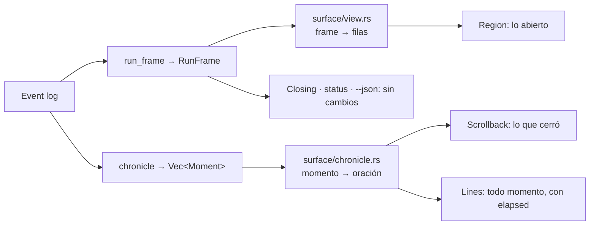

# M19 · La crónica del run

Una sola derivación de "qué pasó", en el vocabulario en que el frame ya dice
"dónde está". Las superficies dejan de elegir palabras: la región, el
scrollback y las líneas append-only disponen las mismas. Aguas abajo de M02:
`Happening` tiene la forma de `EventPayload` (nueve dominios), no la forma
plana vieja.

## Lo que hay hoy

| | región + scrollback | append-only (pipe, CI, `TERM=dumb`) |
|---|---|---|
| deriva de | `RunFrame` — estado en un instante | `EventPayload` crudo, evento por evento |
| elige palabras en | `surface/view.rs` | `surface/lines.rs::detail` (match de 36 brazos) |
| vocabulario de estados | `render::state::NodeDisplay` | ninguno — el `kind_name` del evento |
| dice | `+ implement — finished — noted · 3s` | `[3s] node_finished on `implement` — noted` |
| comparten | una función: `view::closed_as` | |

Tres textos afirman una unidad sin mecanismo: rustdoc de `lines.rs` ("*it
is the same content the pinned region carries*"), rustdoc de `render::state`
("*the vocabulary every surface says it in*"), D162 ("*el mismo contenido
sale como líneas append-only, una por evento*"). `Scrollback::gone` es
memoria que existe porque el scrollback deduce "qué cerró" comparando frames
en vez de leerlo del log; ahí vivió un defecto real.

## El principio

El log es una secuencia de eventos; una persona lo lee como una secuencia de
hechos. El engine deriva el frame (dónde está cada cosa) y la crónica (qué
pasó, en orden) del mismo log y con los mismos tipos. El CLI elige las
palabras una vez por hecho; cada superficie solo las dispone. Lo que un
frame dice que un nodo *es*, la crónica dice que *se volvió*: el mismo
`NodeState`, y `NodeDisplay` lo nombra una sola vez.



## La derivación

```rust
// crates/engine/src/view/chronicle.rs

/// One thing that happened to a run, placed: when, to which node, and
/// what. Derived from the log the way a frame is and in the same types —
/// what a frame says a node *is*, a moment says it *became*.
pub struct Moment {
    pub seq: Seq,
    pub at: DateTime<Utc>,
    /// The run's own clock at this point: from its first event to this one.
    pub elapsed: Duration,
    /// The node it concerns, `None` for a run-level moment.
    pub node: Option<NodeId>,
    pub happening: Happening,
}

/// What happened, read as a person reads it. Nine brazos, one per event
/// domain; each domain owns the reading of its own kinds.
pub enum Happening {
    Run(run::Happening),
    Node(node::Happening),
    Session(session::Happening),
    Tasks(tasks::Happening),
    Scope(scope::Happening),
    Findings(findings::Happening),
    Artifacts(artifacts::Happening),
    Gates(gates::Happening),
    Children(children::Happening),
    /// A kind this binary does not know. Still a moment: a reader not told
    /// the log carries more than the binary reads is a reader misled.
    Unknown { kind: String },
}

// Per-domain readings (core/src/events/<dominio>/happening.rs), each
// `impl From<(&XEvent, &EventMeta, &RunState)> for x::Happening`:
pub mod run     { pub enum Happening { Created { mode: ModeName, base_branch: String }, Paused(PauseReason), Resumed(OnInterrupt), Closed { terminal: TerminalState, tokens: TokenUsage }, PromotionSignaled { to: ModeName, reason: String, evidence: Evidence } } }
pub mod node    { pub enum Happening { RunnerResolved(ResolvedRunner), Reached { state: NodeState, elapsed: Option<Duration>, children: Vec<ChildLink> }, Rerouted(Reroute), HookRan { phase: HookPhase, exit_code: i32 }, ContextAssembled, CriteriaChecked { task: TaskId, phase: Phase, checked: usize }, ScopeChecked { violations: usize }, BaselineCaptured } }
pub mod session { pub enum Happening { Opened(OpenSession), Called(ToolCall), Message(AgentMessageType), Degraded(Degradation) } }
pub mod tasks   { pub enum Happening { Registered { task: TaskId }, Moved { task: TaskId, to: TaskStatus } } }
pub mod scope   { pub enum Happening { Expansion { task: TaskId, step: ScopeExpansionStep } } }
pub mod findings{ pub enum Happening { Finding { id: FindingId, severity: FindingSeverity, title: String, change: FindingChange } } }
pub mod artifacts{ pub enum Happening { Submitted { kind: ArtifactKind, name: String, taken: bool }, Accepted(ArtifactId), Written { path: PathBuf } } }
pub mod gates   { pub enum Happening { Escalated(Escalation), Resolved(GateResolvedPayload), Answered { channel: Channel, responder: Option<Responder> } } }
pub mod children{ pub enum Happening { Born(RunId), Closed { run_id: RunId, terminal: TerminalState }, Iteration { iteration: u32 } } }
pub enum ScopeExpansionStep { Requested { paths: Vec<String> }, Granted { by: Decider }, Denied { by: Decider, reason: Option<String> } }
pub enum FindingChange { Posted, Updated, Withdrawn { reason: String }, Refused { operation: FindingOperation, problems: usize } }

/// Reads the log as the sequence of moments a person met it as: one per
/// event, in the log's order, each placed by the run's own elapsed.
/// Pure, and monotone in the log: the chronicle of a prefix is a prefix
/// of the chronicle.
pub fn chronicle(events: &[StoredEvent]) -> Vec<Moment>
```

`chronicle` deriva `RunState` una vez (necesita `elapsed` del nodo que
cierra y sus `children`) y recorre el log con él.

### Invariantes

1. **Uno por evento.** `chronicle(events).len() == events.len()`, `Unknown`
   incluido.
2. **Monótona en el log.** Para todo `n`, `chronicle(&events[..n])` es
   prefijo de `chronicle(events)`.
3. **El frame concuerda con la crónica.** Para cada nodo,
   `frame.nodes[n].state` es lo que dice el último momento sobre `n`:
   `Reached{state}` → `NodeStanding::Reached(state)`; `Escalated` →
   `Reached(Waiting{..})`; ninguno → `ToGo` o `Skipped`. `frame.reroutes` ==
   cuenta de `Rerouted`; `frame.degraded` == los `Degraded`;
   `frame.children` == `Born`/`Closed`.

## Cada evento, un momento

`kept` = lo que una terminal observada conserva encima de su región (P6;
valores propuestos). Ejemplos con `Glyphs::Ascii`.

| kind | Happening | tipo que reutiliza | kept | dice |
|---|---|---|---|---|
| `run_created` | `Run::Created` | — | semilla (se pliega, no se escribe) | `run — created — mode `standard` off main` |
| `run_paused` | `Run::Paused` | `PauseReason` | sí | `? run — paused — node `lint` failed: exit 1` |
| `run_resumed` | `Run::Resumed` | `OnInterrupt` | sí | `> run — resumed` |
| `run_finished` | `Run::Closed` | `TerminalState` | no (el bloque de cierre es su registro) | `+ run — finished` |
| `promotion_signaled` | `Run::PromotionSignaled` | `Evidence` | sí | `? run — promotion to `ship` — cap: 400; spent: 500` |
| `runner_resolved` | `Node::RunnerResolved` | `ResolvedRunner` | no | `implement — executor on claude-code/opus` |
| `node_started` | `Node::Reached{Running}` | `NodeState` | no | `> implement — running — attempt 1` |
| `node_finished` | `Node::Reached{Finished}` | `NodeState`, `ChildLink` | sí | `+ implement — finished — noted · 3s` |
| `node_failed` | `Node::Reached{Failed}` | `NodeState`, `Failure` | sí | `x lint — failed — exit 1 · 2s` |
| `node_rerouted` | `Node::Rerouted` | `Reroute` | sí | `lint — rerouted to `fix`: criteria still red (1/2)` |
| `hook_executed` | `Node::HookRan` | `HookPhase` | no | `build — hook before exit 0` |
| `context_assembled` | `Node::ContextAssembled` | — | no | `implement — context assembled` |
| `criteria_checked` | `Node::CriteriaChecked` | `Phase` | no | `work — T001 integration: 3 criteria` |
| `scope_checked` | `Node::ScopeChecked` | — | no | `work — 2 paths out of scope` |
| `baseline_captured` | `Node::BaselineCaptured` | — | no | `run — baseline captured` |
| `agent_session_opened` | `Session::Opened` | `OpenSession` | no | `implement — session opened as builder on opus` |
| `agent_message` (tool_use) | `Session::Called` | `ToolCall` | no | `implement — called Edit` |
| `agent_message` (usage, note) | `Session::Message` | `AgentMessageType` | no | `implement — usage` |
| `capability_degraded` | `Session::Degraded` | `Degradation` | sí | `! implement — edit_hooks not declared by codex: scope checked after the session` |
| `task_registered` | `Tasks::Registered` | `TaskId` | no | `plan — task T001 registered` |
| `task_status_changed` | `Tasks::Moved` | `TaskStatus` | no | `work — T001 is done` |
| `scope_expansion_requested` | `Scope::Expansion{Requested}` | — | no | `work — T001 asks for src/db/` |
| `scope_expansion_granted` | `Scope::Expansion{Granted}` | `Decider` | no | `work — T001 scope granted by policy` |
| `scope_expansion_denied` | `Scope::Expansion{Denied}` | `Decider` | no | `work — T001 scope denied by policy: outside the pack` |
| `finding_posted` | `Findings::Finding{Posted}` | `FindingSeverity` | sí | `review — finding F1 blocking: SQL built by hand` |
| `finding_updated` | `Findings::Finding{Updated}` | ídem | no | `review — finding F1 updated minor: …` |
| `finding_withdrawn` | `Findings::Finding{Withdrawn}` | ídem | sí | `review — finding F1 withdrawn: fixed upstream` |
| `finding_refused` | `Findings::Finding{Refused}` | `FindingOperation` | no | `review — finding F1 post refused: 2 problems` |
| `artifact_submitted` | `Artifacts::Submitted` | `ArtifactKind` | no | `plan — tasks tasks.yaml submitted: accepted` |
| `artifact_accepted` | `Artifacts::Accepted` | `ArtifactId` | no | `plan — accepted tasks.yaml` |
| `artifact_written` | `Artifacts::Written` | — | no | `plan — wrote scratch/staging/plan/note.md` |
| `child_run_created` | `Children::Born` | `RunId` | no | `> compose — child run 01J… opened` |
| `child_run_finished` | `Children::Closed` | `TerminalState` | sí | `+ compose — child run 01J… finished` |
| `loop_iteration` | `Children::Iteration` | — | no | `work — iteration 3` |
| desconocido | `Unknown` | `UnknownKindCount` | sí | `run — `criteria_checked_v2`, a kind this binary does not read` |

Toda palabra de estado sale de `NodeDisplay::of(state).label()`; toda
palabra de cierre de run o hijo, de `view::closed_as`; toda capacidad, de
`Capability::as_str`; ningún `{:?}`.

## Las palabras

```rust
// crates/cli/src/surface/chronicle.rs

/// One moment as a surface says it, before any layout decides where it goes.
pub(super) struct Said { pub(super) word: Option<StateWord>, pub(super) text: String }
/// The words for `moment`. One match per domain, and the only ones.
pub(super) fn say(moment: &Moment) -> Said
/// Whether a terminal a person is watching keeps `happening` above its region.
pub(super) fn kept(happening: &Happening) -> bool     // el match de P6
/// The rows a settled node leaves behind: its own line, and its children indented under it.
pub(super) fn graduation(moment: &Moment, glyphs: Glyphs) -> Vec<String>
```

La forma de toda oración es `yunta_core::text::aside`: `sujeto — lo que
carga`. Para un nodo, "lo que carga" es `NodeDisplay::of(state).label()`.

Ejemplo, las dos superficies sobre el mismo log; lo marcado es la misma
cadena byte a byte:

```text
terminal · región + scrollback                 pipe / CI · append-only
------------------------------------------      ----------------------------------------------
run 01J…: created at ~/.yunta/runs/01J…         live view off (stderr is not a terminal): one line per event
+ [plan — finished — 3 tasks · 4s]              [0s]  > plan — running — attempt 1
x [lint — failed — exit 1 · 2s]                 [0s]    plan — executor on claude-code/opus
  lint — rerouted to `fix`: criteria …          [4s]    plan — accepted tasks.yaml
+ fix — finished — clippy clean · 9s            [4s]  + [plan — finished — 3 tasks · 4s]
+ [lint — finished — exit 0 · 2s]               [4s]  > lint — running — attempt 1
── región anclada ──                            [6s]  x [lint — failed — exit 1 · 2s]
> run implement · executor claude-code/opus     [6s]    lint — rerouted to `fix`: criteria …
  this node's recent calls: Edit, Read, Bash    …
nothing needs you                               [17s] + [lint — finished — exit 0 · 2s]
nodes 3/5 · 1 run · 1 reroute                   [18s]   implement — called Edit
```

`lint` corre dos veces y aparece dos veces arriba con dos resultados: no
hay `gone` que olvidar, porque un nodo que cierra dos veces son dos momentos.

## Las disposiciones

- **Lines**: `moment(&Moment)` escribe `[elapsed] {glyph} {text}` para todo
  momento. `open`, `note` sin cambios. Se borran `detail`, `resolution`,
  `counted_problems`.
- **Scrollback**: queda `over(region, out)` y `write(lines)`. Se borran
  `gone`, `leaving`, `restart`.
- **Region**: `show(frame, run_id, answerable)` sin cambios; `graduate(frame)`
  → `record(&[String])`; se borra `restart`.
- **view.rs**: se borran `graduation`, `settled_nodes`, `working_nodes`;
  `closed_as` queda.
- **Closing · status · --json · MCP**: sin cambios.
- **Turns · Feed · Fold**: sin cambios.

## El pase del pintor

1. `absorb(events)` pliega en `Folded` y sigue a un sucesor de promoción —
   sin cambios.
2. `write_settled()`: `let moments = chronicle(folded.settled())`; para cada
   `m` en `moments[written..]`, `draw.record(&m, glyphs)`: `Lines` escribe
   cada uno; `Live` escribe los `kept` como `graduation` vía
   `Region::record`. `written = moments.len()`. Bajo la cortina no escribe
   (igual que hoy).
3. `redraw()`: `run_frame` → `region.show` — sin cambios.

`attach_to(seed)` sigue haciendo `written = folded.settled().len()` — por el
invariante 1 es `chronicle(seed).len()`. `follow` resetea `written = 0`;
`region.restart()` se va. `Painter` gana `glyphs: Glyphs` desde `SurfaceEnv`.

## Archivos

| archivo | acción | qué |
|---|---|---|
| `crates/engine/src/view/chronicle.rs` | nuevo | `Moment`, `Happening`, `chronicle()` |
| `crates/core/src/events/<dominio>/happening.rs` | nuevo (M02) | `<dominio>::Happening` y `From` |
| `crates/engine/src/view/mod.rs` | modifica | `mod chronicle; pub use …` |
| `crates/engine/src/lib.rs` | modifica | reexporta |
| `crates/engine/tests/chronicle.rs` | nuevo | los cinco tests de abajo |
| `crates/engine/tests/properties.rs` | modifica | dos propiedades (prefijo; frame ≡ crónica) |
| `crates/testkit-core/src/frames.rs` | modifica | `pub fn moment(seq, node, happening) -> Moment` |
| `crates/cli/src/surface/chronicle.rs` | nuevo | `Said`, `say`, `kept`, `graduation` + tests (los 8 de `lines.rs` migrados + uno por brazo) |
| `crates/cli/src/surface/lines.rs` | modifica | `event` → `moment`; borra `detail`/`resolution`/`counted_problems` |
| `crates/cli/src/surface/scrollback.rs` | modifica | borra `gone`/`leaving`/`restart` y sus 4 tests (2 migran al engine) |
| `crates/cli/src/surface/region.rs` | modifica | `graduate` → `record`; borra `restart` |
| `crates/cli/src/surface/view.rs` | modifica | borra `graduation`, `settled_nodes`, `working_nodes` |
| `crates/cli/src/surface/painter.rs` | modifica | `glyphs`; `Draw::record`; `write_settled` itera la crónica; `follow` sin `restart`; test de los dos draws |
| `crates/cli/src/surface/mod.rs` | modifica | `mod chronicle;` rustdoc: "tres superficies sobre dos derivaciones y un vocabulario" |
| `crates/cli/src/commands/status/decision.rs` | modifica | `Layout::aside` → `Layout::advice` |
| `crates/cli/tests/run_surface.rs` | modifica | test pty-vs-pipe; el del downgrade busca `touch — running` |
| `docs/design/adrs.md` / `adr/` | modifica | D164; notas en D162 y D45 |
| `docs/design/contrato-del-run.md` §8.5 | modifica | "la crónica sale entera como líneas append-only, una por evento; sobre una terminal, lo que cerró sube al scrollback con las mismas palabras y lo abierto vive en la región" |
| `README.md` filas `run`/`resume` | modifica | "every moment of the run arrives as one line, in the words the live view uses" |
| `docs/design/glosario.md` | modifica | `frame`, `crónica`/`momento` |

## Tests

| test | dónde | sostiene |
|---|---|---|
| `every_event_is_one_moment` | engine/tests/chronicle.rs | invariante 1, `Unknown` incluido |
| `the_chronicle_of_a_prefix_is_a_prefix_of_the_chronicle` | engine/tests/properties.rs | invariante 2 |
| `the_frame_agrees_with_the_chronicle` | engine/tests/properties.rs | invariante 3 |
| `a_settled_node_carries_how_long_it_worked_and_the_children_it_bore` | engine/tests/chronicle.rs | `elapsed` y `children` |
| `a_node_that_settles_twice_is_two_moments` | engine/tests/chronicle.rs | el defecto de `gone`, imposible |
| `what_a_watched_terminal_keeps_above_its_region_is_what_the_append_only_surface_writes` | cli/src/surface/painter.rs | mismos beats a `Live` y `Lines`; scrollback (sin glifo) ⊆ lines (sin `[elapsed] `), mismo orden |
| `every_kind_earns_its_words_once` | cli/src/surface/chronicle.rs | los 8 de `lines.rs` + uno por brazo |
| `a_run_read_back_from_a_pipe_says_what_a_watched_terminal_kept` | cli/tests/run_surface.rs | pty vs pipe con `Checkout` |

## ADR D164 (texto)

**D164 — El run se lee como una crónica derivada, y cada superficie la
dispone.** El engine deriva del log, junto al frame, una *crónica*: un
momento por evento, en el orden del log, en los mismos tipos que el frame
usa para decir dónde está cada cosa. Es pura y monótona en el log. El CLI
elige las palabras de un momento una sola vez, con el mismo vocabulario de
estados que el frame, y cada superficie solo las dispone: la región dibuja
del frame lo que está abierto; el scrollback conserva de la crónica lo que
cerró algo o pidió algo a una persona; la superficie append-only escribe
todos los momentos con el tiempo del run adelante. Un test de propiedad
sostiene que el frame concuerda con la crónica, y otro que lo que una
terminal observada conserva es lo que la superficie append-only escribe.
Racional: dos derivaciones con dos vocabularios se pagan dos veces por cada
kind nuevo y divergen sin que ningún test lo diga; un scrollback que deduce
"qué cerró" comparando frames necesita memoria por nodo, donde vivió un
defecto real. Descartados: que el modo append-only dibuje frames (un frame no
es una línea); declarar las dos superficies distintas y corregir D162
(barato, sin nada que las ate); `--format json` como salida de máquina (queda
habilitado por el tipo, no lo reemplaza). Revisa D162 y D45.
